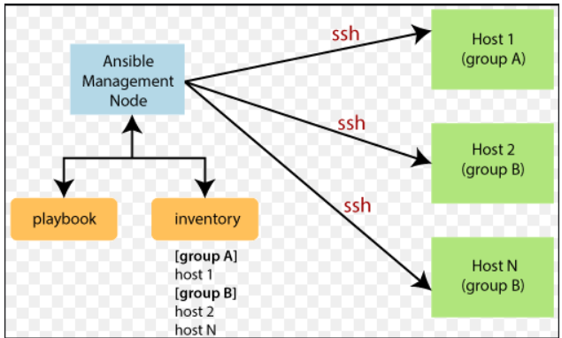
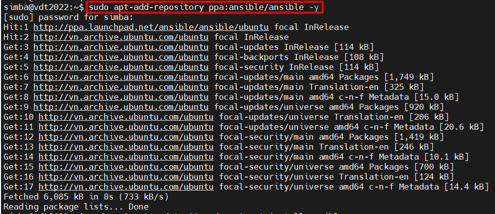
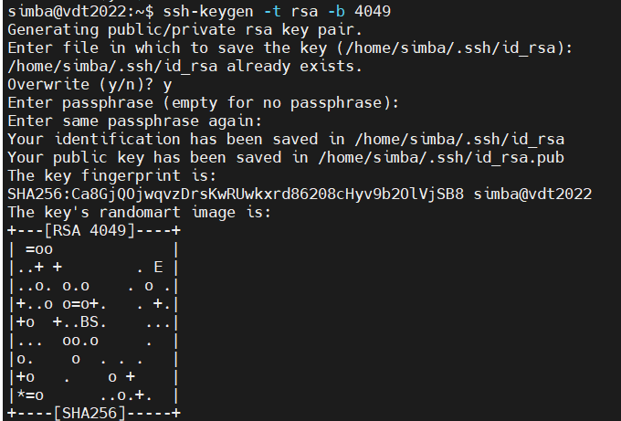
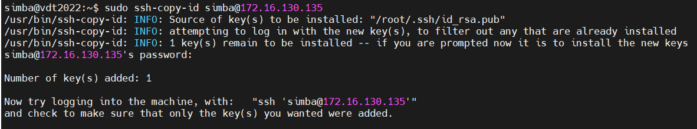
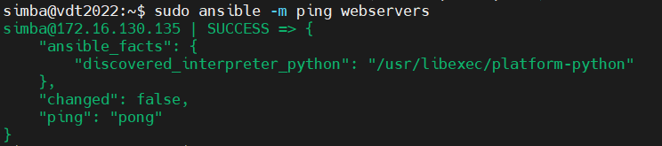
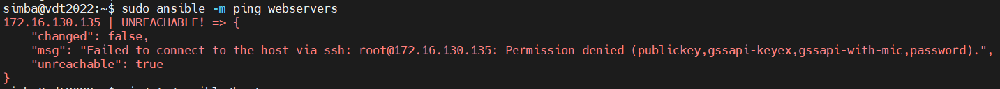
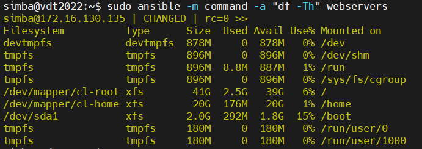
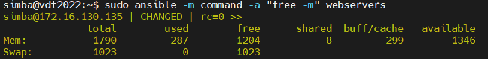
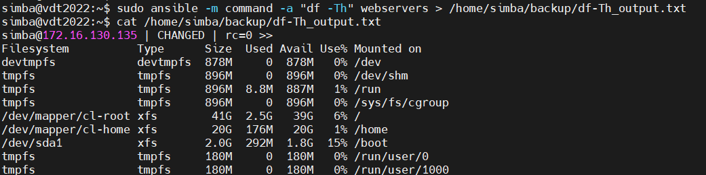

# Mục lục    

[1. Ansible là gì ?](#1)   
[2. Một số thuật ngữ cơ bản ](#2)  
[3. Ứng dụng của Ansible](#3)     
[4. Cài đặt Ansible](#4)      

## [Tham khảo](#5)    

----    

<a name='1'></a>    

## 1. Ansible là gì ?       

- `Ansible` là một open source, phần mềm mạnh mẽ tự động cho configuration, managing và deploying software ứng dụng trong các node không có bất kỳ downtime chỉ bởi đang sử dụng SSH.  
    - Ngày nay, hầu hết các tool automation IT chạy như một agent trong remote host, nhưng Ansible chỉ cần một kết nối SSH và Python (2.4 trở lên) được cài đặt trong node remote để biểu hiện kích hoạt nó.    

### Ansible làm việc như thế nào ? 
- Vấn đề: Khi làm việc với server thì có cần lo nhiều thứ để setup: `crontab, update, phần mềm mới, deploy ứng dụng, chỉnh sửa file cấu hình,...   
- Tool automation chính là giải pháp cho những vấn đề này. Có rất nhiều tool được sử dụng hiện nay như là: `Chef, Puppet, Ansible, SaltStack, CFEngine, StackStorm,...`      
- Ansible Engine thì được hỗ trợ cung cấp xây dựng từ dự án community Ansible.      
- Ansible Tower thì là một framework enterprise để `điều khiển, bảo mật, quản lý và mở rộng` `automation Ansible` của bạn. (community or  engine) với 1 UI (User Interface) và API (Application Programing Interface).       

### Ansible phân loại thành 2 kiểu server      
   ***Controlling machine và nodes***       

- Controlling Machine: nơi cài đặt Ansible.         
- Nodes được quản lý bởi `controlling machine` qua SSH. Vị trí của nodes được chỉ định bởi controlling machine thông qua `Inventory` của nó.   
- Ansible có thể xử lý 100 nodes từ một hệ thống đơn qua kết nối SSH.   
- Được xử lý, thực thi và vận hành toàn bộ bởi lệnh `ansible`. Một vài TH, bạn yêu cầu để thực thi đa lệnh cho deployment, bạn có thể build playbook.       

    

<a name='2'></a>  

## Một số thuật ngữ cơ bản     
- `Controlling Machine`: nơi cài đặt Ansible chịu trách nhiệm quản lý, điều khiển gửi các task đến các máy con cần quản lý.      
- `Inventory`: Là file `INI`chứa thông tin các server cần quản lý. File này thường nằm tại đường dẫn `/etc/ansible/hosts`.          
- `Playbook`: Là file chứa các task của Ansible được ghi dưới dạng YAML. Máy controller sẽ đọc các task trong Playbook và đẩy các lệnh thực thi tương ứng bằng Python xuống các máy con.    
- `Task`: Một block ghi tác vụ cần thực hiện trong playbook và các thông số liên quan. Ví dụ 1 playbook có thể chứa 2 task là: yum update và yum install vim.       
- `Module`: Ansible có rất nhiều module, ví dụ module yum dùng để cài đặt các gói phần mềm qua yum.      
- `Role`: Là một tập playbook được định nghĩa sẵn để thực thi 1 tác vụ nhất định.       
- `Play`: là quá trình thực thi của 1 playbook từ đầu đến cuối.          
- `Facts`: Thông tin của những máy được Ansible điều khiển, cụ thể là thông tin về OS, network, system,...           
- `Handlers`: Dùng để kích hoạt các thay đổi của dịch vụ như start, stop service.        
   

<a name='3'></a>  

## 3. Ứng dụng của Ansible   
- Ansible có rất nhiều ứng dụng trong triển khai hạ tầng và quản trị hệ thống.   
   - `Provisioning`: Khởi tạo VM, container hàng loạt trong môi trường cloud dựa trên API (Openstack, AWS, Google Cloud, Azuse...)   
   - `Configuration Management`: Quản lý cấu hình tập trung các dịch vụ tập trung, mà không cần phải tốn công chỉnh sửa cấu hình trên từng server.   
   - `Application Deployment`: Deploy ứng dụng hành loạt, quản lý hiệu quả vòng đời của ứng dụng từ giai đoạn dev cho tới production.  
   - `Security & Compliance`: Quản lý các chính sách về an toàn thông tin một cách đồng bộ trên trên nhiều môi trường và sản phẩm khác nhau (deploy policy, cấu hình firewall hàng loạt trên nhiều server...)    
<a name='4'></a>  

## 4. Cài đặt Ansible     

- B1: Chúng ta sử dụng Repository PPA Ansible chính thức trong hệ thống, chạy lệnh sau để thêm repository    
```     
simba@vdt2022:~$ sudo apt-add-repository ppa:ansible/ansible -y
simba@vdt2022:~$ sudo apt-get update && sudo apt-get install ansible -y

```   

   
    

- B2: Chuẩn bị SSH Keys để Remote Hosts.    
  - Đầu tiên, chúng ta tạo một SSH key sử dụng lệnh phía dưới và copy key đến remotes hosts.     

```   
simba@vdt2022:~$ ssh-keygen -t rsa -b 4049
```   
   

   - Sau khi tạo SSH Key thành công, bây giờ copy key đã được tạo đến tất cả các remote server.    

```   
simba@vdt2022:~$sudo ssh simba@172.16.130.135  
```  
   

- B3: Tạo file `Inventory` đến Remote Hosts (Nodes)     
  - File `Inventory`, file này giữ thông tin máy chủ, cái mà máy chủ chúng ta phải được kết nối từ local đến remote.    
  - Default file `Inventory` sẽ dưới file `/etc/ansible/hosts`     

- Bây giờ thêm 1 máy chủ đến file `Inventory`. Mở và edit file sử dụng lệnh `vi`.     
```   
simba@vdt2022:~$ sudo vi /etc/ansible/hosts
```  
- Thêm địa chỉ host IP address    
```   
[webservers]  
172.16.130.135 
```    
- Bây giờ kiểm tra kết nối đến các nodes    
```    
simba@vdt2022:~$ sudo ansible -m ping webservers
```  
   
- Ping lỗi xảy ra         

   

```   
#Kiểm tra lượng RAM trong các nodes   
simba@vdt2022:~$ sudo ansible -m command -a "free -m" webservers

#Kiểm tra nhanh ổ cứng trên các node   
simba@vdt2022:~$ sudo ansible -m command -a "df -Th" webservers    
```  
   
    

***Nếu chúng ta muốn xuất đến bất kì file nào chúng ta sử dụng lệnh sau***   
```   
simba@vdt2022:~$ sudo ansible -m command -a "df -Th" webservers > /home/simba/backup/df-Th_output.txt
```      
      

<a name='5'></a>         

## Tham khảo   
[1]https://blog.vinahost.vn/ansible-la-gi     
[2]https://www.tecmint.com/install-and-configure-ansible-automation-tool-in-linux/   


