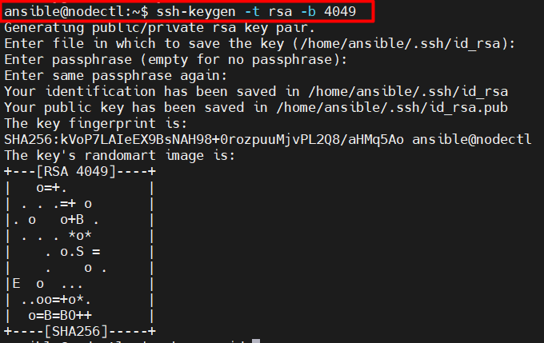
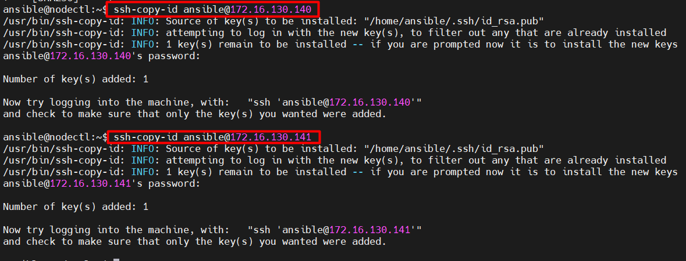
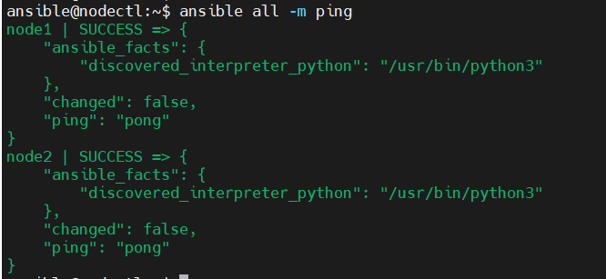

## Cài đặt triển khai Ansible trên Ubuntu 20.04   
### 1. Chuẩn bị     
### 1.1 Mô hình triển khai   

   

### 1.2 IP Planning  
|Hostname|hardware|Interface|Disk|  
|----|----|----|----|   
|nodectl|2 CPU - 2GB RAM|ens33: 172.16.130.146|30GB|  
|node1|2 CPU - 2GB RAM|ens33: 172.16.130.140|30GB|   
|node2|2 CPU - 2GB RAM|ens33: 172.16.130.141|30GB|   

### 2. Cài đặt     
- ` Cập nhật gói, update OS`    
```   
apt-get update -y && apt-get upgrate -y 
```    

- `Disable firewall`   
```   
systemctl disable ufw    
systemctl stop ufw   
systemctl status ufw         
```    

### 2.1 Cấu hình SSH key và khai báo file inventory    
- Đứng tại node AnsibleServer tạo SSH Key, sau đó copy sang các node còn lại.  
- Mục tiêu: là sử dụng `keypair` để không phải đăng nhập password mỗi khi đăng nhập vào các client.    
```    
ssh-keygen -t rsa -b 4049     
```     

   

- Thực hiện copy file key sang các node còn lại.  
```  
ssh-copy-id ansible@172.16.130.140 
ssh-copy-id ansible@172.16.130.141   
```    
   


### 2.2 Cài đặt Ansible   
- Thực hiện cài đặt Ansible trên 1 node có vai trò quản lý điều khiển tất cả các node còn lại, đó được gọi là `node controller`.   
- Ở đây là Ansible   
```    
apt-get install ansible -y      
```     

### 2.3 Khai báo file inventory      
- Default thì danh sách các host mà AnsibleServer điều khiển đều nằm trong file `/etc/ansible/hosts`.     
- Tạo một file backup   
```   
cp /etc/ansible/hosts /etc/ansible/hosts.bak    
```   
- Thực hiện thêm thông tin danh sách các node trong bài lab vào file /etc/ansible/hosts có nội dung:   

```   
[hosts1]  
172.16.130.140  
[hosts2]  
172.16.130.141    
```    
- Kiểm tra danh sách các node đã được khai báo trong file inventory     
```  
ansible all --list-hosts  
```   
- Trong TH cần kiểm tra các host trong mỗi group. VD group: hosts1   

```   
ansible hosts1 --list-host   
```    
- Ở phiên bản Ansible 2.0 trở lên file /etc/ansible/hosts có thể thực hiện bổ sung thêm 1 số tùy chọn về user và password  
- Nội dung sau khi chỉnh sửa:  
```    
[hosts1]  
node1 ansible_host=172.16.130.140 ansible_port=22 ansible_user=ansible    
[hosts2]  
node2 ansible_host=172.16.130.141 ansible_port=22 ansible_user=ansible      
```    
- Trong đó:  
   - `node1`: hostname của node  
   - `ansible_host`: Địa chỉ IP tương ứng với hostname của node.  
   - `ansible_port`: Port SSH được sử dụng trên các node tương ứng.  
   - `ansible_user`: User mà node controller sử dụng để tương tác với các node còn lại thông qua dịch vụ ssh.    

- Kiểm tra kết nối đến các node đã chính xác hay chưa bằng câu lệnh `ansible` với các tùy chọn:   
   - `all`: tất các các node được khai báo.  
   - `-m ping`: thể hiện module ping để kiểm tra kết nối đến các node.   

```  
ansible all -m ping   
```   
   

## Tham khảo   
[1]https://github.com/DTThang/Ansible/blob/main/install.md   
