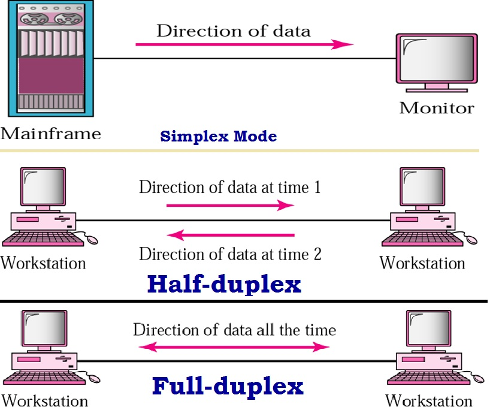
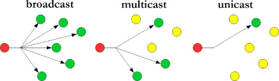

# Mục lục   
   
[1. Khái niệm cơ bản](#2)   
[2. Switch là gì?](#1)            

## [Tham khảo](#5)      

-----   

   

***Hiện tượng Collision domain là hiện tượng mà nếu hai thiết bị đồng thời gửi tín hiệu điện vào đường truyền thì các tín hiệu của hai thiết bị sẽ gây nhiễu cho nhau dẫn đến lỗi bit và mất frame.***        

- Để giảm thiểu số lượng collision có thể xảy ra, các thiết bị kết nối đến một collision domain phải chạy một giải thuật có tên gọi là CSMA/CD (Carrier Sense Multiple Access with Collision Detection).        

  

## 1. Khái niệm cơ bản
- `Singplex`: Bên gửi chỉ có gửi dữ liệu cho bên nhận.    
    -  VD: bàn phím và màn hình.  
- `Half-Duplex`: Bên gửi có thể gửi, nhận dữ liệu, nhưng chỉ thực hiện một hành động vào một thời điểm.       
    - VD: bộ đàm     
- `Full-Duplex`: Bên gửi có thể gửi và nhận dữ liệu đồng thời.      
    - VD: điện thoại      

       

- `Unicast`: Gói tin gửi đi từ một nguồn và nhận chỉ một đích. (một host sẽ nhận tất cả dữ liệu truyền từ host nào đó).     
- `Broadcast`: Gửi tin gửi đi từ một nguồn đến tất cả các đích có kết nối trực tiếp của nó. (trong cùng một mạng).       
- `Multicast`: Truyền đa hướng, gói tin gửi từ một điểm tới một tập hợp các điểm khác còn lại, tức là một nguồn và nhiều đích (trong nhóm Multicast).        

       
- Protocol là tập hợp tất các các quy tắc, quy ước để đảm bảo cho các máy tính trên mạng có thể giao tiếp với nhau.

   

## 2. Switch là gì ?     
- Swith sẽ giải quyết vấn đề mở rộng kích thước của một mạng LAN, làm giảm thiểu kích thước các collision domain và tăng thêm băng thông đấu nối cho các thiết bị đầu cuối.       
- Swith là thiết bị lớp 2 thực hiện chức năng chuyển tiếp frame tốc độ cao dựa vào địa chỉ MAC của frame.     

### Hoạt động chuyển mạch của Ethernet Swith    

- Hoạt động: Khi frame đi vào một cổng switch, switch sẽ thực hiện chuyển tiếp frame này ra khỏi một cổng thích hợp để đi đến được thiết bị nhận.    
- Để thực hiện được việc đó thì switch dựa vào bảng thông tin đó là bảng địa chỉ MAC (MAC Address Table).    
- Khi host A muốn gửi frame cho host B, nó sẽ đóng gói dữ liệu thành frame có `source MAC` của host A và `Destination MAC` của host B. Khi frame đi đến switch, switch sẽ nhìn vào `Destination MAC` của `frame header` và thực hiện tra cứu bảng địa chỉ MAC để xem MAC này nằm ở cổng nào của switch rồi gửi frame qua cổng đó.   

- Học địa chỉ MAC vào bảng MAC: Switch thực hiện học các địa chỉ MAC của các thiết bị đầu cuối vào bảng MAC từ source MAC của Ethernet frame khi frame đi vào một cổng nào đó của switch.    

- Chuyển tiếp (forward) frame ra một cổng thích hợp: dựa vào destination MAC của frame     
   - Nếu destination MAC của frame là một địa chỉ unicast MAC có sẵn, switch chỉ cần chuyển frame ra cổng tương thích.  
   - Nếu destination MAC của frame là một địa chỉ unicast MAC không có trong bảng MAC và địa chỉ broadcast, switch sẽ thực hiện nhân bản (flood) frame này ra tất cả các cổng trừ cổng nhận vào.   

   

## Tham khảo   
