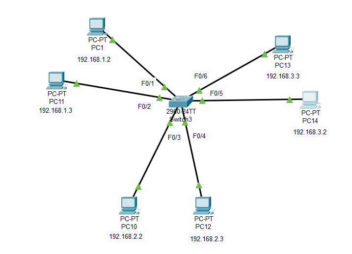
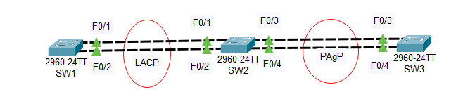

# Mục lục   
[1. VLAN(Virtual Lan Area Network)](#1)      
[2. Trunking ](#2)      
[3. VTP - VLAN Trunking Protocol ](#3)      
[4. STP - Spanning Tree Protocol ](#4)    
[5. Định tuyến giữa các VLAN](#5)   
[6. Etherchannel](#6)    
[7. Port Security](#7)      

----    

<a name='1'></a>      

## 1. VLAN (Virtual Local Area Network) là gì ?     
- VLAN là một mạng LAN ảo. Kỹ thuật này cho phép tạo lập các mạng LAN độc lập một cách logic trên cùng một kiến trúc hạ tầng vật lý.         
- VLAN là một broadcast-domain được tạo bởi các switch. Bình thường thì router đóng vai trò tạo ra broadcast-domain. Đối với VLAN switch có thể tạo ra broadcast-domain đó.     
- Bạn có thể hiểu rằng, VLAN dùng để chia một switch thành nhiều switch nhỏ hơn và hoạt động độc lập với nhau.   
    

```  
Switch#configuration terminal   
Switch(config)#vlan10   
Switch(config-vlan)#name VLAN10 
Switch(config)#vlan20  
Switch(config-vlan)#name VLAN20
Switch(config)#vlan30   
Switch(config-vlan)#name VLAN30
Switch(config)#int f0/1
Switch(config-if)#switchport access vlan 10
Switch(config)#int f0/2
Switch(config-if)#switchport access vlan 10
Switch(config)#int f0/3
Switch(config-if)#switchport access vlan 20
Switch(config)#int f0/4
Switch(config-if)#switchport access vlan 20
Switch(config)#int f0/5
Switch(config-if)#switchport access vlan 30
Switch(config)#int f0/6
Switch(config-if)#switchport access vlan 30

```      

- Dải giá trị VLAN-ID chạy từ 0 đến 4095, bao gồm:   
   - `1 đến 1001`: dải VLAN thông thường, là dải VLAN thường được sử dụng.    
   - `1002 đến 1005`: dải VLAN được dùng để giao tiếp với các kiểu mạng LAN khác.   
   - `1006 đến 4094`: dải VLAN mở rộng, dải này chỉ có thể sử dụng khi switch hoạt động ở mode `transparent`   
   - `0 và 4095`: dành riêng, không sử dụng.   

- Mặc định, VLAN 1, 1002 đến 1005 luôn tồn tại trên switch, không thể xóa, sửa VLAN này.     

### Phân loại VLAN    
- Mạng VLAN gồm 3 loại chính như sau:     
   - `Port-based VLAN`: là cách cấu hình VLAN đơn giản và phổ biến. Mỗi cổng của switch được gắn với một VLAN xác định (mặc định là VLAN 1), như vậy bất kì một host nào sẽ cắm vào một VLAN nào đó.   
   - `MAC address based VLAN`: Cách cấu hình này ít được sử dụng do bất tiện trong việc quản lý.   
   - `Protocol - based VLAN`:Cách cấu hình này gần giống như MAC address based VLAN, nhưng sử dụng một địa chỉ logic hay địa chỉ IP thay thế cho địa chỉ MAC.      

### Lợi ích của VLAN   
- Tiết kiệm băng thông của mạng: Do VLAN có thể chia nhỏ mạng LAN ra thành các đoạn khác nhau.     
- Khi gửi một gói tin thì gói tin đó sẽ chỉ truyền trên VLAN một duy nhất, không truyền ra các VLAN khác nên giảm được lưu lượng, tiết kiệm được băng thông, không làm giảm tốc độ đường truyền.     

### Khi nào bạn cần sử dụng VLAN   
- Khi bạn có hơn 200 máy tính trong mạng LAN.   
- Lưu lượng quảng bá (broadcast traffic) trong mạng LAN là quá lớn.    
- Chuyển đổi một switch đơn thành nhiều switch ảo.    


<a name='2'></a>   

## 2. Trunking    

- Đường trunk sẽ đảm bảo lưu lượng của các VLAN đều có thể đi qua nó để đến được VLAN tương ứng ở switch đầu kia.        
- Hai cổng trên hai switch ở hai đầu đường trunk được gọi là cổng `Trunk`.   
- Các cổng được kết nối từ các end -user được gọi là cổng `Access`

### Các kỹ thuật Trunking   
- Kỹ thuật Trunking Dot1Q: chèn thêm 4 byte thông tin trunking vào giữa Ethernet Frame.    

- Kỹ thuật Trunking ISL: thực hiện đóng gói toàn bộ Ethernet Frame giữa một Header 26 byte và một đường kiểm tra lỗi CRC dài 4 byte.     

### Các mode cấu hình trunking trên cổng switch    

||Access|Trunk|Desirable|Auto|  
|----|----|----|----|----|    
|Access|Access|N/A|Access|Access|   
|Trunk|N/A|Trunk|Trunk|Trunk|   
|Desirable|Access|Trunk|Trunk|Trunk|    
|Auto|Access|Trunk|Trunk|Access|     

***Note: Các frame đi trên đường `Trunk` sẽ được chèn thêm thông tin tương ứng với VLAN mà nó thuộc về (gắn thêm tag). Ngược lại, các frame đi trên đường `Access` là các `frame Ethernet` thông thường không bị (tag) thêm thông tin nào cả.***    

- Giao thức DTP (Dynamic Trunking Protocol): giao thức thiết lập trunking giữa các switch.     

- Việc trunking ngoài ý muốn như vậy sẽ gây ra những mối nguy cơ về bảo mật.    

<a name='3'></a>    

## 3.VTP - VLAN Trunking Protocol    
- `VTP(VLAN Trunking Protocol)` là giao thức dùng để đồng bộ cấu hình VLAN với nhau mà không cần có sự can thiệp của người quản trị.     
- VTP sử dụng các đường trunk layer 2 để trao đổi thông tin. Để các switch chạy được VTP thì các đường trunk phải được thiết lập giữa chúng.     
- `VTP domain`: Các switch thuộc cùng một domain mới có thể trao đổi thông tin VTP với nhau.     
- `VTP mode`:  
   - Server: toàn quyền thao tác trên cấu hình VLAN    
      - Tạo/sửa/xóa VLAN   
      - Học cấu hình VLAN từ switch khác.    
      - Forward thông tin VLAN: sau khi học xong thông tin VLAN, switch sẽ chuyển tiếp thông tin đến các switch tiếp theo có thể update.   

   - Client: không được phép thay đổi cấu hình VLAN.   
      - Đồng bộ cấu hình VLAN từ các switch khác.   
      - Forward thông tin VLAN.   
   - Transparent: 
      - Tạo/sửa/xóa VLAN  
      - Không đồng bộ với cấu hình VLAN   
      - Forward thoogn tin VLAN    

- Số `revision`: phản ánh độ mới của cấu hình VLAN.      
- Cấu hình VLAN có số `revision` cao sẽ đè lên cấu hình VLAN có `revision` thấp    

- VTP Pruning: giúp switch giảm thiểu việc forward những lưu lượng không cần thiết qua chuyển mạch, tiết kiệm tài nguyên mạng.    

```  
Switch(config)#vtp domain domain-name  
Switch(config)#vtp password password  
Switch(config)#vtp mode {server | client | transparent}   
Switch(config)#vtp pruning
Switch#show vtp status 
Switch#show vtp password  
```

<a name='4'></a>   

## 4.STP (Spanning Tree Protocol)     
- Nếu một mạng doanh nghiệp chỉ dùng một router gateway đi Internet thì sẽ có khả năng là router này xảy ra sự cố thì cả một hệ thống mạng doanh nghiệp sẽ bị gián đoạn. Chính vì thế ta phải set up cho router tuyến đường dự phòng để có thể tránh gây gián đoạn mạng trong những vị trí quan trọng của sơ đồi mạng.    
- Giao thức `STP của switch layer 2`: để tránh hiện tượng `loop` cần phải khóa tất cả các vòng loop xuất hiện trên mạng chuyển mạch.  
     - STP sẽ tự động trao đổi thông tin, tính toán và khóa các vòng loop trong sơ đồ.    
- Tuy nhiên, khi xảy ra sự cố các tuyến đường dự phòng sẽ được mở để đảm bảo mạng không bị gián đoạn.       

### Cisco Per - VLAN STP (pVST+)    
- `pVST+`: mỗi VLAN sẽ chạy một tiến trình STP để có thể thực hiện cân bằng tải giữa các VLAN từ đó sử dụng đường truyền một cách tối ưu.    

### Configuration STP

|Command|Detail|   
|----|----|  
|SW(config)#[no] spanning-tree vlan `vlan-id`|Disable/Enable STP trên VLAN. Default STP enable trên mọi VLAN|      
|SW(config)#spanning-tree vlan `vlan-id` root {primary/secondary} |`Primary`: switch trở thành root switch cho VLAN vlan-id.`Secondary`: switch sẽ trở thành tuyến đường dự phòng cho root switch trên VLAN vlan-id|     
|SW(config)#spanning-tree vlan `vlan-id` cost cost|Lưu ý cost priority phải là bội số của 4096|       
|SW(config)#spanning-tree vlan `vlan-id` port-priority `priority`|Lưu ý cost priority phải là bội số của 16|    
|SW(config)#spanning-tree vlan `vlan-id` hello-time `seconds` SW(config)#spanning-tree vlan `vlan-id` forward-time `seconds` SW(config)#spanning-tree vlan `vlan-id` max-age `seconds`|Hiệu chỉnh timer của STP|    
|SW(config)#spanning-tree mode {pvst / rapid-pvst/ mst}| Default cisco active mode pVST+|   
|SW(config)#show spanning-tree [vlan vlan-id]|Check inf active basic STP|    

<a name='5'></a>   

## 5.Định tuyến giữa các VLAN

- Mục đích: Để các host thuộc các VLAN khác nhau có thể trao đổi thông tin với nhau thì cần phải định tuyến giữa các VLAN    
- Có 2 phương pháp định tuyến VLAN: sử dụng `router` và sử dụng `switch layer 3`     
- Cấu hình để cổng F0/1 của switch là cổng trunk    
```    
SW(config)#int f0/1   
SW(config)#sw mod trunk 
SW(config)#sw trunk allowed vlan all   
```  
***Note:Lệnh `sw trunk encapsulation dot1q` không có trên dòng switch layer2 như 2950, 2960***   

### Trên Router
```     
Router(config)#int f0/0 
Router(config-if)#no shutdown 
Router(config-if)#ip add 192.168.1.1 255.255.255.0
Router(config)#int f0/0.2 
Router(config-subif)#encapsulation dot1q 2
Router(config-subif)#ip add 192.168.2.1 255.255.255.0
Router(config-subif)#exit
Router(config)#int f0/0.3 
Router(config-subif)#encapsulation dot1q 3
Router(config-subif)#ip add 192.168.3.1 255.255.255.0
Router(config-subif)#exit
```   

### Route Switch layer 3    
- Switch layer 3 ngoài khả năng như switch layer 2 thì còn có thể định tuyến và chuyển mạch lớp 3 dựa vào địa chỉ IP của các gói tin.     
- Có thể cấu hình định tuyến VLAN trên Switch layer 3 thông qua các SVI - Switched Virtual Interface.   
- SVI được sử dụng để kết nối đến các VLAN, cung cấp gateway đến các host thuộc VLAN này.     
- Định tuyến trực tiếp trên các switch    

```  
Bật chế độ định tuyến trên switch 
SW(config)#ip routing   
Cấu hình SVI (interface VLAN) tương ứng với từng VLAN      
SW(config)#int VLAN 1
SW(config-if)#ip add 192.168.1.1 255.255.255.0 
SW(config-if)#no shutdown  
SW(config)#int VLAN 2
SW(config-if)#ip add 192.168.2.1 255.255.255.0 
SW(config-if)#no shutdown
SW(config)#int VLAN 3
SW(config-if)#ip add 192.168.3.1 255.255.255.0 
SW(config-if)#no shutdown
```  
<a name='6'></a>   

## 6.Etherchannel   
- Để `tăng băng thông` đấu nối giữa các switch, ta cần sử dụng nhiều đường nối song song giữa các switch.
- Tuy nhiên, việc đấu nối song song như vậy sẽ hình thành `loop` và giao thức STP sẽ khóa các loop này và chỉ còn một đường duy nhất giữa hai switch.    
- `Etherchannel`: là giải pháp cho vấn đề trên, một switch sẽ thực hiện `bó` nhiều đường đấu nối với nhau thành một đường duy nhất. Từ đó tăng băng thông đấu nối cũng như tuyến đường dự phòng giữa các switch.    

### Đặc điểm  
- Etherchannel thì ` bó ` được tối đa 8 cổng physical cùng loại.  
- Các cổng bó phải thống nhất về:   
    - Trunking mode: chuẩn trunking (dot1q or ISL), mode trunking (On/Desirable/Auto), nếu không phải là mode Access.    
    - Cấu hình VLAN: Nếu là cổng trunk, Etherchannel phải cùng qua một danh sách VLAN và thống nhất về `native` VLAN. Nếu là cổng access thì các cổng thành phần phải thuộc cùng về một VLAN.   
    - Speed và Duplex: các cổng phải thống nhất với nhau về speed và duplex.    
    - Thống nhất về setup STP: Port cost, Port - priority,...    

### Cấu hình tĩnh Etherchannel    

```   
Trên SW1  
SW1(config)#int range f0/1-2
SW1(config-if-range)#channel-group 12 mode on   
SW1(config-if-range)#exit   

Trên SW2
SW2(config)#int range f0/1-2
SW2(config-if-range)#channel-group 12 mode on   
SW2(config-if-range)#exit   

Kiểm tra trạng thái    
SW1#show etherchannel summary     
```     

### Cấu hình Etherchannel bằng Protocol    
- Có 2 giao thức chính đó là:   
    - PAgP_Port Aggregation Protocol: là giao thức của Cisco.  
    - LACP_Link Aggregation Control Protocol: là giao thức chuẩn quốc tế của IEEE.      

- Cả hai giao thức đều có hai mode active: ` Chủ động ` và ` Bị động `    
   - Với PAgP: mode Chủ động là `Desirable`, còn mode Bị động là `Auto`    
   - Với LACP: mode Chủ động là `Active`, còn mode Bị động là `Passsive`     

***Note:Để Etherchannel được thiết lập thì ít nhất một trong hai đầu phải hoạt động ở mode Chủ động***    

```    
Cấu hình Etherchannel PAgP   

SW1(config-if)#channel-protocol pagp   
SW1(config-if)#channel-group số_hiệu_kênh mode {desirable/auto}   

Cấu hình Etherchannel LACP   

SW1(config-if)#channel-protocol LACP  
SW1(config-if)#channel-group số_hiệu_kênh mode {active/passive}   
```   
### LAB   

   
  

````          
SW1  
interface range f0/1-2 
channel-protocol lacp 
channel-group 1 mode active  
SW2  
int range f0/1-2
channel-protocol lacp 
channel-group 1 mode passive   
SW2  
int range f0/3-4  
channel-protocol pagp 
channel-group 2 mode desirable 
SW3 
int range f0/3-4
channel-protocol pagp 
channel-group 2 mode auto        
````    
<a name='7'></a>   

### 7.Port Security    

- MAC flooding là một kỹ thuật tấn công rất phổ biến trong mạng LAN    
- Mục đích: giúp cho kẻ tấn công có thể nghe lén, thu thập thông tin trong mạng.    
- Khi kẻ tấn công gửi source MAC giả vào switch thì khi đó đến một limited nào đó bảng MAC sẽ bị đầy. Và khi một cổng nào đó của switch gửi frame lên thì bảng MAC đang chứa đầy MAC giả tạo nên nó sẽ flooding ra tất cả các cổng trừ cổng nó nhận vào. Và rồi attacker sẽ biết được thông tin.   
- `Port Security` là một tính năng bảo mật layer 2 trên switch, thường được triển khai trên `access switch` sẽ giới hạn số lượng địa chỉ MAC được học trên một cổng.   

### Command   

```     
SW(config-if)#switchport port-security   
SW(config-if)#switchport mode access 
SW(config-if)#switchport port-security maxiumsố_lượng    
SW(config-if)#switchport port-security mac-address   

Chỉ định hành động của switch khi xảy ra vi phạm   
SW(config-if)#switch port-security violation {shutdown|restrict|protect}    
 
```   
- `shutdown` đưa vào trạng thái err-disable và chuyển hắn vào status down.  
- `restrict` đưa cổng vào status (up/up) frame vi phạm bị loại bỏ và gửi thông điệp cảnh báo.  
- `protect` cổng vẫn active nhưng không gửi thông điệp cảnh báo      

### Khôi phục   

```    
SW(config)#errdisable recovery cause psecure-violation    
SW(config)#errdisable recovery intervalseconds    
```   

- `seconds` là khoảng thời gian tính bằng giây switch sẽ mở lại cổng được bật `port security`.   

### Check Status  
 
```  
SW#show port-security   
SW#show port-security interfacetên_cổng  
SW#show port-security address    
```    
### VD    

```   
SW(config)#int f0/1 
SW(config-if)#shutdown
SW(config-if)#switchport mode access  
SW(config-if)#switchport port-security  
SW(config-if)#switchport port-security maxium 1  
SW(config-if)#switchport port-security mac-address 0000.1111.222   
SW(config-if)#switchport port-security violation shutdown  
SW(config-if)#no shutdown       
```  
<a name='8'></a>   

## LAB  

   

