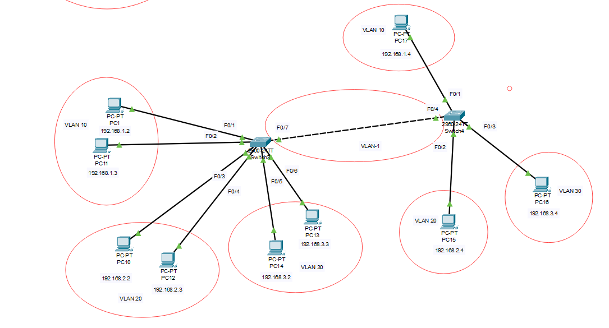

# Mục lục   
[1. VLAN(Virtual Lan Area Network)](#1)      
[2. ](#2)    

## [Tham khảo](#3)     

----    

<a name='1'></a>    
## 1. VLAN (Virtual Local Area Network) là gì ?     
- VLAN là một mạng LAN ảo. Kỹ thuật này cho phép tạo lập các mạng LAN độc lập một cách logic trên cùng một kiến trúc hạ tầng vật lý.         
- VLAN là một broadcast-domain được tạo bởi các switch. Bình thường thì router đóng vai trò tạo ra broadcast-domain. Đối với VLAN switch có thể tạo ra broadcast-domain đó.     
- Bạn có thể hiểu rằng, VLAN dùng để chia một switch thành nhiều switch nhỏ hơn và hoạt động độc lập với nhau.   
    

```  
Switch#configuration terminal   
Switch(config)#vlan10   
Switch(config-vlan)#name VLAN10 
Switch(config)#vlan20  
Switch(config-vlan)#name VLAN20
Switch(config)#vlan30   
Switch(config-vlan)#name VLAN30
Switch(config)#int f0/1
Switch(config-if)#switchport access vlan 10
Switch(config)#int f0/2
Switch(config-if)#switchport access vlan 10
Switch(config)#int f0/3
Switch(config-if)#switchport access vlan 20
Switch(config)#int f0/4
Switch(config-if)#switchport access vlan 20
Switch(config)#int f0/5
Switch(config-if)#switchport access vlan 30
Switch(config)#int f0/6
Switch(config-if)#switchport access vlan 30

```      

- Dải giá trị VLAN-ID chạy từ 0 đến 4095, bao gồm:   
   - `1 đến 1001`: dải VLAN thông thường, là dải VLAN thường được sử dụng.    
   - `1002 đến 1005`: dải VLAN được dùng để giao tiếp với các kiểu mạng LAN khác.   
   - `1006 đến 4094`: dải VLAN mở rộng, dải này chỉ có thể sử dụng khi switch hoạt động ở mode `transparent`   
   - `0 và 4095`: dành riêng, không sử dụng.   

- Mặc định, VLAN 1, 1002 đến 1005 luôn tồn tại trên switch, không thể xóa, sửa VLAN này.     

### Phân loại VLAN    
- Mạng VLAN gồm 3 loại chính như sau:     
   - `Port-based VLAN`: là cách cấu hình VLAN đơn giản và phổ biến. Mỗi cổng của switch được gắn với một VLAN xác định (mặc định là VLAN 1), như vậy bất kì một host nào sẽ cắm vào một VLAN nào đó.   
   - `MAC address based VLAN`: Cách cấu hình này ít được sử dụng do bất tiện trong việc quản lý.   
   - `Protocol - based VLAN`:Cách cấu hình này gần giống như MAC address based VLAN, nhưng sử dụng một địa chỉ logic hay địa chỉ IP thay thế cho địa chỉ MAC.      

### Lợi ích của VLAN   
- Tiết kiệm băng thông của mạng: Do VLAN có thể chia nhỏ mạng LAN ra thành các đoạn khác nhau.     
- Khi gửi một gói tin thì gói tin đó sẽ chỉ truyền trên VLAN một duy nhất, không truyền ra các VLAN khác nên giảm được lưu lượng, tiết kiệm được băng thông, không làm giảm tốc độ đường truyền.     

### Khi nào bạn cần sử dụng VLAN   
- Khi bạn có hơn 200 máy tính trong mạng LAN.   
- Lưu lượng quảng bá (broadcast traffic) trong mạng LAN là quá lớn.    
- Chuyển đổi một switch đơn thành nhiều switch ảo.    


<a name='2'></a>   

## 2. Trunking    

- Đường trunk sẽ đảm bảo lưu lượng của các VLAN đều có thể đi qua nó để đến được VLAN tương ứng ở switch đầu kia.        
- Hai cổng trên hai switch ở hai đầu đường trunk được gọi là cổng `Trunk`.   
- Các cổng được kết nối từ các end -user được gọi là cổng `Access`

### Các kỹ thuật Trunking   
- Kỹ thuật Trunking Dot1Q: chèn thêm 4 byte thông tin trunking vào giữa Ethernet Frame.    

- Kỹ thuật Trunking ISL: thực hiện đóng gói toàn bộ Ethernet Frame giữa một Header 26 byte và một đường kiểm tra lỗi CRC dài 4 byte.     

### Các mode cấu hình trunking trên cổng switch    

||Access|Trunk|Desirable|Auto|  
|----|----|----|----|----|    
|Access|Access|N/A|Access|Access|   
|Trunk|N/A|Trunk|Trunk|Trunk|   
|Desirable|Access|Trunk|Trunk|Trunk|    
|Auto|Access|Trunk|Trunk|Access|     

***Note: Các frame đi trên đường `Trunk` sẽ được chèn thêm thông tin tương ứng với VLAN mà nó thuộc về (gắn thêm tag). Ngược lại, các frame đi trên đường `Access` là các `frame Ethernet` thông thường không bị (tag) thêm thông tin nào cả.***    

- Giao thức DTP (Dynamic Trunking Protocol): giao thức thiết lập trunking giữa các switch.     

- Việc trunking ngoài ý muốn như vậy sẽ gây ra những mối nguy cơ về bảo mật.    

### VTP - VLAN Trunking Protocol    
- `VTP(VLAN Trunking Protocol)` là giao thức dùng để đồng bộ cấu hình VLAN với nhau mà không cần có sự can thiệp của người quản trị.     
- VTP sử dụng các đường trunk layer 2 để trao đổi thông tin. Để các switch chạy được VTP thì các đường trunk phải được thiết lập giữa chúng.     
- `VTP domain`: Các switch thuộc cùng một domain mới có thể trao đổi thông tin VTP với nhau.     
- `VTP mode`:  
   - Server: toàn quyền thao tác trên cấu hình VLAN    
      - Tạo/sửa/xóa VLAN   
      - Học cấu hình VLAN từ switch khác.    
      - Forward thông tin VLAN: sau khi học xong thông tin VLAN, switch sẽ chuyển tiếp thông tin đến các switch tiếp theo có thể update.   

   - Client: không được phép thay đổi cấu hình VLAN.   
      - Đồng bộ cấu hình VLAN từ các switch khác.   
      - Forward thông tin VLAN.   
   - Transparent: 
      - Tạo/sửa/xóa VLAN  
      - Không đồng bộ với cấu hình VLAN   
      - Forward thoogn tin VLAN    

- Số `revision`: phản ánh độ mới của cấu hình VLAN.      
- Cấu hình VLAN có số `revision` cao sẽ đè lên cấu hình VLAN có `revision` thấp    

- VTP Pruning: giúp switch giảm thiểu việc forward những lưu lượng không cần thiết qua chuyển mạch, tiết kiệm tài nguyên mạng.    

```  
Switch(config)#vtp domain domain-name  
Switch(config)#vtp password password  
Switch(config)#vtp mode {server | client | transparent}   
Switch(config)#vtp pruning
Switch#show vtp status 
Switch#show vtp password  
```

<a name='1'></a>   

### LAB  

   

