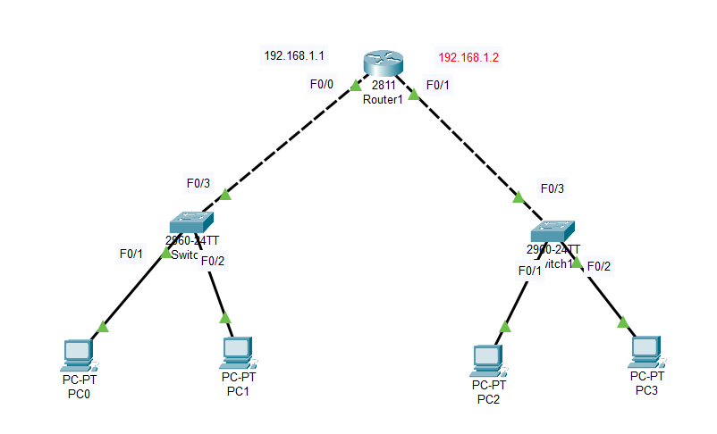

# DHCP   

## Dynamic Host Control Protocol    

### Topology   

    

### Commands   
```   
#Router1   
R(config)#ip dhcp pool LAN1  
R(dhcp-config)#network 192.168.1.0 255.255.255.0  
R(dhcp-config)#default-gateway 192.168.1.1      
R(dhcp-config)#dns-server 8.8.8.8   

R(config)#ip dhcp pool LAN2 
R(dhcp-config)#network 192.168.2.0 255.255.255.0  
R(dhcp-config)#default-gateway 192.168.2.1  
R(dhcp-config)#dns-server 8.8.8.8    

```   

- Lệnh `R(config)#ip dhcp excluded-address 192.168.1.1 192.168.1.10`: dùng để loại trừ dãy không cấp phát địa chỉ IP    

