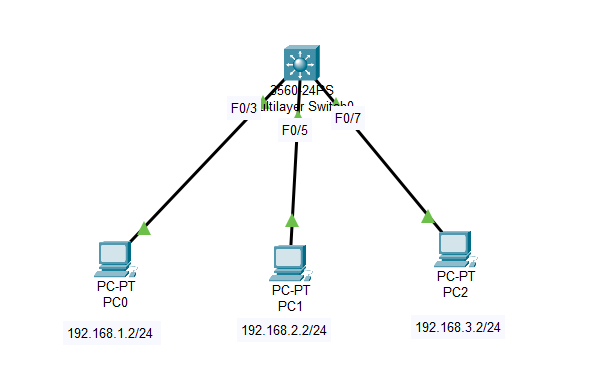

## SVI_Switch Vlan Interface    
- Mô đun của SVI rất đơn giản, bất đầu bằng cách tạo VLAN layer 2 trên Switch, sau đó config địa chỉ IP trên giao diện VLAN layer3.      
### Topology    

   

### Commands   
```    
Tạo và gán port các VLAN   
SW(config)#vlan 2,3  
SW(config)#int range f0/4-6  
SW(config-if-range)#switchport access VLAN 2  
SW(config)#int range f0/4-6  
SW(config-if-range)#switchport access VLAN 2    

Bật chức năng định tuyến trên Switch   
SW(config)#ip routing    

Cấu hình các SVI   
SW(config)#int vlan 1 
SW(config-if)#ip add 192.168.1.1 255.255.255.0   
SW(config-if)#no shutdown 
SW(config)#int vlan 2 
SW(config-if)#ip add 192.168.2.1 255.255.255.0   
SW(config-if)#no shutdown 
SW(config)#int vlan 3 
SW(config-if)#ip add 192.168.3.1 255.255.255.0   
SW(config-if)#no shutdown 
```    
