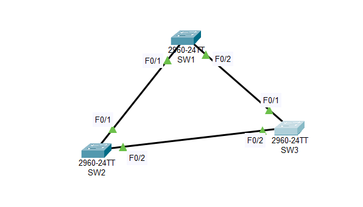

## STP_Spanning Tree Protocol   
### Topology      

   

### Commands    

```     
Configuration Switch 1
SW1(config)#int f0/1 
SW1(config-if)#switchport mode trunk
SW1(config)#int f0/2 
SW1(config-if)#switchport mode trunk
SW1(config)#vlan 2 
SW1(config-if)#name VLAN2
SW1(config)#vlan 3  
SW1(config-if)#name VLAN3  
SW1(config)#vtp mode server
SW1(config)#vtp domain cisco
SW1(config)#vtp password vnpro  
SW1(config)#spaning-tree vlan 1 root primary  

Configuration Switch 2
SW2(config)#int f0/1 
SW2(config-if)#switchport mode trunk
SW2(config)#int f0/2 
SW2(config-if)#switchport mode trunk  
SW2(config)#vtp mode client
SW2(config)#vtp domain cisco
SW2(config)#vtp password vnpro  
SW2(config)#spaning-tree vlan 2 root primary  
SW2(config)#spanning-tree vlan 1 root secondary    

Configuration Switch 3
SW3(config)#int f0/1 
SW3(config-if)#switchport mode trunk
SW3(config)#int f0/2 
SW3(config-if)#switchport mode trunk  
SW3(config)#vtp mode client
SW3(config)#vtp domain cisco
SW3(config)#vtp password vnpro  
SW3(config)#spaning-tree vlan 3 root primary  
SW3(config)#int f0/1 
SW3(config)#spanning-tree vlan 1 cost 39 
```   

