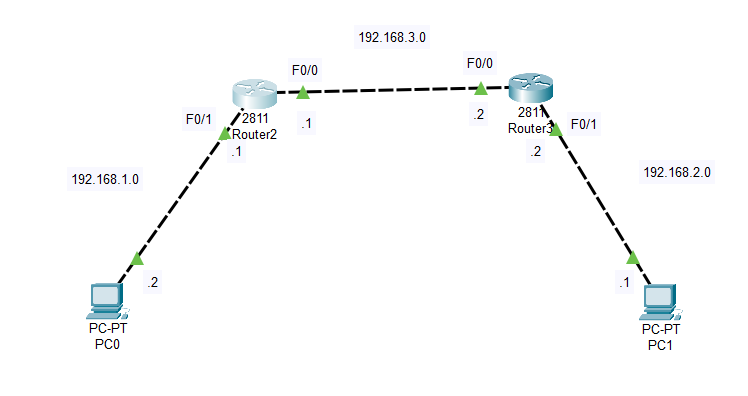

## RIP_Routing Information Protocol    
### Overview    
- `RIP` là một giao thức distance-vector điển hình. Mỗi router sẽ gửi toàn bộ bảng định tuyến của mình cho router láng giềng theo định kỳ 30s/lần.     
- `RIP` trao đổi thông tin theo cơ chế `"lan truyền tin đồn".`    
- `Metric` trong RIP được tính thep hop-count, là số nằm giữa router đang xét và đích đến. Với RIP  `Metric` maxium là 15. Nếu mạng đích đến cách router đang xét 16 router trở lên thì nó không thể đi đến được.    
- RIP được đóng gói vào các `datagram UDP`, sử dụng source port và destination port là `512`.    
- Cách thức hoạt động của RIP sẽ gây ra hiện tượng loop vì thế sẽ có một số quy tắc chống loop và định thời timer được đưa ra. Các quy tắc và timer này làm giảm tốc độ hội tụ của RIP.    
- AD của RIP là 120.    

### Các quy tắc chống loop    
### Split-horizon       
- Cơ chế: Khi router nhận được cập nhật định tuyến cho một subnet từ phía cổng nào thì nó không gửi ngược lại cập nhật về phía cổng mà nó nhận.     
- Ngoài ra, khi xảy ra sự cố down mạng thì RIP còn sử dụng thêm các quy tắc để thúc đẩy nhanh hơn tiến trình cập nhật định tuyến và hỗ trợ cho tiến trình chống loop.   
     - `Route - poisoning`: Khi một subnet kết nối trực tiếp chuyển sang down, router sẽ gửi đi một bản tin cập nhật cho subnet này có metric=16 (infinity metric) cho láng giềng của nó. Và cứ thế router nhận được lại tiếp tục gửi đến các router láng giềng kế tiếp để biết được rằng subnet này đang bị down.           

    - `Poison-reserve`: Hồi đáp lại về cho láng giềng một bản tin cập nhật cho subnet ấy với metric = 16.   
    - `Trigger - update`: Việc phát ra các bản tin Route-poisoning và Poiso-reserve phải được thực hiện ngay lập tức mà không cần chờ tới hạn định kỳ gửi cập nhật định tuyến.     

### Bộ định thời Holdown timer    
- Khi R1 nhận được cập nhật route-poisoning từ R3 cho subnet và kết luận route này down, R1 sẽ không chấp nhận bất kỳ thông tin nào đến từ nguồn tin khác ngoại từ R3 trong suốt thời gian holdown-timer. Nhờ đó mà route-poisoning cho subnet được update kịp thời đến R2 và không còn gây ra loop.      
### Các timer   
- `Update timer`: khoảng thời gian định kỳ gửi bản tin cập nhật định tuyến ra khỏi các cổng chạy RIP, giá trị `default là 30s`.    
- `Invalid timer`: Khi router đã nhận được cập nhật về một subnet nào đó mà sau khoảng thời gian `invalid timer` vẫn không nhận lại cập nhật về mạng này `(30s/lần)`, router sẽ coi route đi đến sub này là invalid timer nhưng vẫn chưa xóa khỏi table routing. Default timer là 180s.    
- `Flush timer`: Khi router đã nhận được cập nhật về một subnet nào đó mà sau khoảng thời gian `flush timer` vẫn không nhận lại được cập nhật về mạng này `(30s/lần)`, router sẽ xóa bỏ hẳn route khỏi table routing. Default của timer là 240s.  

### So sánh RIPv1 và RIPv2     
- RIPv1: classful, sử dụng địa chỉ broadcast 255.255.255.255 để gửi đi các bản tin cập nhật.      
- RIPv2: classless, sử dụng địa chỉ multicast 224.0.0.9 để gửi đi bản tin cập nhật.    

# Lab
## Configuration RIP      

   

### Router 2
```  
R(config)#router rip  
R(config-router)#network 192.168.3.0
R(config-router)#network 192.168.1.0   
R(config-router)#exit    
R(config)#    

```   
### Router 3   
```    
R(config)#router rip  
R(config-router)#network 192.168.3.0   
R(config-router)#network 192.168.2.0   
R(config-router)#exit   
R(config)#   
``` 

- Trong cấu hình RIP, thực hiện các cổng tham gia RIP bằng command `network`    
```  
R(config)#router rip 
R(config-router)#network major_network  
``` 
- Khi `network` mạng nào thì cổng có địa chỉ thuộc mạng ấy sẽ tham gia RIP, router sẽ thực hiện gửi/nhận các bản tin cập nhật định tuyến trên cổng này. Mạng của cổng tham gia RIP sẽ được broadcast đi trong các bản tin định tuyến.   
   
