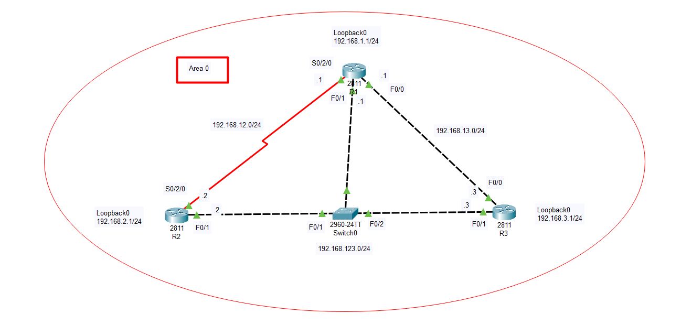

# OSPF_Open Shortest Path First    
## Overview      
- `OSPF` là một giao thức link - state điển hình. Mỗi router khi chạy giao thức sẽ gửi các bản tin trạng thái đường link LSA (Link State Advertisement) của nó cho tất cả các router trong vùng (area).      
- OSPF có `AD = 110`    
- Metric của `OSPF` gọi là cost, được tính theo bandwidth trên cổng chạy OSPF.     
- OSPF chạy trên nền IP, có protocol_id là 89.   
- OSPF là một giao thức chuẩn quốc tế, được định nghĩa trong RFC_2328.    
## Cách thức hoạt động   
- Bầu chọn Router - id  
- Thiết lập quan hệ láng giềng (neighbor).    
- Trao đổi thông tin trạng thái đường link.   
- Tính toán xây dựng bảng định tuyến (dựa vào giải thuật dijkstra).     

### Router_id   
- `Router_id` của router OSPF có định dạng của một địa chỉ IP. Mặc định router chạy OSPF sẽ chọn `router_id` là địa chỉ có IP cao nhất trong các interface đang active (up/up), ưu tiên cổng loopback.      
- Thiết lập `router_id` tĩnh   
```   
R(config)#router ospf process_id   
R(config-router)#router-id A.B.C.D      
```        
- Lệnh reset tiến trình OSPF    
```    
R#clear ip ospf process      
```  

### Thiết lập láng giềng     
- Địa chỉ Multicast dành riêng cho OSPF là `224.0.0.5`      
- `5 loại thông tin bắt buộc` để thiết lập được quan hệ láng giềng.   
   - Area_id  
   - Hello timer và Dead timer     
   - Hai địa chỉ IP đấu nối phải cùng subnet (một vài TH còn yêu cầu cả subnet-mask).   
   - Thỏa mãn các điều kiện xác thực.   
   - Cùng bật hoặc cùng tắt cờ stub.    

### Area_id  
- Area_id được gán cho link của router chứ không phải gán cho bản thân router.    
- Những router mà có tất cả các link đều được gán vào một vùng được gọi là `internal router`.    
- Những router có các link thuộc về các vùng khác nhau được gọi là ABR (Area Border Router_router biên giới vùng).    

### Hello timer và Dead timer    

- Hello timer là khoảng thời gian router gửi gói tin hello ra khỏi cổng chạy OSPF. Khi một router nhận được hello từ láng giềng nó sẽ thiết lập dead timer. Cứ sau thời gian dead timer mà router không nhận được gói tin từ láng giềng, nó sẽ coi láng giềng này không còn nữa và sẽ xóa mọi thông tin mà nó học được từ láng giềng.     
- Defaul `hello timer` và `dead timer` là 10s và 40s.   
- Hiệu chỉnh các giá trị này trên các cổng chạy OSPF    
```   
R(config-if)#ip ospf {hello-interval | dead-interval} seconds     
```    
### Cùng subnet  
- Hai địa chỉ IP1 và IP2 đấu nối với nhau giữa hai router bắt buộc phải cùng một subnet thì mới có thể thiết lập láng giềng với nhau.    
### Thỏa mãn authorization   
- Hai router cần thống nhất với nhau về password được sử dụng thì mới có thể thiết lập láng giềng.    
### Cờ stub    
- Kiến trúc đa vùng OSPF có một loại vùng gọi là vùng stub. Vùng này là vùng không tiếp nhận LSA type - 5.   
- Khi một link của router thuộc vùng stub thì bắt buộc đầu kia của link cũng phải gán link này thuộc vùng stub.    

## Trao đổi thông tin trạng thái đường link    
- LSDB_LinkState Database: Bảng cơ sở dữ liệu  trạng thái đường link là một bảng trên router ghi nhớ mọi trạng thái đường link của router trong vùng.   
- `LSA_LinkState Advertisement` không phải là một loại ` gói tin` mà chỉ một `bản tin`. `LSU_LinkState Update` mới thực sự là `gói tin` và nó chứa đựng các bản tin này.     

### Point - to - Point   
- Loại link point-to-point điển hình là kết nối serial điểm - điểm chạy giao thức HDLC(High_Level Data Link Control) hoặc PPP nối giữa hai điểm.   
### Broadcast Multiaccess        
- `Bầu DR, BDR, DROther` dựa vào số `priority` từ cao xuống dưới. Nếu số priority bằng nhau thì sẽ xét đến giá trị `router_id` cũng từ cao xuống dưới.  
- Môi trường Broadcast Multicast điển hình chính là môi trường Ethernet LAN.    
- Trao đổi thông tin qua một router đầu mối gọi là DR_Designated Router.    
- Trên mỗi kết nối Multi Access, một DR router được bầu ra, một router khác sẽ được bầu làm Backup DR (BDR) để dự phòng cho DR trong TH DR down. Các router còn lại đóng vai trò là DR Other.    
- DR other sẽ không gửi trực tiếp cho nhau mà sẽ gửi lên cho DR và BDR. Sau đó, DR sẽ forward lại thông tin cho các router DR other.     
- Thông tin OSPF được gửi đến DR/BDR router theo địa chỉ `multicast 224.0.0.6 `và router DR chuyển xuống các router DROther theo địa chỉ `multicast 224.0.0.5 `   

- DROther có trao đổi dữ liệu với DR và BDR nên quan hệ láng giềng là `full` 
- DROther không bao giờ trao đổi trạng thái đường link với nhau nên quan hệ của chúng là `2 - Way`    
- `Nếu ta cấu hình router nhận giá trị priority bằng 0, router này sẽ không tham gia vào tiến trình bầu chọn DR và BDR, nó luôn luôn là DROther.`    
- Luật `non-preempt` Không tranh quyền DR khi đã được bầu chọn xong. Chỉ khi nào DR được bầu chọn down thì router khác mới có cơ hội tranh quyền DR.   
- Sau khi đã trao đổi thông tin trạng thái đường link cho nhau thì mỗi router đã có bảng cơ sở dữ liệu về trạng thái đường link của mọi router trong vùng. Khi đó dựa vào bảng dữ liệu này, router sẽ chạy giải thuật Dijkstra để tính toán con đường đi ngắn nhất đến mọi đích trong mạng và xây dựng bảng định tuyến.     
### Cost   
- Metric trong OSPF là cost tích lũy trên đường đi đến mạng đích.    
- Cost trên mỗi cổng thì dựa vào giá trị bandwidth       
```  
R(config-if)#bandwidth BW(đơn vị là kbps)     
```     
|Loại cổng|Bandwidth(Kbps)|Cost|    
|----|-----|-----|  
|Ethernet|10000|10|  
|Fast Ethernet|100000|1|  
|Serial|1544|64|     

- Quy tắc tính cost: thực hiện tính ngược từ đích về router đang xét và cộng dồn cost theo quy tắc `vào thì cộng, đi ra thì không cộng.`     


# LAB    
### Commands   

    

- Cấu hình OSPF đơn vùng   
```    
Trên R1
R1(config)#router ospf 1
R1(config-router)#network 192.168.1.0 0.0.0.255 area 0 
R1(config-router)#network 192.168.12.0 0.0.0.255 area 0 
R1(config-router)#network 192.168.13.0 0.0.0.255 area 0 
R1(config-router)#network 192.168.123.0 0.0.0.255 area 0 
R1(config-router)#exit

Trên R2
R1(config)#router ospf 1
R1(config-router)#network 192.168.2.0 0.0.0.255 area 0 
R1(config-router)#network 192.168.12.0 0.0.0.255 area 0 
R1(config-router)#network 192.168.123.0 0.0.0.255 area 0 
R1(config-router)#exit

Trên R3
R1(config)#router ospf 1
R1(config-router)#network 192.168.3.0 0.0.0.255 area 0 
R1(config-router)#network 192.168.13.0 0.0.0.255 area 0 
R1(config-router)#network 192.168.123.0 0.0.0.255 area 0 
R1(config-router)#exit
```    
- Lệnh kiểm tra neighbor của các router   
```   
R1#show ip ospf neighbor    
```     
### Hiệu chỉnh Router_Id   

```   
R1(config)#router ospf 1
R1(config-router)#router-id 1.1.1.1   
R1(config-router)#end
R1#clear ip ospf process      

R2(config)#router ospf 1
R2(config-router)#router-id 2.2.2.2   
R2(config-router)#end
R2#clear ip ospf process  

R3(config)#router ospf 1
R3(config-router)#router-id 3.3.3.3   
R3(config-router)#end
R3#clear ip ospf process   
```   

- Lệnh kiểm tra `R1#show ip ospf`     
### Hiệu chỉnh bầu chọn DR/BDR    
```    
R1(config)#interface f0/0    
R1(config-if)ip ospf priority 255 

R1(config)#interface f0/1   
R1(config-if)ip ospf priority 0   

R2(config)#interface f0/0    
R2(config-if)ip ospf priority 254   

```    

- Do luật `non - preempt` nên cầu reset cầu hình trên các router.   
`R1#clear ip ospf process`     

### Hiệu chỉnh cost   
```   
R2(config)#int s0/0/0  
R2(config-if)#ip ospf cost 1    

R2(config)#int f0/0      
R2(config-if)#ip ospf cost 2    
```  s