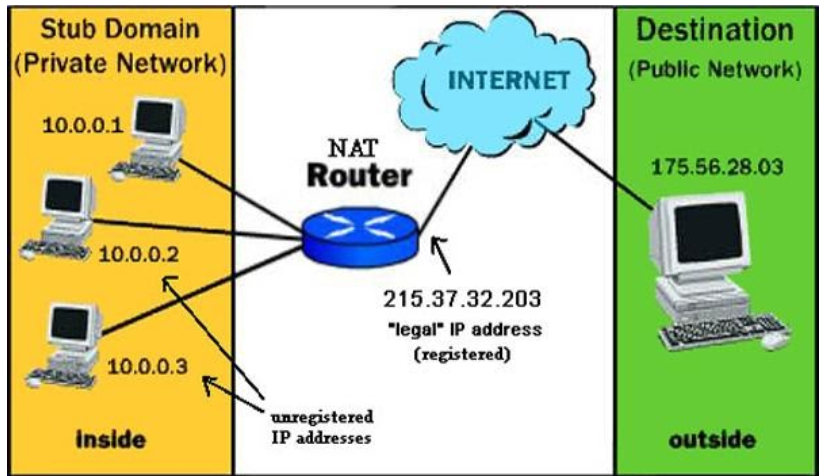

## Protocols   
### 1. SNMP_Simple Network Management Protocol     
- `Mục đích`: Để có thể quản lý bao quát được hiện trạng mạng của một doanh nghiệp, đội ngũ quản trị phải sử dụng một hệ thống quản lý tập trung.     
- Nền tảng của việc quản lý mạng tập trung là một giao thức cho phép truyền tải các thông số cần quản lý từ các thiết bị về một đầu mối quản lý trung tâm đó chính là `SNMP`.    
- Giao thức `SNMP` chạy trên nền UDP, sử dụng port 161 và port 162.    
   - Port `161` sử dụng cho hoạt động Truy vấn - Hồi đáp `(set, get, trả lời cho get)`.   
   - Port `162` sử dụng cho hoạt động `Trap`.    

 ### 2. Syslog   
 - Syslog là một công cụ không thể thiếu trong hoạt động quản lý mạng. Syslog cho phép một thiết bị phát đi các thông điệp về các hoạt động diễn ra trên thiết bị. Các thông điệp này có thể được lưu trữ nội bộ trên thiết bị hoặc gửi đến một server quản lý tập trung.       
 - 1 thông điệp Syslog sẽ đưa ra hai thông tin về vấn để được cảnh báo:      
     - Thực hiện cảnh báo về vấn đề gì (Facility)    
     - Mức độ nghiêm trọng của thông điệp (Level)     

- Có tổng cộng 8 level cho một thông điệp syslog gồm:   
    - Emergency (level 0)   
    - Alert (lever 1)   
    - Critical (level 2)   
    - Error (level 3)   
    - Warning (level 4)   
    - Notice (level 5)   
    - Informational (level 6)   
    - Debugging (level 7)   

- Chỉ số level càng thấp thì mức độ nghiêm trọng càng tăng.   

### 3. NTP_Network Time Protocol      
- Yêu cầu của quản lý mạng: là đồng bộ thời gian thực giữa các thiết bị, điều này được thực hiện bằng giao thức NTP (Network Time Protocol)     
- NTP chạy trên nền UDP sử dụng port 123     

### 4. ACL_Access Control List     
- ACL thường được gọi tắt là access-list, là một danh sách điểu khiển truy nhập.     
    - 2 mục đích:    
       - Traffic filtering (Lọc lưu lượng)   
       - Data classification (Phân loại dữ liệu)    
- Các loại access - list:   
   - Standard ACL: chỉ đề cập đến source IP của gói tin IP      
   - Extended ACL: đề cập đến source IP, destination IP, source port, destination port, giao thức (TCP, UDP, ICMP,...)      
   - Các loại khác:     

### NAT_Network Address Translation        
- NAT dùng để chuyển đổi IP private trong mạng cục bộ qua cổng `router biên` thành IP public để truy cập đến các mạng công cộng (Internet)   
     
     

