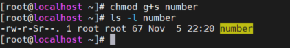
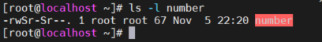
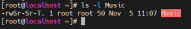

# Mục lục    
[1.Cho phép hệ thống quản lý tập tin từ dòng lệnh](#1)   
[2.Cho phép quản lý mặc định và truy vấn tập tin](#2)    

## Tham khảo   
 
---- 

### 1.Cho phép hệ thống quản lý tập tin từ dòng lệnh      
|Quyền|Giá trị|   
|----|----|   
|Read permission|4|  
|Write permission|2|   
|Execute|1|   

- `read + execute` = 5   
- `read + execute + write` = 4+2+1 = 7    

   - 0 or ---: Không có quyền   
   - 1 or --x: execute   
   - 2 or -w-: write - only  
   - 3 or -wx:write and execute   
   - 4 or r--: read - only  
   - 5 or r-x: read and execute   
   - 6 or rw-: read and write   
   - 7 or rwx: read, write and execute   

- `chmod WhoWhatWhich file|directory`: cấp phép quyền hạn truy cập của tập tin hay thư mục.  

|Nhóm-người-dùng|Thao tác|Quyền|    
|----|----|----|   
|u-user|+ :thêm quyền|r-read|   
|g-group|- :xóa quyền|w-write|   
|o-others|= :gán ngang quyền|x -excute|   
|a -all|     

- Gán thêm quyền write cho group: chmod g+w namefile   
- Xóa quyền read trên group và others: chmod go-r namefile   
- Cấp quyền execute cho mọi người: chmod ugo+x namefile     
- `chown`: Lệnh để thay đổi người sở hữu trên tập tin, thư mục.  
- `chown -R`: (recursive) cho phép thay đổi người sở hữu của thư mục và tất cả các thư mục con của nó.   
- `chgrp`: thay đổi nhóm sở hữu của một tập tin, thư mục.   
### 2.Cho phép quản lý mặc định và truy vấn tập tin   

- `|u+s(suid)|`cho phép thực thi được thực hiện dưới owner của file.    

  

- `|g+s(sgid)`cho phép thực thi được thực hiện dưới owner group của file.   

   
- `|o+(sticky)|`mục đích là ngăn chặn người dùng này xóa file người dùng khác.  

 
- setuid = 4; setgid = 2; sticky = 1;
## Lệnh umask   

## Tham khảo
[1]https://news.cloud365.vn/linux_basic-sticky-bit-suid-sgid/   
[2]
