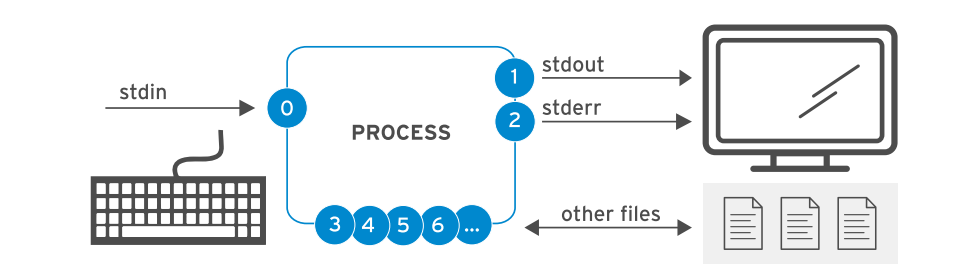
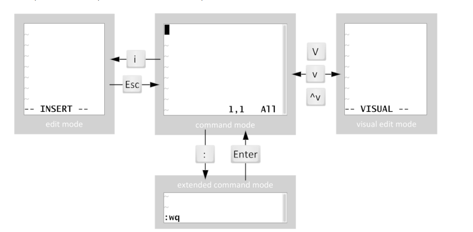
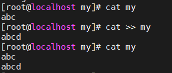
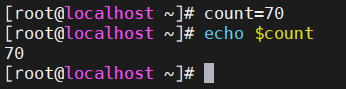
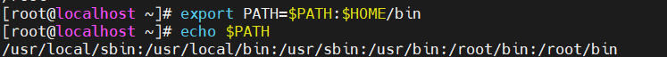
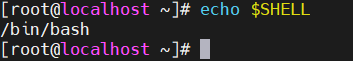

  # Mục lục   
  1. Tạo tệp văn bản
  2. Thay đổi môi trường shell

  ## Tham khảo   
  
  ----

  1. Tạo tệp văn bản  

    

  |channel name|description|default connection|usage|  
  |----|----|----|----|   
  |stdin|đầu vào tiêu chuẩn|keybroad|chỉ đọc|  
  |stdout|đầu ra tiêu chuẩn|Terminal|chỉ đọc|  
  |stderr|lỗi tiêu chuẩn|Terminal|chỉ đọc|  
  |filename|Tệp khác|none| đọc and/or viết|   
  - vim filename 
  - "i": insert thay đổi nội dung trong file. 
  - :q! lệnh thoát Vim
  - :w lệnh lưu tài liệu hiện tại 
  - :wq lệnh lưu và thoát trong cùng 1 lệnh.  

   
  - cat > file: tạo một file điền nội dung vào file mới tạo 
  - cat >> file: đè lên file mới tạo mội nội dung thêm vào.  

  
  
  2. Thay đổi môi trường Shell  
  - echo $count: Hiện thị giá trị của một biến cụ thể  
  - count=70
  - echo $count 

  - Cấu hình biến môi trường "$PATH"   

    
  - Biến môi trường Shell   

    

  ## Tham khảo  
  [1]https://www.wikihow.vn/T%E1%BA%A1o-v%C3%A0-ch%E1%BB%89nh-s%E1%BB%ADa-t%E1%BB%87p-v%C4%83n-b%E1%BA%A3n-b%E1%BA%B1ng-Terminal-tr%C3%AAn-Linux 

