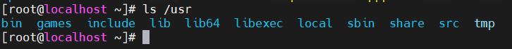

## Mục lục  

---

*Các file trong Linux*

1./-root - Thư mục gốc  
2./bin - Các tập tin thực thi của người dùng  
3./sbin - Các tập tin thực thi của hệ thống  
4./etc - Các tập tin cấu hình  
5./dev - Các tập tin thiết bị   
6./proc - Thông tin tiến hành  
7./var - Các tập tin biến đổi  
8./tmp - Thư mục chứa các tập tin tạm  
9./usr - Các chương trình của người dùng  
10./home - Thư mục người dùng  
11./boot - Các tập tin của chương trình khởi động máy.  
12./lib - Các tập tin thư viện của hệ thống.  
13./opt - Các ứng dụng tùy chọn hay thêm   
14./mnt - Thư mục mount  
15./media - Các thiết bị tháo lắp  
16./srv - Dữ liệu dịch vụ  

### Mục đích:  

*Mục đích của bài viết này là để tìm hiểu và làm việc với các file trong linux hiệu quả hơn*  

### Tham khảo

----

   

   - /usr: phần mềm đã cài đặt, những thư viện đã chia sẻ bao gồm tệp và chỉ đọc những dữ liệu chương trình.  
      - /usr/bin: lệnh của người dùng.
      - /usr/sbin: lệnh quản lý hệ thống.  
      - /usr/local: phần mềm đã được khách hàng cài ở mã nguồn. 

   - /etc: Những tệp cấu hình riêng của hệ thống.  

   - /var: Biến đổi dữ liệu riêng đến hệ thống, tệp này có thể tự thay đổi.  
 
  

   - /dev: Chứa các tập tin thiết bị đặc biệt đã được sử dụng bởi hệ thống để truy cập phần cứng.  

   - /boot: Tệp tin đã cần để bắt đầu quá trình khởi động.  

   - /tmp: Thư mục chứa các tệp tin tạm thời được tạo bởi hệ thống và người dùng.   

   - /home: Chứa các tập tin người dùng trong hệ thống.  
   - /root: Thư mục chính cho siêu người dùng quản lý, root.  
   -  /run: Thời gian chạy cho quá trình đã bắt đầu từ khởi động sau.   

   - /lib: Thư viện hỗ trợ các file thực thi trong /bin và /sbin.  

   
### Tham khảo   
[1]https://wiki.matbao.net/kb/co-ban-cau-truc-thu-muc-trong-linux/

[2]https://quantrimang.com/cau-truc-cay-thu-muc-trong-linux-84056

