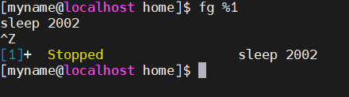
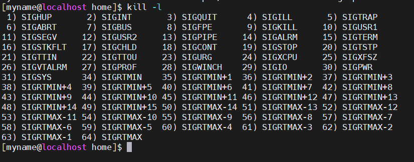
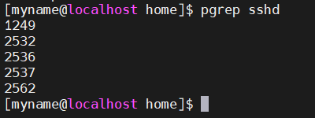
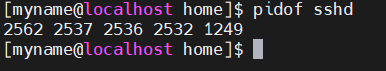

# Mục lục     
 * [1. Listing processes](#1)  
 * [2. Controlling jobs](#2)  
 * [3. Killing processes](#3)  
 * [4. Monitoring processes activity](#4)

## [Tham khảo](#5)  
----
*Mục đích: có thể xem được thông tin về chương trình đang chạy trong một hệ thống để quyết định trạng thái, tài nguyên sử dụng, và quyền sở hữu, vì thế bạn có thể điều khiển chúng.*    

### 1. Listing process
- Một `process` là một phiên bản đang chạy của hệ điều hành, có thể thực thi chương trình. Một `process` bao gồm:   
   - Một không gian địa chỉ của bộ nhớ đã được phân bổ.   
   - Bảo mật  
   - Một hoặc nhiều quyền thực thi của mã chương trình   
   - Trạng thái process    
- Môi trường của một process bao gồm:   
   - Local và global    
   - A current scheduling context. 

#### Mô tả trạng thái process   
- Mỗi CPU (or CPU core) chỉ đang làm việc trong một quy trình tại một thời điểm duy nhất.   

|Name|Flag|Mô tả|   
|----|----|----|   
|Running|R|Process thì đang thực thi trong một CPU hoặc đang chờ để chạy|  
|Sleeping|S |Process thì đang chờ một vài tình trạng|   
|Daemon|D|Process đang đợi I/O|  
|Kill|K|Dừng process để cho phép một task đang chờ yêu cầu đến tín hiệu|    
|Stopped|T|Process đang trong quá trình dừng chạy|   
|Zombie|Z|Process bị chấm dứt nhưng chưa được giải phóng bởi parent process|  
|Execute|X|Process đã được hoàn thành |   
||<| Process có độ ưu tiên cao, có thể có nhiều thời gian CPU hơn|   
||N|Process có độ ưu tiên thấp, chỉ có thể chiếm CPU khi các process khác có độ ưu cao hơn hết thời gian CPU|   

- Khi xử lý sự cố một hệ thống, nó thì quan trọng để hiểu như thế nào giao tiếp kernel với process và như thế nào giao tiếp process với người khác.      
- Lệnh top: trình bày trạng thái của mỗi quy trình  
*Note: Trong một hệ thống CPU đơn, chỉ có một quá trình được chạy trong một thời điểm. Nó có thể để xem một vài process với trạng thái `R`. Tuy nhiên, không phải process nào cũng đang chạy, một vài process đang chờ.*     
-Lệnh `ps`: cung cấp danh sách process hiện tại với thông tin chi tiết bao gồm:   
   - `UID`: định danh người sở hữu   
   - `PID`: định danh process duy nhất   
   - CPU và thời gian thực đã được sử dụng   
   - Tất cả Process chiếm bao nhiêu bộ nhớ.    
   - Trạng thái process hiện tại  
   - Cục bộ của process `stdout`, được biết như `controlling terminal`.  
    Cấu trúc:  
      - `ps [option]`:    
      - Options:
         - `aux`: trình bày tất cả process   
         - `lax`: một danh sách dài cung cấp nhiều kỹ thuật chi tiết.   
         - `ef`: trình bày tất cả thông tin process.    
         - `-fG` [tên user]: xem thông tin tiến trình thuộc nhóm người dùng nhất định.      
         - `-U root -u root u`: hiện thị thông tin tiến trình chạy dưới quyền root.   
         - `-o`: xem thông tin cụ thể của các tiến trình đang chạy.  

VD: lệnh `ps`
       

   - `PID`: Id của tiến trình   
   - `TTY`: Thông tin terminal mà người dùng đăng nhập.  
   - `TIME`: Thời gian CPU bị khởi động bởi process.
   - `CMD`: Câu lệnh để thực hiện process đó.   

## 2. Controlling jobs    
- Có 2 loại process: 
   - Foreground Process:
      - Foreground process là chuyển jobs từ background sang foreground.
   - Background Process:
      - Background process là tiếp tục jobs khi bị tạm dừng.
         - Để bắt đầu một background process thêm dấu "`&`" tại cuối lệnh.   

- Background process và foreground process thường được thao tác thông qua Jobs ID.   
- Lệnh `jobs`: Trình bày các process đang chạy.
- Lệnh `ps j`: Trình bày thông tin liên quan đến jobs.  
- Lệnh `ctrl + Z`: để tạm dừng process.  

   
- Lệnh `ctrl + C`: để kết thúc process.  

## 3.Killing process   
- Lệnh `kill`: là lệnh tắt process đang chạy   
- Cấu trúc:   
   - kill [option] [pid]   
       - Options:   
          - `1 HUP` (hangup): Khởi động lại process   
          - `2 INT`: Kết thúc process (Crtl + C)     
          - `3 QUIT`: Lưu và thoát khỏi process (Ctrl+ \ )    
          - `9 KILL`: Dừng process ngay lập tức    
          - `15 TERM`: Yêu cầu process dừng hoạt động. 
          - `18 CONTINUE`: Tiếp tục process.   
          - `19 STOP`: Dừng process tạm thời. (Ctrl + Z)   

- Lệnh `kill -l`: hiển thị danh sách tên và số của tất cả tín hiệu có sẵn.   
    
- Lệnh `pkill`: chỉ cần biết `pid` or name để kill process, thay vì phải biết số jobs.      
- Lệnh `killall`: kill tất cả các process theo name.   
- Lệnh `ptree`: hiện thị process dưới dạng cây.     
- Lệnh `pgrep`: Tra cứu hoặc báo hiệu các process dựa trên tên hoặc các thuộc tính khác.   
    - Cấu trúc: `pgrep [name or diff]` 

    
- Lệnh `pidof`: tìm ID của process đang chạy.    
 
- Lệnh `w`: hiện thị danh sách người dùng đăng nhập và process hiện tại đang chạy.   

## 5.Tham khảo   
[1]https://news.cloud365.vn/ps-command-tim-hieu-va-huong-dan-su-dung/   
[2]https://bizflycloud.vn/tin-tuc/tim-hieu-ve-process-trong-linux-20210430234059408.htm
