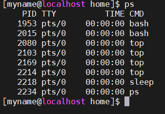

# Mục lục     
 * [1. Listing processes](###1)  
 * [2. Controlling jobs](#2)  
 * [3. Killing processes](#3)  
 * [4. Monitoring processes activity](#4)

## [Tham khảo](#5)  
----
*Mục đích: có thể xem được thông tin về chương trình đang chạy trong một hệ thống để quyết định trạng thái, tài nguyên sử dụng, và quyền sở hữu, vì thế bạn có thể điều khiển chúng.*    

### 1. Listing process 
- Một `process` là một phiên bản đang chạy của hệ điều hành, có thể thực thi chương trình. Một `process` bao gồm:   
   - Một không gian địa chỉ của bộ nhớ đã được phân bổ.   
   - Bảo mật  
   - Một hoặc nhiều quyền thực thi của mã chương trình   
   - Trạng thái process    
- Môi trường của một process bao gồm:   
   - Cục bộ và global   
   - Văn bản kế hoạch hiện tại  
   - Tài nguyên hệ thống đã được phân bổ, như là mô tả file và port mạng.  

#### Mô tả trạng thái process   
- Mỗi CPU (or CPU core) chỉ đang làm việc trong một quy trình tại một thời điểm duy nhất.   

|Name|Flag|Mô tả|   
|----|----|----|   
|Running|R|Process thì đang thực thi trong một CPU hoặc đang chờ để chạy|  
|Sleeping|S |Gián đoạn: Process thì đang chờ cho một vài tình trạng: một yêu cầu phần cứng, truy cập tài nguyên hệ thống, hoặc tín hiệu|   
|Sleeping|D|Không gián đoạn: Process thì chỉ đang ngủ, nhưng không giống như trạng thái S, không yêu cầu tới tín hiệu, đang đợi I/O|  
|Sleeping|K|Có thể kill: Chỉ định đến trạng thái D không gián đoạn, nhưng biến đổi để cho phép một task đang chờ tới yêu cầu đến  tín hiệu|   
|Sleeping|I| Báo cáo: một tập hợp con của trạng thái D|  
|Stopped|T|Process đang trong quá trình dừng chạy|   
|Zombie|Z| Đây là các tiến trình con đã bị chấm dứt nhưng chưa được giải phóng bởi parent process|  
|Zombie|X|Khi parent process dọn lên (reaps) duy trì kết cấu child process, Process bây giờ sẽ được hoàn thành.|   
||<| Process có độ ưu tiên cao, có thể có nhiều thời gian CPU hơn|   
||N|Process có độ ưu tiên thấp, chỉ có thể chiếm CPU khi các process khác có độ ưu cao hơn hết thời gian CPU|   

- Khi xử lý sự cố một hệ thống, nó thì quan trọng để hiểu như thế nào giao tiếp kernel với process và như thế nào giao tiếp process với người khác.      
- Lệnh top: trình bày trạng thái của mỗi quy trình  
*Note: Trong một hệ thống CPU đơn, chỉ có một quá trình được chạy trong một thời điểm. Nó có thể để xem một vài process với trạng thái `R`. Tuy nhiên, không phải process nào cũng đang chạy, một vài process đang chờ.*     
-Lệnh `ps`: cung cấp danh sách process hiện tại với thông tin chi tiết bao gồm:   
   - `UID`: định danh người sở hữu   
   - `PID`: định danh process duy nhất   
   - CPU và thời gian thực đã được sử dụng   
   - Tất cả Process chiếm bao nhiêu bộ nhớ.    
   - Trạng thái process hiện tại  
   - Cục bộ của process `stdout`, được biết như `controlling terminal`.  
    Cấu trúc:  
      - `ps [option]`:    
      - Options:
         - `aux`: trình bày tất cả process   
         - `lax`: một danh sách dài cung cấp nhiều kỹ thuật chi tiết.   
         - `ef`: trình bày tất cả thông tin process.    
         - `-fG` [tên user]: xem thông tin tiến trình thuộc nhóm người dùng nhất định.      
         - `-U root -u root u`: hiện thị thông tin tiến trình chạy dưới quyền root.   
         - `-o`: xem thông tin cụ thể của các tiến trình đang chạy.  

VD: lệnh `ps`
       

   - `PID`: Id của tiến trình   
   - `TTY`: Thông tin terminal mà người dùng đăng nhập.  
   - `TIME`: Lượng CPU tính bằng phút giây mà tiến trình đó chạy.   
   - `CMD`: Câu lệnh để thực hiện process đó.   

## 2.Controlling jobs    
- Có 2 loại process: 
   - Foreground Process
   - Background Process  
      - Foreground process: mọi process mà bạn bắt đầu chạy là foreground process. Nó nhận input từ bàn phím và gửi output ra màn hình.  
         - Trong khi một chương trình đang chạy trong foreground và cần một khoảng thời gian dài, vì vậy không thể chạy bất kỳ lệnh khác bởi vì dòng nhắc không có sẵn tới khi chương trình đang chạy kết thúc process và thoát ra.  
      - Background process chạy mà không kết nối đến bàn phím. Nếu backgroud yêu cầu bất cứ đầu vào từ bàn phím, chương trình sẽ đợi.   
         - Để bắt đầu một background process thêm dấu "`&`" tại cuối lệnh.   

- Background process và foreground process thường được thao tác thông qua Job ID.   
- Lệnh `jobs`: Bạn có thể trình bày danh sách của jobs ở Bash là đang theo dõi cho phiên riêng với jobs  
- Lệnh `ps j`: Trình bày thông tin liên quan đến jobs.  

## 5.Tham khảo   
[1]https://news.cloud365.vn/ps-command-tim-hieu-va-huong-dan-su-dung/   
[2]https://bizflycloud.vn/tin-tuc/tim-hieu-ve-process-trong-linux-20210430234059408.htm
