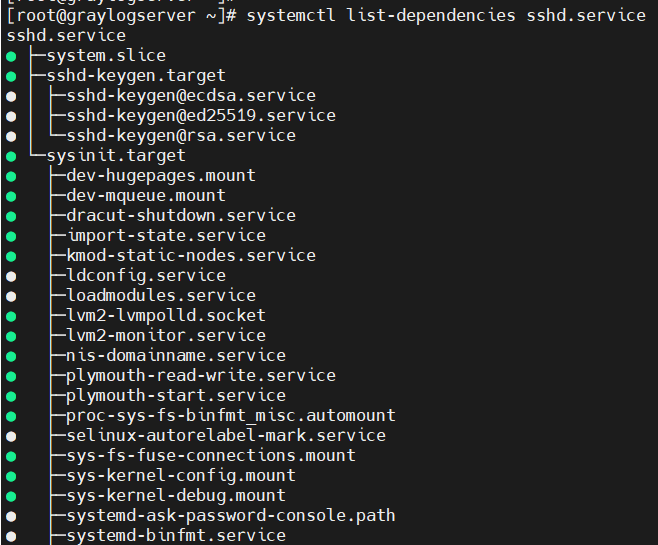

## Mục lục    
[1. Systemd](#1)       

### [Tham khảo](#2)    

----  

        
### 1. Systemd        

- Khái niệm:      
   - Systemd thuộc nhóm chương trình: system and service manager.      
   - Nó quản lý (bật/tắt/khởi động lại...) các dịch vụ chạy trên máy từ lúc nó boot cho đến lúc nó tắt.       
   - Daemon (Disk And Executive Monitor) là một process chờ hoặc chạy trong `background`, thực thi đa số tasks.     
   - Nó cũng quản lý luôn cả hệ thống (system) cụ thể là các công việc:    
       - set tên máy (hostname).      
       - Cấu hình loopback interface.     
       - Thiết lập và mount các filesystem như /sys/dev,...     
   - Systemd thường là process đầu tiên khi khởi động máy, còn được gọi là init system.      

   

### Unit file   

- Tất cả các chương trình được quản lý bởi `systemd` đều được thực thi dưới dạng `daemon` chạy ngầm dưới `background` và được cấu hình thành 1 file configuration gọi là `unit` file.     
- Các `unit` file bao gồm 12 loại:    
   - `.service`: các file quản lý hoạt động của một số chương trình.         
   - `.socket`: quản lý các kết nối.     
   - `.device`: quản lý thiết bị.   
   - `.mount`: gắn thiết bị.   
   - `.automount`: tự động gắn thiết bị.     
   - `.target`: quản lý tạo liên kết.   
   - `.path`: quản lý các đường dẫn.    
   - `.timer`: dùng cho cron-job để lập lịch.    
   - `.snapshot`: sao lưu.  
   - `.slice`: dùng cho quản lý tiến trình.   
   - `.scope`: quy định không gian hoạt động.     

*systemd cung cấp:*      
- `systemctl`: dùng để quản lý units (service, socket, mount,...).
- `journald`: dùng để quản lý log hoạt động của hệ thống (ghi log).     
- `logind`: dùng để quản lý và theo dõi việc đăng nhập/đăng xuất của user.   
- `networkd`: dùng để quản lý các kết nối mạng thông qua các cấu hình mạng.    
- `timedated`: dùng để quản lý thời gian hệ thống hoặc thời gian mạng.    
- `udev`: dùng để quản lý các thiết bị và fireware.           

### Unit Service trong Systemd  
- Loại này sẽ được khởi động khi bật/tắt.      
- `systemctl` có nhiệm vụ điều khiển hệ thống systemd và service manager. 
- Lệnh `systemctl list-units --type=service`: chỉ hiện thị các unit service với trạng thái kích hoạt `ACTIVE`.      

  
- Lệnh `systemctl list-units --type=service --all`: liệt kê các unit service bất kể các trạng thái kích hoạt.     

 
       
- Lệnh `systemctl list-unit-files --type=service`: hiện thị tất cả các trạng thái của các unit service đã được cài đặt.    

      

- Các tùy chọn bật/tắt service trong systemctl:   
    - `start`: bật service.  
    - `stop`: tắt service.   
    - `restart`: khởi động lại service.    
    - `reload`: load lại file cấu hình (chỉ có một số service hỗ trợ như là Apache,Mysql,...).    
    - `enable`: service được khởi động cùng hệ thống.   
    - `disable`: service không được khởi động cùng hệ thống.   
    - `static`: khởi động bởi một unit đã bật tự động.          

    

- `Lệnh quản lý Service`     

|Task|Command|     
|----|----|     
|Xem chi tiết thông tin về trạng thái unit|systemctl status `unit`|     
|Stop một service trong hệ thống đang chạy|systemctl stop `unit`|     
|Start một service trong hệ thống đang chạy|systemctl start `unit`|    
|Restart một service trong hệ thống đang chạy|systemctl restart `unit`|    
|Reload file cấu hình của service đang chạy|systemctl reload `unit`|    
|Hoàn thành vô hiệu một service đã bắt đầu cả thủ công và lúc khởi động|systemctl mask `unit`|     

- Lệnh `systemctl list-dependencies sshd.service`: để xem tất cả các phụ thuộc dependencies của service `sshd`.     

    

- Để tránh xung đột giữa các dịch vụ khi start thì bạn dùng lệnh `systemctl mask [name]`. Nó sẽ tạo một đường link trong thư mục cấu hình đến file `/dev/null` để ngăn cản starting.    
- `/dev/null` là một file thiết bị ảo dùng để chứa dữ liệu rác.      
- Lệnh `systemctl unmask [name]`: để unmask unit service.      

      

   
## Tham khảo  
[1]https://freetuts.net/lenh-systemctl-trong-linux-3651.html
[2]https://wiki.debian.org/systemd#Introduction   

