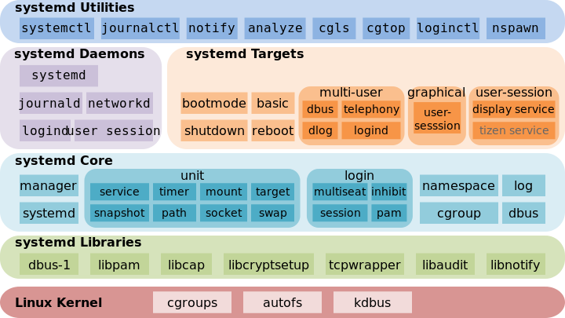
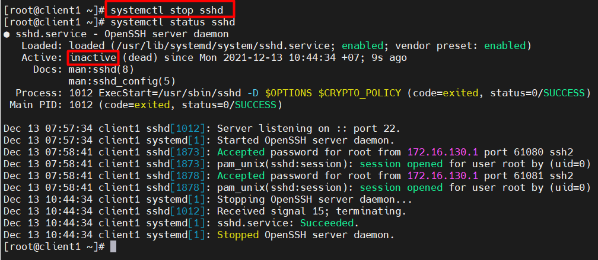

## Mục lục    
[1. Systemd](#1)       

### [Tham khảo](#3)    

----  

        
### 1. Systemd        

- Khái niệm:      
   - Systemd thuộc nhóm chương trình: system and service manager.      
   - Nó quản lý (bật/tắt/khởi động lại...) các dịch vụ chạy trên máy từ lúc nó boot cho đến lúc nó tắt.       
   - Daemon (Disk And Executive Monitor) là một process chờ hoặc chạy trong `background`, thực thi đa số tasks.     
   - Nó cũng quản lý luôn cả hệ thống (system) cụ thể là các công việc:    
       - set tên máy (hostname).      
       - Cấu hình loopback interface.     
       - Thiết lập và mount các filesystem như /sys/proc,...     
   - Systemd thường là process đầu tiên khi khởi động máy, còn được gọi là init system.      

   

### Unit file   

- Tất cả các chương trình được quản lý bởi `systemd` đều được thực thi dưới dạng `daemon` chạy ngầm dưới `background` và được cấu hình thành 1 file configuration gọi là `unit` file.     
- Các `unit` file bao gồm 12 loại:    
   - `.service`: các file quản lý hoạt động của một số chương trình.         
   - `.socket`: quản lý các kết nối.     
   - `.device`: quản lý thiết bị.   
   - `.mount`: gắn thiết bị.   
   - `.automount`: tự động gắn thiết bị.     
   - `.target`: quản lý tạo liên kết.   
   - `.path`: quản lý các đường dẫn.    
   - `.timer`: dùng cho cron-job để lập lịch.    
   - `.snapshot`: sao lưu.  
   - `.slice`: dùng cho quản lý tiến trình.   
   - `.scope`: quy định không gian hoạt động.     

*systemd cung cấp:*      
- `systemctl`: dùng để quản lý units (service, socket, mount,..). 
- `journald`: dùng để quản lý log hoạt động của hệ thống (ghi log).     
- `logind`: dùng để quản lý và theo dõi việc đăng nhập/đăng xuất của user.   
- `networkd`: dùng để quản lý các kết nối mạng thông qua các cấu hình mạng.    
- `timedated`: dùng để quản lý thời gian hệ thống hoặc thời gian mạng.    
- `udev`: dùng để quản lý các thiết và fireware.           

### Unit Service trong Systemd     
- Loại này sẽ được khởi động khi bật/tắt.    
- Lệnh `systemctl list-units --type=service`: chỉ hiện thị các unit service với trạng thái kích hoạt `ACTIVE`.      

  
- Lệnh `systemctl list-units --type=service --all`: liệt kê các unit service bất kể các trạng thái kích hoạt.     

 
       
- Lệnh `systemctl list-unit-files --type=service`: hiện thị tất cả các trạng thái của các unit service đã được cài đặt.    

      

- Các tùy chọn bật/tắt service trong systemctl:   
    - `start`: bật service.  
    - `stop`: tắt service.   
    - `restart`: khởi động lại service.    
    - `reload`: load lại file cấu hình (chỉ có một số service hỗ trợ như là Apache,Mysql,...).    
    - `enable`: service được khởi động cùng hệ thống.   
    - `disable`: service không được khởi động cùng hệ thống.    

    

