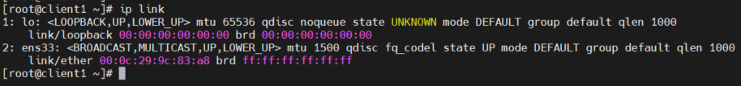
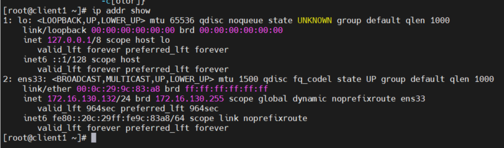
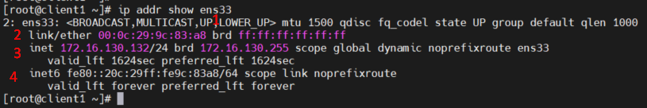
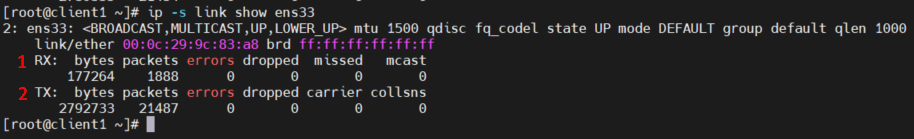
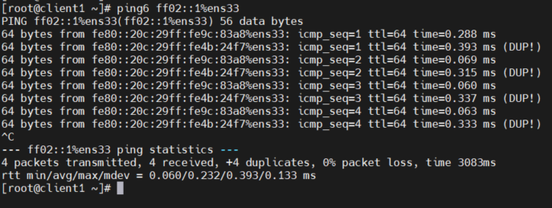
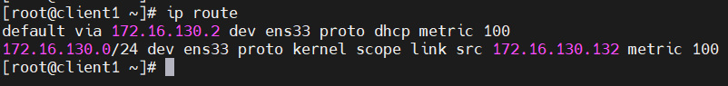
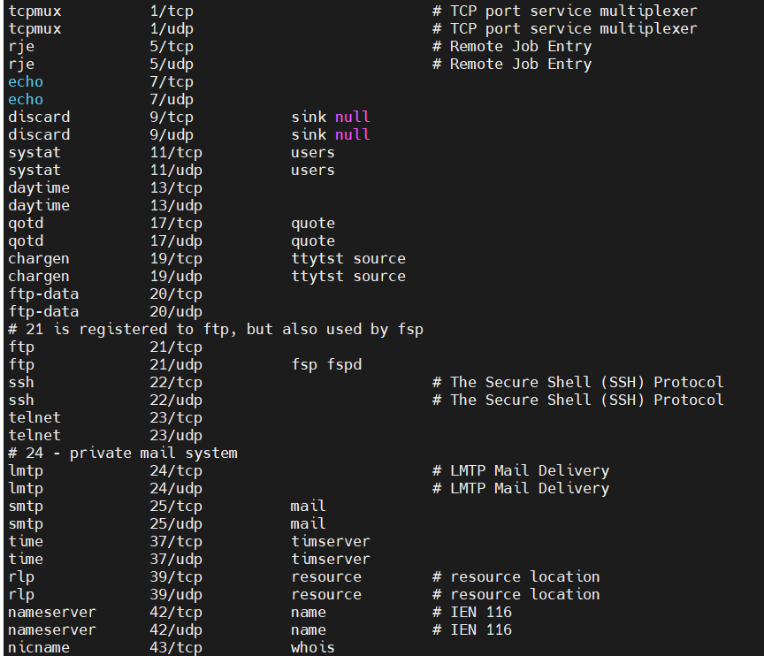
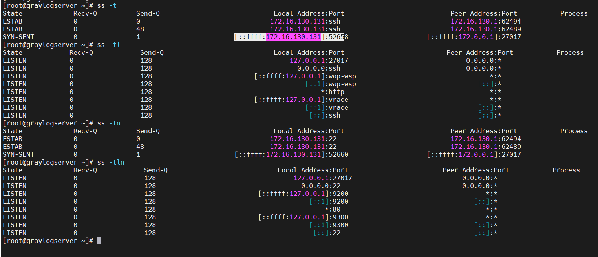

# Mục lục    
[1. Network Interface ](#1)    
[2. Lệnh ip](#2)      

## [Tham khảo](#3)    

----     

      

### 1. Network Interface         

- Network interface (giao diện mạng) là kênh kết nối giữa thiết bị và mạng. Bạn có thể có nhiều interface hoạt động cùng một lúc, các interface có thể được kích hoạt (actived) hoặc bỏ kích hoạt (de-actived).    
- Về mặt vật lý, giao diện mạng có thể tiến hành thông qua thẻ giao diện mạng (NIC - Network Interface Card) hoặc được triển khai trừu tượng hơn dưới dạng phần mềm.    

- File cấu hình ở những nơi khác nhau tùy vào mỗi nền tảng:    
    - Debian: `/etc/network/interfaces`   
    - CentOS: `/etc/sysconfig/Network-scripts/`   
    - SUSE: `/etc/sysconfig/network`     

     

### 2. Lệnh ip     

- Lệnh `ip link`: liệt kê tất cả interface mạng có sẵn trong hệ thống.    

   

- Lệnh `ip addr show`: hiện thị thông tin của từng `Ethernet` đã được kết nối.    

    

- Lệnh `ip addr show ens33`: hiện thị thông tin về ens33.   

   

Trong đó:    
1. Một interface hoạt động là `UP`.    
2. Địa chỉ MAC của thiết bị.   
3. Dòng `inet` hiện thị một địa chỉ IPv4, network prefix length và scope.    
4. Dòng `inet6` hiện thị một địa chỉ IPv6, network prefix length và scope.    

*Note `inet6 fe80::5054:ff:fe00:b/64 scope link ....`: hiện thị interface có địa chỉ IPv6 của link, scope chỉ sử dụng để giao tiếp trong link Ethernet cục bộ*  

- Lệnh `ip -s link show ens3`: hiện thị số liệu thống kê về hiệu suất mạng.    

      

Trong đó:   
- `1(RX)`: số lượng đã nhận.      
- `2(TX)`: gói đã được truyền.    
*Gói lỗi tin và các gói tin đã bị rơi*         

- Lệnh `ping`: để sử dụng để kiểm tra có kết nối mạng.       
- Lệnh `ping6`: kiểm tra kết nối mạng của địa chỉ IPv6.        

- Ping `ping6 ff02::1%ens33`: dùng để sử dụng để tìm nút IPv6 khác trên mạng local.     

      

### Troubleshooting Routing     

- Lệnh `ip route`: hiện thị thông tin routing table của IPv4.      

       

- Cấu trúc: `ip [Options] route`    
    - [Options]:    
        - `-6`: hiện thị bảng định tuyến của IPv6.         

- 

## Tracing Routes Taken by Traffic      

- `Traceroute` là công cụ để xác định đường đi được sử dụng để đến đích của một gói tin. Công cụ này sử dụng giao thức ICMP.      
- `Traceroute` hoạt động bằng cách gửi một loạt các yêu cầu echo ICMP đến đích.    

   

- `***`: hiện thị gói tin không đến được đích do mất mạng, lưu lượng lớn dẫn đến tắc nghẽn hoặc tường lửa làm giảm lưu lượng.          

### Troubleshooting Port and Services   
- Dịch vụ TCP sử dụng sockets là điểm cuối end-ponit trong liên kết truyền thông 2 chiều (two-way communication) và được tạo thành từ một địa chỉ IP, Protocol và number port.     
- Service thì sử dụng một tiêu chuẩn port còn client thì sử dụng ngẫu nhiên port có sẵn.    
- Danh sách các port tiêu chuẩn của service được lưu ở file `/etc/services`    

    

- Lệnh `ss`: hiện thị thông số socket.     
- Cấu trúc:     
    - `ss [Options]`:   
    - [Options]   
       - `-n`: hiện thị số thay thế của tên cho interface và port.    
       - `-t`: hiện thị sockets TCP.    
       - `-l`: chỉ hiện thị socket listening.   
       - `-p`: hiện thị process đang sử dụng socket.   
       - `-a`: hiện thị tất cả (listening and established)     
       - `-A inet`: hiện thị các kết nối hoạt động cho tất cả địa chỉ inet. (but no listening sockets).      

     

