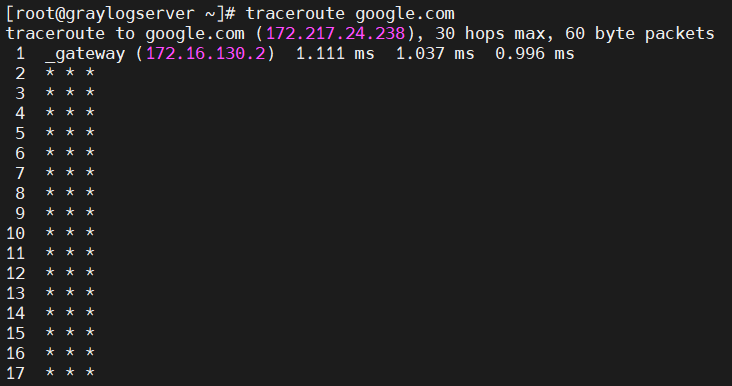
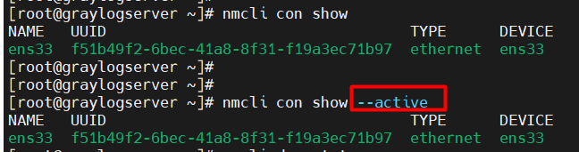
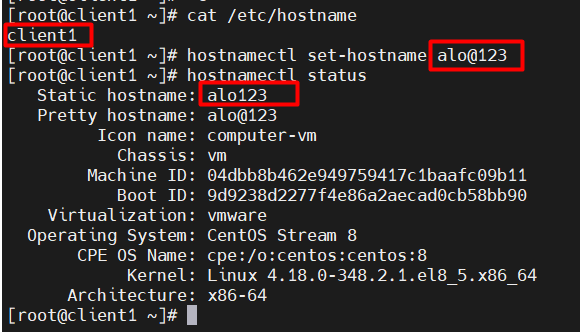
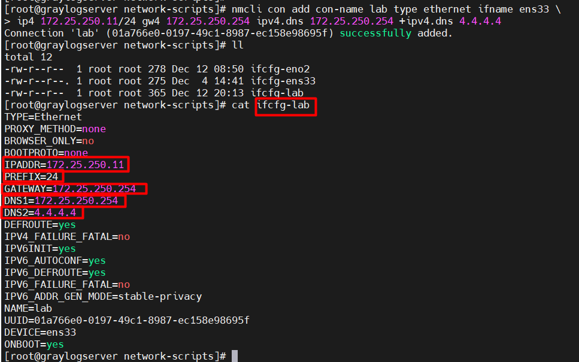

# Mục lục    
[1. Network Interface ](#1)    
[2. Lệnh ip](#2)      
[3. Cấu hình mạng](#3)       
[4. Chỉnh sửa files cấu hình mạng](#4)    

## [Tham khảo](#5)    

----     

      

### 1. Network Interface         

- Network interface (giao diện mạng) là kênh kết nối giữa thiết bị và mạng. Bạn có thể có nhiều interface hoạt động cùng một lúc, các interface có thể được kích hoạt (actived) hoặc bỏ kích hoạt (de-actived).    
- Về mặt vật lý, giao diện mạng có thể tiến hành thông qua thẻ giao diện mạng (NIC - Network Interface Card) hoặc được triển khai trừu tượng hơn dưới dạng phần mềm.    

- File cấu hình ở những nơi khác nhau tùy vào mỗi nền tảng:    
    - Debian: `/etc/network/interfaces`   
    - CentOS: `/etc/sysconfig/Network-scripts/`   
    - SUSE: `/etc/sysconfig/network`     

     

### 2. Lệnh ip     

- Lệnh `ip link`: liệt kê tất cả interface mạng có sẵn trong hệ thống.    

   

- Lệnh `ip addr show`: hiện thị thông tin của từng `Ethernet` đã được kết nối.    

    

- Lệnh `ip addr show ens33`: hiện thị thông tin về ens33.   

   

Trong đó:    
1. Một interface hoạt động là `UP`.    
2. Địa chỉ MAC của thiết bị.   
3. Dòng `inet` hiện thị một địa chỉ IPv4, network prefix length và scope.    
4. Dòng `inet6` hiện thị một địa chỉ IPv6, network prefix length và scope.    

*Note `inet6 fe80::5054:ff:fe00:b/64 scope link ....`: hiện thị interface có địa chỉ IPv6 của link, scope chỉ sử dụng để giao tiếp trong link Ethernet cục bộ*  

- Lệnh `ip -s link show ens3`: hiện thị số liệu thống kê về hiệu suất mạng.    

      

Trong đó:   
- `1(RX)`: số lượng đã nhận.      
- `2(TX)`: gói đã được truyền.    
*Gói lỗi tin và các gói tin đã bị rơi*         

- Lệnh `ping`: để sử dụng để kiểm tra có kết nối mạng.       
- Lệnh `ping6`: kiểm tra kết nối mạng của địa chỉ IPv6.        

- Ping `ping6 ff02::1%ens33`: dùng để sử dụng để tìm nút IPv6 khác trên mạng local.     

         

- Lệnh `ip addr add 172.16.130.5 dev ens33`: gán địa chỉ ip cho interface mạng.    

    

- Lệnh `ip addr del 172.16.130.5/prefix dev ens33`: gỡ bỏ ip ra khỏi interface mạng.   

   

### Troubleshooting Routing     

- Lệnh `ip route`: kiểm chứng cổng mặc định.    

       

- Cấu trúc: `ip [Options] route`    
    - [Options]:    
        - `-6`: hiện thị bảng định tuyến của IPv6.        

- Cấu hình một cổng trên hệ thống B để truy cập đến hệ thống trên mạng khác.        
`ip route add 192.168.2.0/24 via 192.168.1.1`         

- Xóa một định tuyến `ip route del default`    
- Hoặc chỉ định định tuyến cần xóa `ip route del <dia chi ip> via <gateway>`     

     

- Lệnh `route -n`: hiện thị bảng định tuyến.      

   

## Tracing Routes Taken by Traffic      

- `Traceroute` là công cụ để xác định đường đi được sử dụng để đến đích của một gói tin. Công cụ này sử dụng giao thức ICMP.      
- `Traceroute` hoạt động bằng cách gửi một loạt các yêu cầu echo ICMP đến đích.    

   

- `***`: hiện thị gói tin không đến được đích do mất mạng, lưu lượng lớn dẫn đến tắc nghẽn hoặc tường lửa làm giảm lưu lượng.          

### Troubleshooting Port and Services   
- Dịch vụ TCP sử dụng sockets là điểm cuối end-ponit trong liên kết truyền thông 2 chiều (two-way communication) và được tạo thành từ một địa chỉ IP, Protocol và number port.     
- Service thì sử dụng một tiêu chuẩn port còn client thì sử dụng ngẫu nhiên port có sẵn.    
- Danh sách các port tiêu chuẩn của service được lưu ở file `/etc/services`    

    

- Lệnh `ss`: hiện thị thông số socket.     
- Cấu trúc:     
    - `ss [Options]`:   
    - [Options]   
       - `-n`: hiện thị số thay thế của tên cho interface và port.    
       - `-t`: hiện thị sockets TCP.    
       - `-l`: chỉ hiện thị socket listening.   
       - `-p`: hiện thị process đang sử dụng socket.   
       - `-a`: hiện thị tất cả (listening and established)     
       - `-A inet`: hiện thị các kết nối hoạt động cho gia đình địa chỉ inet. (but no listening sockets).      

      

    

### 3. Cấu hình mạng     

- `Lệnh nmcli: dùng để quản lý cài đặt mạng và thiết bị`.      

- Lệnh `nmcli dev status`: hiện thị trạng thái của tất cả thiết bị mạng.    

    

- Lệnh `nmcli con show`: hiện thị danh sách của tất cả kết nối.      

      

### Thêm một kết nối mạng   

- Lệnh `nmcli con add`: để thêm một kết nối mạng mới.     

VD: 
- Lệnh `nmcli con add con-name eno2 type ethernet ifname eno2`    
     - Giải thích: Thêm kết nối eno2 cho interface eno2. Và được lưu ở file `/etc/sysconfig/network-scripts/ifcfg-en02`    

- Lệnh `nmcli con add con-name eno2 type ethernet ifname eno2 \ > ip4 192.168.0.5/24 gw4 192.168.0.254`    
    - Giải thích: thêm kết nối eno2 cho interface eno2 với một địa chỉ IPv4 tĩnh.       

     

### Điều khiển kết nối mạng     

- Lệnh `nmcli con up [name]`: kích hoạt kết nối.     
    - `name`: là tên của kết nối chứ không phải tên của interface.     

- Lệnh `nmcli dev dis [device]`: lệnh ngắt kết nối thiết bị interface mạng.       

### Biến đổi cài đặt kết nối mạng     

- File `/etc/sysconfig/network-scripts/ifcfg-*`: lưu trữ thông tin cấu hình kết nối `static`      

         

- Lệnh `nmcli con show [name]`: hiện thị danh sách cài đặt hiện tại cho kết nối.    

    

- Lệnh `nmcli con mod [name]`: sử dụng để thay đổi cài đặt cho một kết nối.   

- Lệnh `nmcli con mod ens33 ipv4.address "172.16.30.2"`      
    - Giải thích: Cài địa chỉ IPv4 cho kết nối tĩnh ens33.      

- Lệnh `nmcli con del [name]`: sử dụng để xóa kết nối từ hệ thống.    

- Lệnh `nmcli gen persisions`: để xem permissions hiện tại của bạn có thể thay đổi cấu hình mạng.     

    

|Command|Purpose|    
|----|----|    
|nmcli dev status| hiện thị trạng thái NetworkManager của tất cả interface mạng|     
|nmcli con show|Hiện thị tất cả kết nối|    
|nmcli con show `name`|hiện thị cài đặt hiện tại cho kết nối `name`|   
|nmcli con add con-name `name`|Thêm một kết nối `name`|     
|nmcli con mod `name`|Biến đổi kết nối `name`|    
|nmcli con reload|Tải lại cấu hình file (hữu ích khi bạn edited bằng tay)|    
|nmcli con up `name`| Kích hoạt kết nối `name`|      
|nmcli dev dis dev|Hủy kích hoạt và ngắt kết nối hiện tại trong interface mạng `dev`|    
|nmcli con del `name`|Xóa kết nối `name` và file cấu hình của nó|    

       
## 4. Chỉnh sửa files cấu hình mạng    

**SO SÁNH CỦA CÀI ĐẶT `NMCLI` VÀ CHỈ THỊ TRONG FILE `IFCFG-*`**        

|nmcli con mod|ifcfg-* File|Effect|    
|----|----|----|      
|ipv4.method manual|BOOTPROTO=none|Địa chỉ IPv4 cấu hình tĩnh|   
|ipv4.method auto|BOOTPROTO=dhcp|Tìm kiếm cấu hình đang cài đặt từ DHCPv4 server|    
|ipv4 addresses "192.0.2.1/24   192.0.2.254"|IPADDR0=192.0.2.1 PREFIX0=24 GATEWAY0=192.0.2.254|Cài địa chỉ IPv4 tĩnh, network prefix, and default gateway|     
|ipv4.dns 8.8.8.8|DNS0=8.8.8.8|Biến đổi /etc/resolv.conf để sử dụng nameserver này|    
|ipve.dns-search example.com|DOMAIN=example.com|Biến đổi /etc/resolv.conf để sử dụng domain này trong chỉ thị `search`|     
|ipv4.ignore-auto-dns true|PEERDNS=no|Ignore thông tin DNS server từ DHCP server|      
|ipv6.method manual|IPV6_AUTOCONF=no|Cấu hình địa chỉ IPv6 tĩnh|        
|ipv6.method auto|IPV6_AUTOCONF=yes|Setting cấu hình mạng bởi đang sử dụng SLAAC từ định tuyến quảng bá|     
|ipv6.method dhcp|IPV6_AUTOCONF=no DHCPV6C=yes|Setting cấu hình mạng bởi đang sử dụng DHCPv6, nhưng không SLAAC|     
|ipv6.address "2001:db8::a/64" 2001:db8::1"|IPV6ADDR=2001:db8::a/64 IPV^DEFAULTGW=2001:db8|Cài địa chỉ IPv6 tĩnh, network prefix và cổng mặc định|     
|ipv6.dns ...| DNS0= ...|Biến đổi /etc/resolv.conf để sử dụng `nameserver` này|      
|ipv6.dns-search example.com|DOMAIN=example.com|Biến đổi /etc/resol.conf để sử dụng domain này trong chỉ thị `search`|     
|ipv6.ignore-auto-dns true|IPV6_PEERDNS=no|Ignore thông tin DNS server từ DHCP server|      
|connection.autoconnect yes|ONBOOT=yes|tự động kích hoạt kết nối này tại boot|     
|connection.id ens3|NAME=ens3| Tên của kết nối này|    
|connection.interface-name ens3|DEVICE=ens3|Kết nội bị ràng buộc `bound` tới interface mạng với tên này|    
|802-3-ethernet.mac-address ...|HWADDR= ...|Kết nối thì bound tới interface mạng với địa chỉ MAC này|   

### Thay đổi tên hệ thống    

- Tên máy chủ tĩnh được chỉ định trong file `/etc/hostname`.   
- Lệnh `hostnamectl`: dùng để biến đổi file trên và có thể xem trạng thái của hệ thống.    

   

- Cập nhật file `/etc/resolv.conf` sử dụng cài đặt DNS trong kết nối file cấu hình.    
- Lệnh `nmcli con mod [name] ipv4.dns [IP]`: cài đặt DNS trong kết nối files cấu hình.     
   - `+ or -`: trước `ipv4.dns` để thêm hoặc xóa một mục cá nhân.     

   

    
## Tham khảo    
[1]https://github.com/phupham1805/linux-basics-course/blob/master/docs/07-Networking/03-Networking-Basics.md

