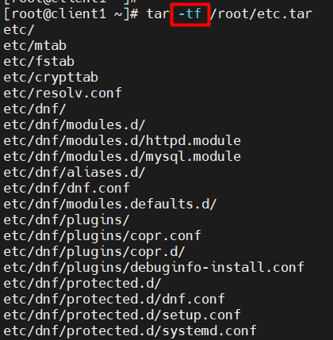
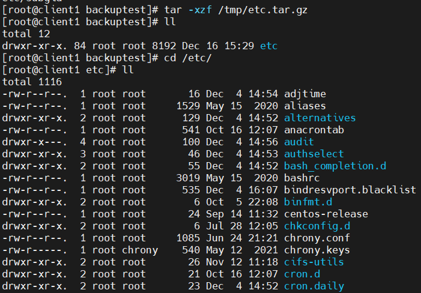
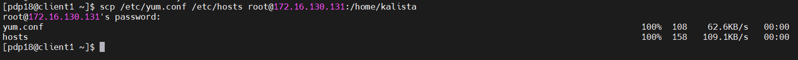
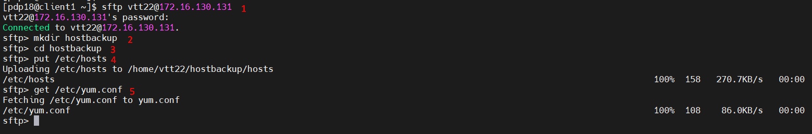
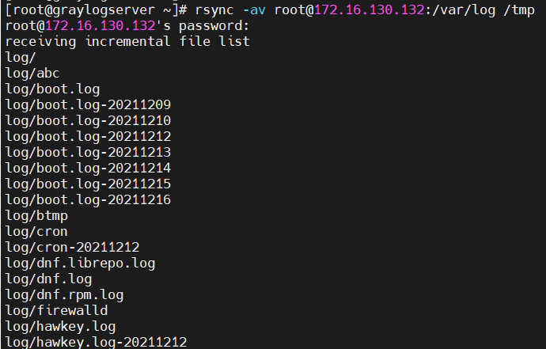

# Mục lục     
[1. Lưu trữ](#1)     
[2. Chuyển files](#2)       

## [Tham khảo](#3)    

-----    

     
### 1. Lưu trữ         

- Lệnh `tar`: dùng để lưu trữ files or directory thành một file nén.       
- Các dạng nén đang sử dụng đó là `gzip, bzip2 or xz`        
- Cấu trúc:    
    - `tar [Options]`:     
    - [Options]     
       - `-c` --create: tạo lưu trữ mới.   
       - `-x` --Extract: Trích từ một lưu trữ có sẵn.     
       - `-t` --list: Hiện thị nội dung bảng của một lưu trữ.          
       - `-v` --verbose: Hiện thị quá trình nén lên màn hình.         
       - `-f` --file: Tên file tar được tạo ra.   
       - `-p` : Duy trì quyền của file và thư mục khi trích xuất một kho lưu trữ.     
       - `-z` --gzip: nén gzip (filename.tar.gz or filename.tgz).        
       - `-j` --bzip2: nén bzip2 (filename.tar.bz2).     
       - `-J` --xz: nén xz (filename.tar.xz).               

- Lệnh `tar -cf /root/etc.tar /etc `: tạo một kho lưu trữ tên là `etc.tar` với nội dung chứa trong thư mục `/etc`.         
 
    

- Lệnh `tar -czf /tmp/etc.tar.gz /etc`: tạo một kho lưu trữ thư mục `/etc` sử dụng nén gzip. Lưu trữ trong file `/tmp/etc.tar.gz`.     
- Các bước để trích xuất một file nén sang lưu ở thư mục `backuptest`     
    - B1: Tạo thư mục backuptest `mkdir backuptest`.   
    - B2: Thay đổi đến thư mục backuptest `cd backuptest/`.  

    - B3: Hiện thị nội dung kho lưu trữ trước khi trích xuất đi. `tar -tzf /tmp/etc.tar.gz `  
    - B4: Trích xuất kho lưu trữ sang thư mục cần lưu.   
    `tar -xzf /tmp/etc.tar.gz`      

    

    
### 2. Chuyển file    

####  Lệnh scp    
- Lệnh `scp /etc/yum.conf /etc/hosts root@172.16.3.2 /home/kalista`: copy file `/etc/yum.conf` và `/etc/hosts`  từ máy local sang file `/home/kalista` của máy server với IP 172.16.3.2.          

   

#### Lệnh sftp    

- Lệnh `sftp [user@]host`: để xác định target system và username.           

   

- `1`: kết nối đến root@172.16.x.x    
- `2`: tạo một thư mục `hostbackup` được lưu ở thư mục root.   
- `3`: chuyển vào thư mục `hostbackup`     
- `4`: upload file `/etc/hosts` vào thư mục `hostbackup`   
- `5`: download file `/etc/yum.conf` vào thư mục `/home/user` or `/root`.    

#### Lệnh rsync      

- Lệnh `rsync -av root@172.16.x.x:/var/log /tmp`: đồng bộ thư mục `/var/log ` trong hệ thống root@172.16.x.x đến thư mục `/tmp`   

        

     

## Tham khảo   

