# Mục lục     

[1. Repository là gì ?](#1)    
[2. RPM (Redhat Package Manager) là gì ?](#2)     
[3. Yum (Yellowdog Updater Modifier) là gì ?](#3)                    
[4. Common Commands](#4)      

## [Tham khảo](#5)          

-----      

<a name='1'></a>      
### 1. Repository là gì?         

- Repository gọi tắt là `repo`: là nơi lưu trữ mà từ đó hệ thống của bạn truy xuất và cài đặt các ứng dụng và bản cập nhật OS.      
- Mỗi kho lưu trữ là một tập hợp các phần mềm được lưu trữ trên một máy chủ từ xa và được sử dụng để cài đặt và cập nhật các gói phần mềm trên hệ thống Linux.      
- Lệnh `yum-config-manager`: được sử dụng để enable/disable `repo`.      
   - VD: `yum-config-manager --disable  baseos`                
             
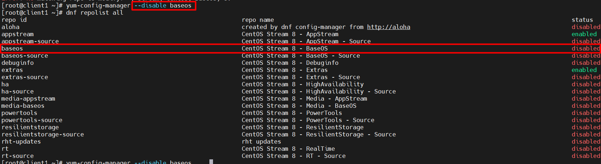      

### Cách tạo một Repo trên local    
   
- B1: Sử dụng lệnh `yum-config-manager` để thêm một gói `repo`.         
```   
yum-config-manager --add-repo="http://content.example.com/rhel8.0/x86_64/rhcsa-practice/rht"          
```       
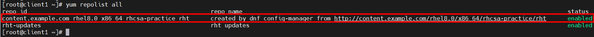  
- B2: Backups các file repo    
   - Di chuyển tất cả các file `.repo` trong thư mục `/etc/yum.repos.d/` sang thư mục khác.    
```  
mkdir /opt/backups-repo    
mv /etc/yum.repos.d/*.repo /opt/backups-repo/     
```     

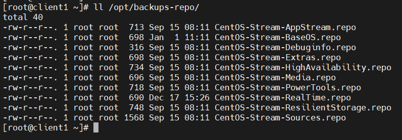   
- B3: Sử dụng lệnh Vi để edit cấu hình `/etc/yum.repos.d/content.example.com_rhel8.0_x86_64_rhcsa-practice_rht.repo` để thêm gpgcheck=0 để disable GPG key check cho `repo`.        

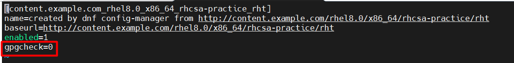    
- B4: Tạo file và cấu hình `/etc/yum.repos.d/aloha.repo` để enable cập nhật `repo` với nội dung sau:   
```   
[rht-updates]   
name=rht updates   
baseurl=http://content.example.com/rhel8.0/x86_64/rhcsa-practice/aloha   
enable=1
gpgcheck=0  
```      
- Giải thích:   
   - Dòng 1: Tên repo sẽ hiện thị trong quá trình cài đặt gói.   
   - Dòng 2: Tên của Repo.  
   - Dòng 3: Vị trí Package.    
   - Dòng 4: Bật sử dụng Repo.   
   - Dòng 5: Bật cài đặt an toàn. Nếu set là 0 thì có nghĩa là tắt.     

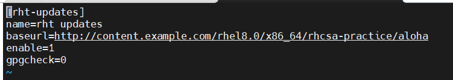   

<a name='2'></a>      
### 2. RPM (Redhat Package Manager) là gì ?     

- Tên file gói RPM bao gồm 4 thành phần: `name-version-release.architecture`(kèm theo đuôi `.rpm`)     

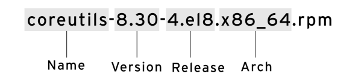     

- RPM có 5 mode basic để vận hành. Mỗi mode có thể sử dụng command `rpm` theo sau đó là `options`. Tuy nhiên, RPM không giải quyết được các phụ thuộc trên sở hữu của nó. Vì vậy, chúng ta sẽ làm việc với trình quản lý gói cấp cao hơn đó chính là `YUM`.     

1. Installing     
`rpm -ivh telnet.rpm`    
2. Uninstalling       
`rpm -e telnet.rpm`     
3. Upgrade       
`rpm -Uvh telnet.rpm`      
4. Query       
`rpm -q telnet.rpm`     
5. Verifying         
`rpm -Vf <path to file>`     

<a name='2'></a>    
### 2. Yum là gì? (Yellowdog Updater Modifier)       

- Yum là trình quản lý gói mã nguồn mở và miễn phí dùng để cài đặt, update, remove và tìm kiếm gói phần mềm trong một hệ thống.          
- Thư mục `/etc/yum.repos.d/` lưu trữ thông tin các gói và cung cấp gói độc lập trên bản phân phối dựa trên RPM và file lưu trữ sẽ có thêm đuôi `.repo`.           
- Yum là trình quản lý gói level-high nhưng vẫn dựa trên RPM để quản lý các gói trên hệ thống Linux.    
- Khác với RPM, Yum sử dụng nhiều kho lưu trữ của bên thứ ba để cài đặt các gói tự động bằng cách giải quyết các vấn đề phụ thuộc của chúng.    
      
- Lệnh `yum update`: dùng để cập nhật các gói tin trong repository lên new version.      

<a name='3'></a>    
### 4. Common Commands    
- Lệnh `yum repolist`: hiển thị danh sách tất cả `repository` đã thêm trong hệ thống.       

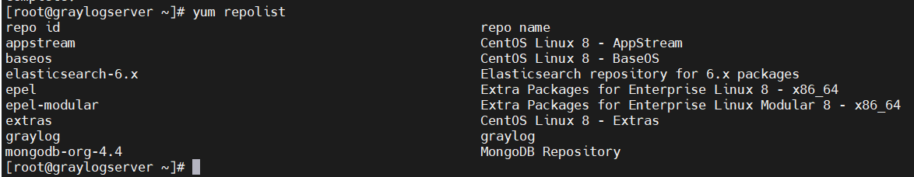     

- Lệnh `yum provides scp`: dùng để kiểm tra gói nào nên được cài để lệnh có thể hoạt động.       

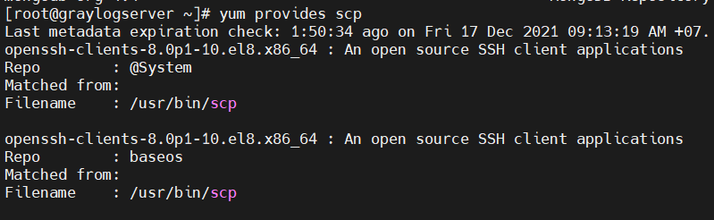      

- Lệnh `yum install httpd -y`: dùng để cài gói httpd và tự động điền `y` cho lời nhắc trong khi vận hành.          

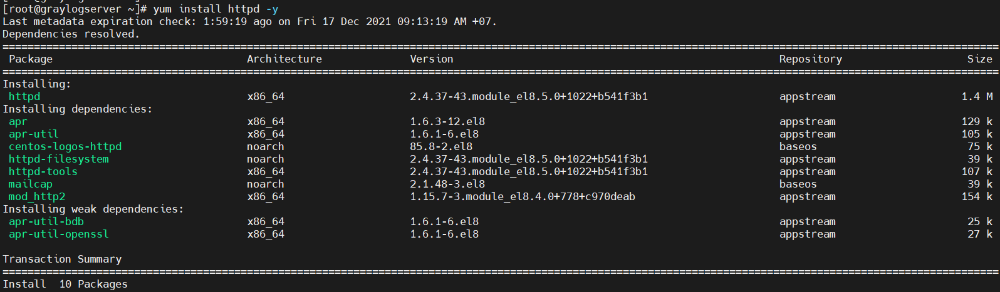    
- Lệnh `yum remove httpd`: dùng để xóa gói (cùng với sự phụ thuộc của gói).       

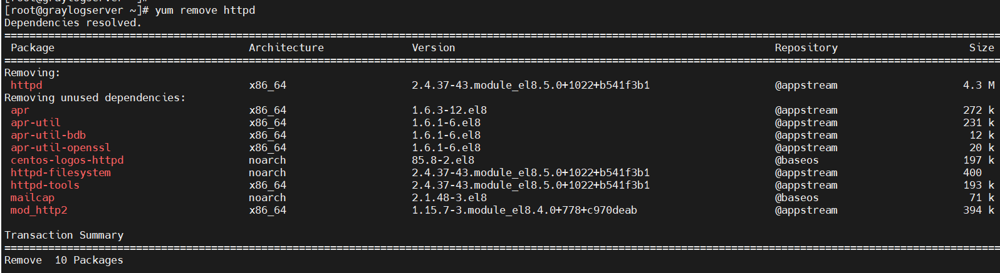  
- Lệnh `yum update httpd`: dùng để cập nhật gói.     

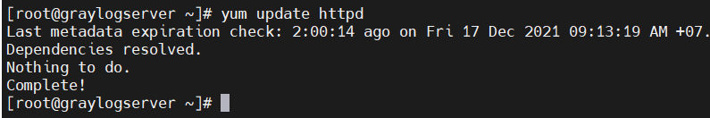      

- Lệnh `yum list`: để tìm kiếm gói cụ thể có tên.     

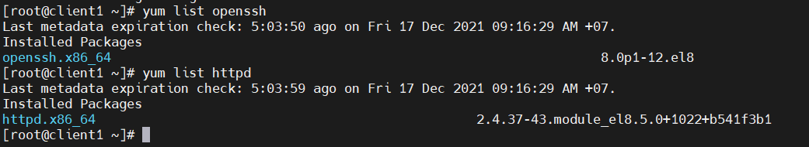     

- Lệnh `yum search`: để tìm kiếm các gói với từ khóa cần tìm và hiện thị nó.            

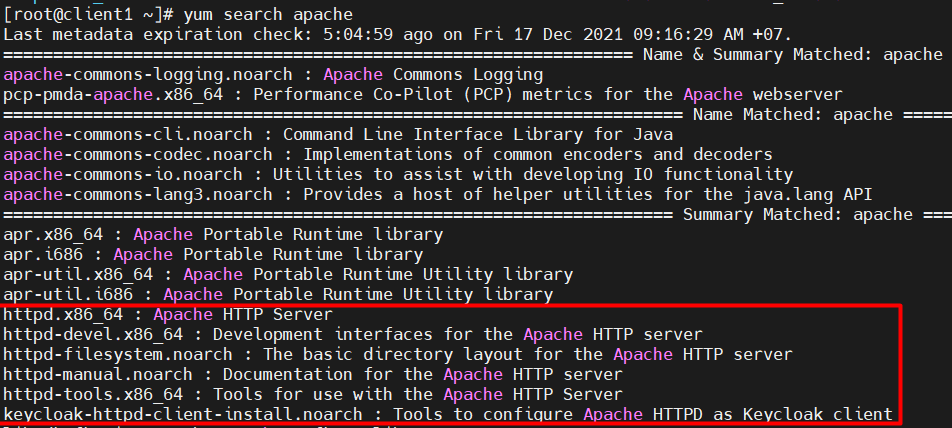        

- Bạn có thể cài đặt một nhóm riêng và nó sẽ cài đặt các gói liên quan thuộc nhóm.
- Lệnh `yum grouplist`: hiện thị tất cả các nhóm sẵn có.        

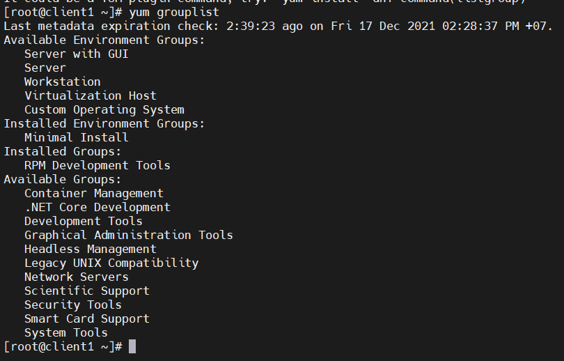      

- Lệnh `yum groupinstall 'System Tools'`: để cài đặt một nhóm gói System Tools.        

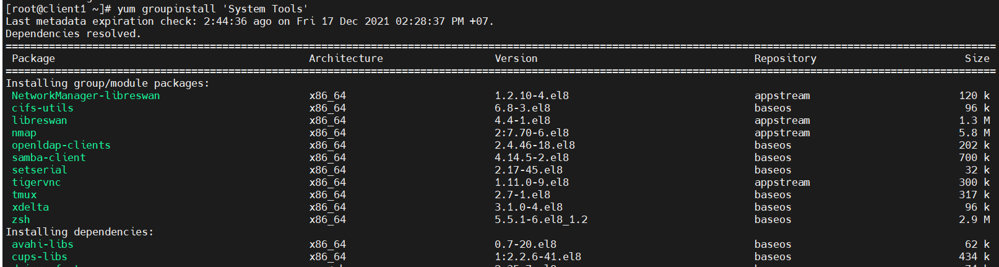       


<a name='3'></a>     

## Tham khảo    
[1]https://blogd.net/linux/cac-thao-tac-co-ban-voi-yum/   
[2]https://news.cloud365.vn/huong-dan-tao-local-yum-repository-tren-centos-7-voi-dia-iso-dvd/
        


