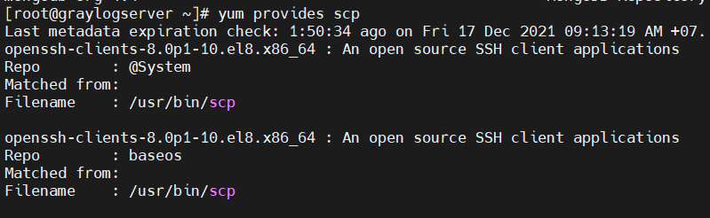
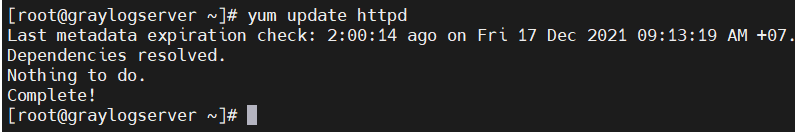
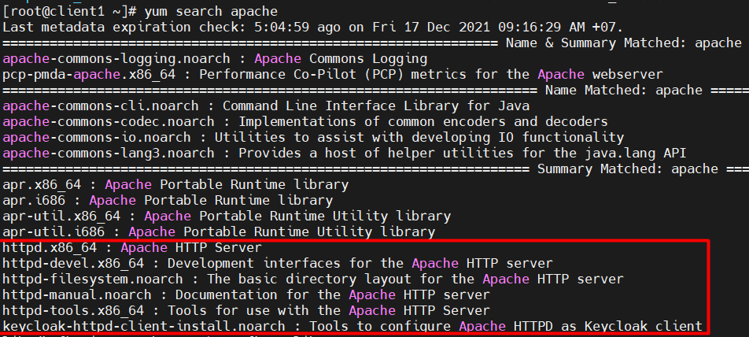

# Mục lục    
[1. RPM](#1)    
[2. YUM](#2)      

## [Tham khảo](#3)      
----    

     

### 1. RPM (Redhat Package Manager)      

- RPM là trình quản lý gói level-low.
- RPM có 5 mode cơ bản để vận hành.        
    - Installing 
    - Uninstalling    
    - Upgrade      
    - Query      
    - Verifying       

        

    
### 2. Yum (Yellowdog Updater Modifier)       

- Yum là trình quản lý gói mã nguồn mở và miễn phí.       
- Thư mục `/etc/yum.repos.d/` lưu trữ thông tin các gói và cung cấp gói độc lập trên bản phân phối dựa trên RPM và file lưu trữ sẽ có thêm đuôi `.repo`.           
- Yum là trình quản lý gói level-high nhưng vẫn dựa trên RPM để quản lý các gói trên hệ thống Linux.    
- Khác với RPM, Yum sử dụng nhiều kho lưu trữ của bên thứ ba để cài đặt các gói tự động bằng các giải quyết các vấn đề phụ thuộc của chúng.    

       

- Lệnh `yum update`: dùng để cập nhật các gói tin trong repository lên new version.  

### Common Commands    
- Lệnh `yum repolist`: hiển thị danh sách tất cả `repository` đã thêm trong hệ thống.     

     

- Lệnh `yum provides scp`: dùng để kiểm tra gói nào nên được cài để lệnh có thể hoạt động.      

      

- Lệnh `yum install httpd -y`: dùng để cài gói httpd và tự động điền `y` cho lời nhắc trong khi vận hành.          

    
- Lệnh `yum remove httpd`: dùng để xóa gói (cùng với sự phụ thuộc của gói).       

  
- Lệnh `yum update httpd`: dùng để cập nhật gói.     

      

- Lệnh `yum list`: để tìm kiếm gói cụ thể có tên.     

     

- Lệnh `yum search`: để tìm kiếm các gói với từ khóa cần tìm và hiện thị nó.            

     

     

## Tham khảo    
[1]https://blogd.net/linux/cac-thao-tac-co-ban-voi-yum/
        

