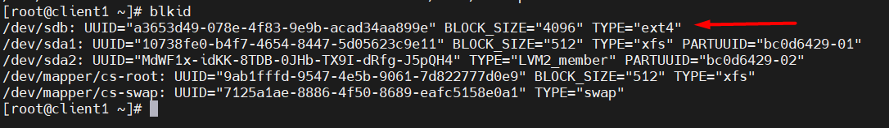

# Mục lục      
[1. Tạo phân vùng](#1)     
[2. Cách thực hiện Mount sau khi gắn Volume mới](#2)    
[3. Tìm file trong local](#3)          

## [Tham khảo](#4)     

-----   

<a name='1'></a>      
### 1. Tạo phân vùng           

*Trước hết ta phải add thêm một disk cho máy. Vào `VM` -> `Setting` -> `Hard Disk` -> `Add`*       
- Lệnh `lsblk`: kiểm tra volume đã được gắn vào máy ảo chưa.     

     

- Ta thấy, một harddisk sdb mới được tạo có 20G và harddisk này chưa được định dạng.      
- Với /dev/sdb mới chưa được định dạng nói trên, trước hết ta dùng lệnh fdisk.     
```  
fdisk /dev/sdb    
```     
- Sau khi dùng `fdisk /dev/sdb`, sẽ xuất hiện chế độ gõ lệnh của fdisk, ấn `m` để đưa ra các hướng dẫn về lệnh fdisk. Trong ví dụ này, ta chọn `n` để thêm một partition mới.    

    

- Sau khi chọn `n`, xuất hiện các lựa chọn: lựa chọn `p` để tạo primary partition - phân vùng có thể boot được, lựa chọn `e` để tạo một phân vùng extended. Bước này chọn `p`, chương trình sẽ hỏi Partition number (1-4), gõ số 1. Chương trình sẽ cho phép bạn thay đổi First cylinder và Last cylinder. Chọn First cylinder = 2048 và Last cylinder = 41943039. Fdisk sẽ quay trở lại chế độ gõ lệnh chính của nó.    
- Gõ `w` để lưu lại bản ghi đã thay đổi.     

    

- Gõ lệnh `fdisk -l` để xem những thay đổi vừa rồi.    

    
- Lệnh `lsblk` để xem những thay đổi.  

   

*Ta thấy volume `sdb` được gán vào máy ảo nhưng chưa được mount với bất kì thư mục nào trong hệ thống Linux*.     

<a name='2'></a>    
### 2. Cách thực hiện Mount sau khi gắn Volume mới.        

- B1: Thực hiện tạo file system cho Volume cần mount, ở đây ta sẽ dùng ext4 (hoặc có thể dùng xfs):   `mkfs.ext4 /dev/sdb`        

    

- B2: Tạo thư mục mới để mount volume với thư mục này.   
`mkdir /backup`      

- B3: Thực hiện mount volume `sdb` với thư mục này.    
`mount /dev/sdb /backup`      


*Kiểm tra xem đã mount thành công chưa bằng lệnh `df -Th`      

    

- Nhưng để cấu hình máy ảo tự nhận volume sau khi reboot ta phải cấu hình file `/etc/fstab`.    
- B1: Lấy uuid của volume.     `blkid`        

     
- B2: Cấu hình file `/etc/fstab` thêm vào dòng cuối      

     

- B3: Thực hiện mount tất cả những gì đã khai báo trong file `/etc/fstab`     
```   
mount -a    
```     
- Lệnh `unmount`: để thoát ổ đĩa ra một cách an toàn mà không làm hỏng dữ liệu lưu trữ trong đó.    

<a name='3'></a>        
### 3. Tìm file trong local        

- Có 2 cách để tìm file:        
   - Cách 1: Sử dụng lệnh `locate` để tìm kiếm một pattern (mẫu) nhất định thông qua file cơ sở dữ liệu được tạo bởi lệnh `updatedb`.    
   - Cách 2: Sử dụng lệnh `find` để tìm kiếm các files trong real-time thông qua phân cấp hệ thống files.        

- Lệnh `find đường_dẫn -name ký_tự_cần_tìm`: cung cấp cho bạn một danh sách tất cả các file và thư mục trong đường dẫn hiện hành.  
- VD: `find / -name '*.txt'`: tìm kiếm các files bắt đầu là thư mục / và kết thúc `.txt`.        

    

- Lệnh ` find / -type [d,f,l,b] -name tên_thư_mục`: chỉ tìm kiếm thư mục or file, soft link, block device, sử dụng `-type d or f,l,b`.        

       
- Tìm kiếm dựa trên kích thước, sử dụng `-size`     
```   
find -size kích thước    
```  
VD: Để tìm kiếm tất cả các file có kích thước lớn hơn 50M và nhỏ hơn 100M.    

`find -size +2M -size -10M`       

      

- Tìm kiếm tất cả các file thay đổi theo thời gian, sử dụng `-mmin`      

```   
find / -mmin thời gian  
```    
VD: Để tìm kiếm tất cả các file thay đổi trong 10 phút trước.     
`find / -mmin 10`     

- Lệnh `locate`: sẽ tìm nhanh và chi tiết hơn lệnh `find`. Lệnh sẽ trả về một danh sách tất cả các đường dẫn chứa nhóm ký tự đặc biệt.     
- Cài đặt:    
``` 
yum install mlocate -y   
updatedb 
```    
VD: Tìm tất cả các tập tin, thư mục có tên vtt22        

   


<a name='4'></a>     
### Tham khảo   
[1]https://news.cloud365.vn/lam-viec-voi-lenh-find-va-locate/   
[2]https://datnt.work/mount-va-unmount-trong-linux/ 


