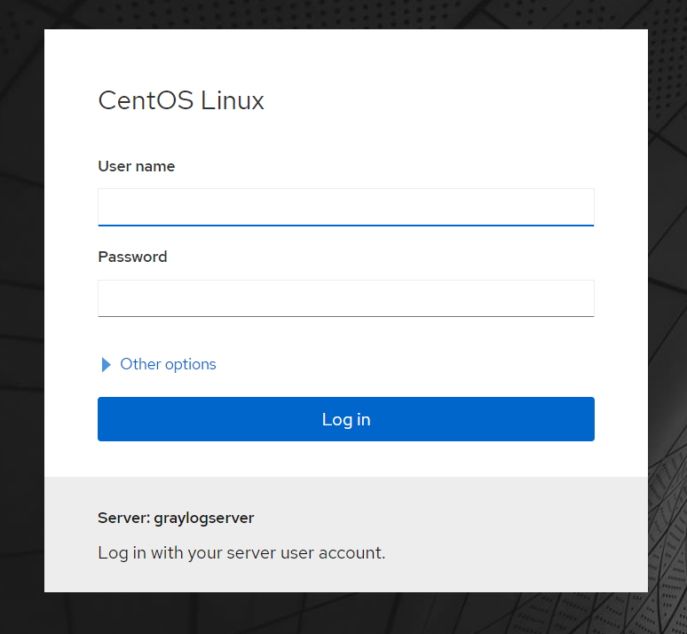
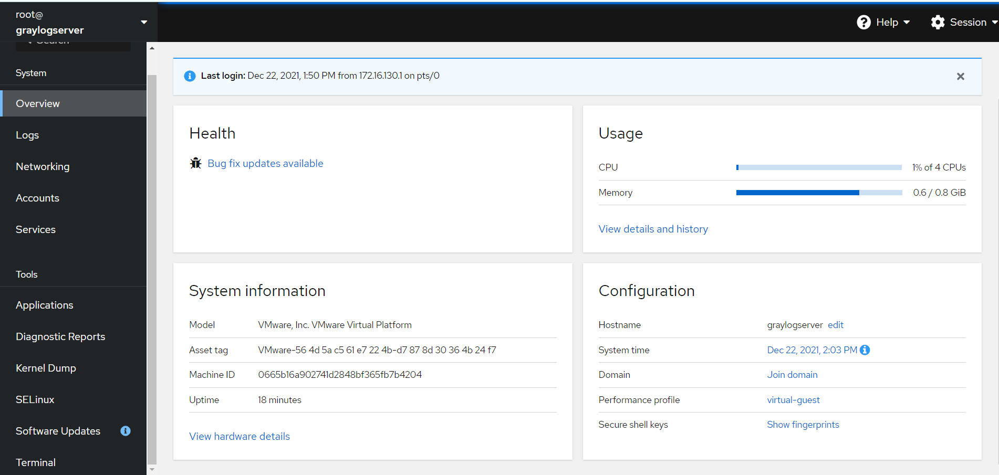
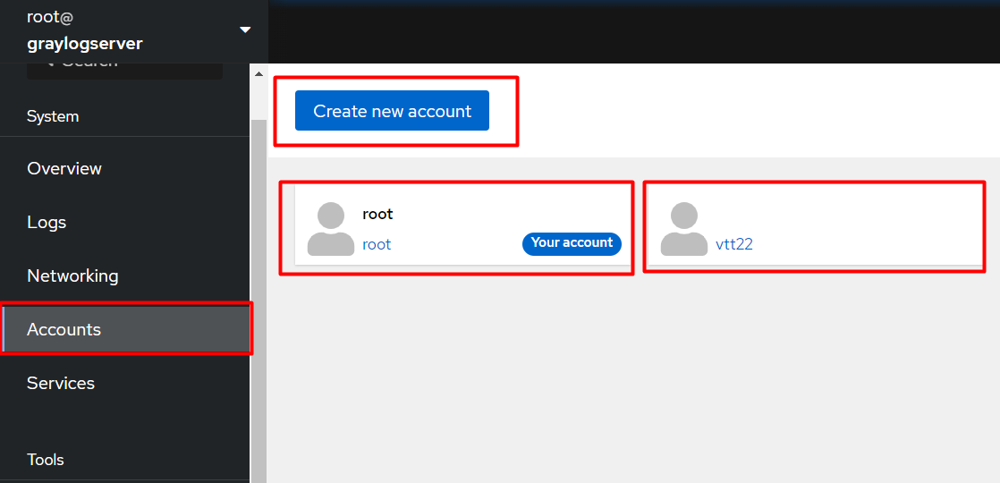
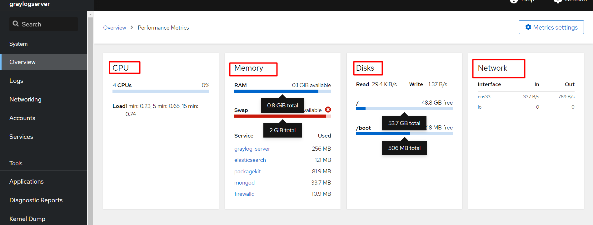
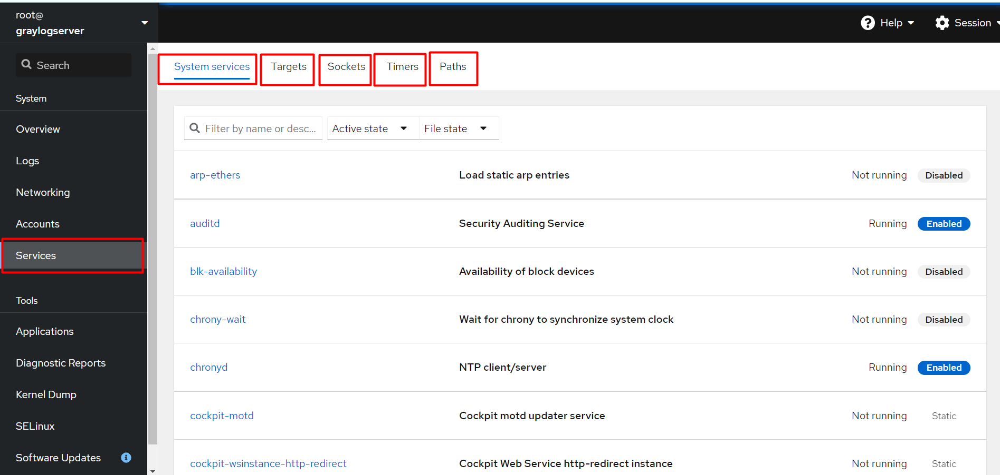
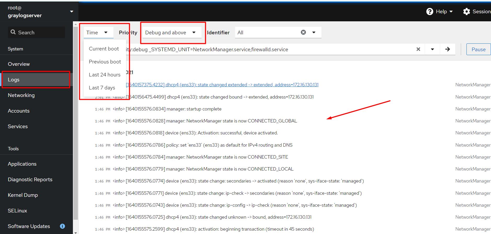
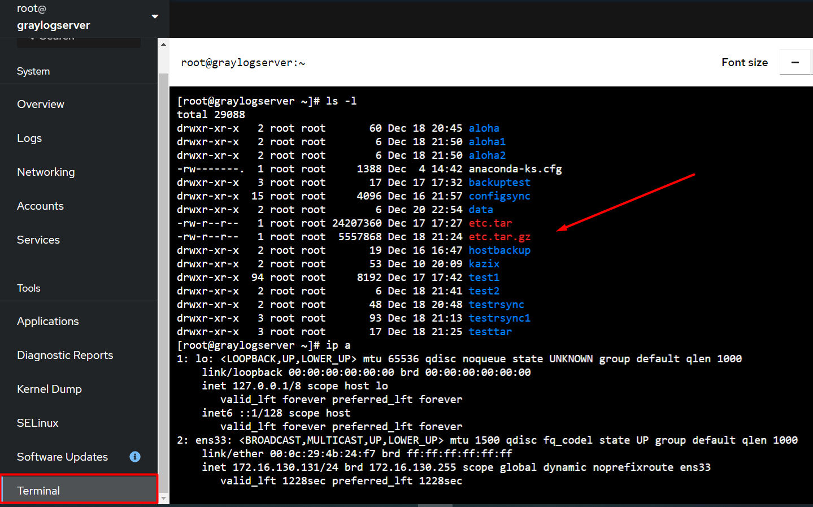
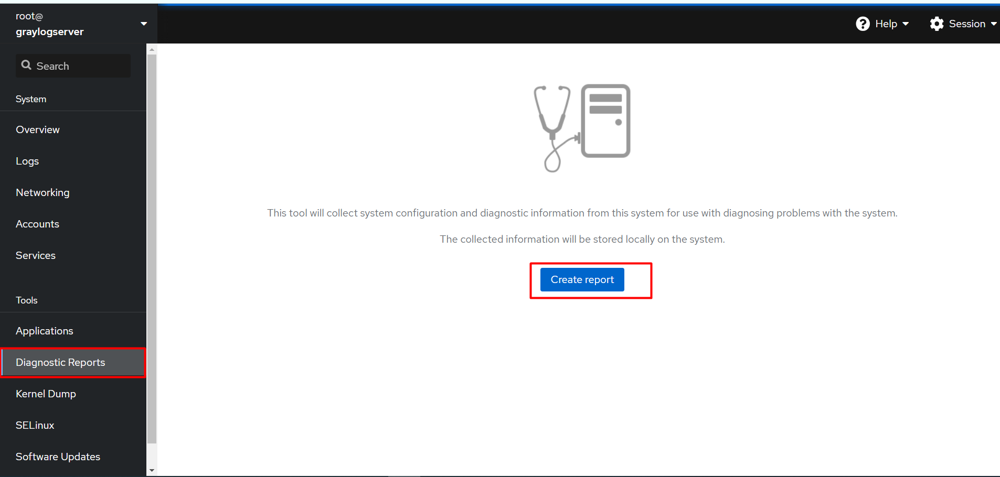
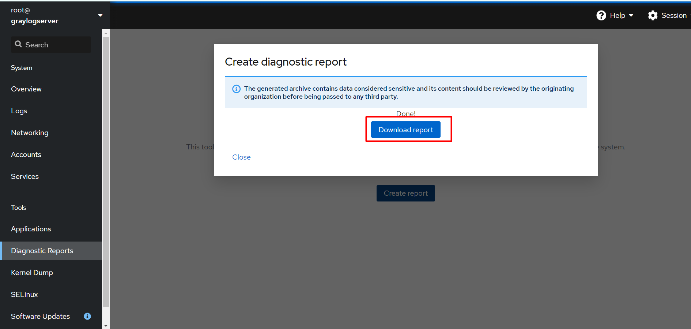

# Mục lục   
[1. Web Console](#1)   

## [Tham khảo](#3)      
-----   

<a name='1'></a>     
### 1. Web Console     
- Web Console là công cụ xử lý sự cố hữu ích hơn khi làm việc với phiên terminal.     
- Để mở Web Console ta phải kích hoạt enable và start service `cockpit.socket` khi chạy một web server, bằng cách:    
```    
sudo systemctl enable --now cockpit.socket    
```  
- Sau đó bạn phải cấu firewall để thêm service cockpit.socket và mở port 9090 trong firewall, bằng cách:     
```  
sudo firewall-cmd --add-service=cockpit --permanent    
sudo firewall-cmd --reload  
```     

- Sau khi đã kích hoạt thành công, thì bạn lên trình duyệt web và gõ `https://servername:9090` trong đó `servername` ở đây là `hostname` or `địa chỉ IP` của server bạn.      
- Và sau đó bảng này sẽ hiện ra: 
    
      

- Bạn nhập username và password để login thành công, và screen này sẽ hiện ra.    

     

- Bạn có thể tạo tài khoản hoặc thay đổi mật khẩu trong mục `Accounts`.       

     

- Để xem tổng quan thông tin hệ thống của bạn và hiệu suất của `CPU`, `Memory`, `Disk I/O` and `Network`     

      

- Mục `Service`, bạn có thể xem `Targets`, `System Services`, `Sockets`, `Timers` and `Path`.       

     

- Để kiểm tra `log` của hệ thống, bạn vào mục `Logs`. Log thì đã được phân loại thành `Errors`, `Warnings`, `Notices` và `All` như hình dưới. Ngoài ra, bạn có thể xem log theo thời gian.      

    

- Để chạy lệnh từ phiên terminal ngay trên giao diện thì bạn vào mục `terminal`, nó sẽ hiện thị shell cho bạn.     

    

- Để tạo `Diagnostic Reports` nhằm mục đích báo cáo chi tiết cấu hình, thông tin hệ thống và thông tin chẩn đoán từ hệ thống của bạn.       

     

- Bạn click vào `Download report` để lưu report.    

    


