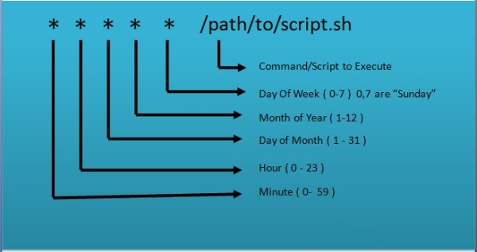
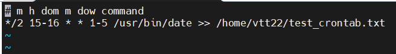
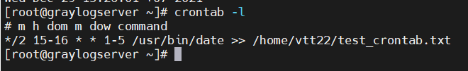
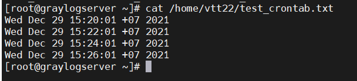
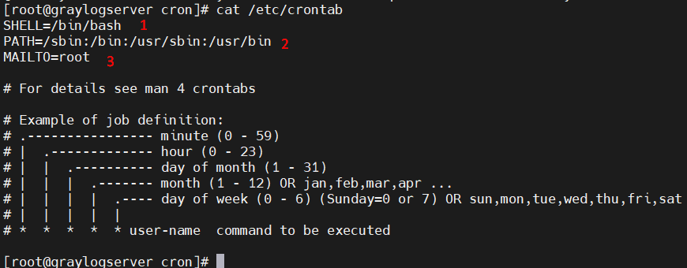
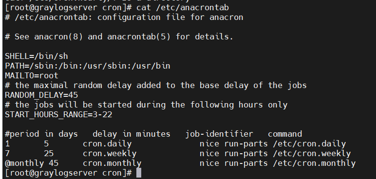

# Mục lục    
[1. Mục đích sử dụng Crontab?](#1)       
[2. Khái niệm](#2)    
[3. Nguyên lý hoạt động](#3)   
[4. Lab](#4)

## [Tham khảo](#5)   

-----   

      
### 1. Mục đích sử dụng Crontab?     

- Tính năng của Cron trong Linux là một chế độ sắp xếp tự động các chương trình, ứng dụng và kích hoạt chúng tại một thời điểm nhất định trong hệ thống (tương tự với Task Scheduler của Windows)
- Tính năng này rất phù hợp trong quá trình tự động:    
   - Sao lưu dữ liệu    
   - Bảo dưỡng hệ thống    
   - Gửi email thống kê cho khách hàng mỗi tuần.     
   - Xóa những file cache có dung lượng quá lớn hàng tháng.       

    
### 2. Khái niệm      

*Cron là gì? Crontab là gì? Cronjob là gì?*      
- Cron là một tiện ích giúp lập lịch chạy những dòng lệnh cho server để thực thi các công việc theo thời gian được lập sẵn.          
- Cronjob là các lệnh thực thi hành động đặt trước vào thời điểm nhất định. Crontab là nơi lưu trữ các cronjob.    
- Cron là một chương trình daemon (nó chạy ngầm trong background). Như các daemon khác thì bạn cần khởi động lại nó nếu như có thay đổi thiết lập gì đó. Chương trình này nhìn vào file thiết lập có tên là crontab để thực thi những task được mô tả ở bên trong.      

     
### 3. Nguyên lý hoạt động    

- Một cron schedule đơn giản là một text file. Mỗi người dùng có một cron schedule riêng.     
- File này thường nằm ở `/var/spool/cron`.     
- Lệnh thường dùng:   
   - `crontab -e`: tạo hoặc chỉnh sửa file crontab.   
   - `crontab -l`: hiển thị file crontab.   
   - `crontab -r`: xóa file crontab.      

- Cấu trúc của crontab:       

     

   
### 4. LAB      

- Dùng lệnh `crontab -e` để thiết lập cronjob.       

   

- Giải thích: Mỗi hai phút từ 15h đến 16h trong tuần từ Monday-Friday gửi `date` của hệ thống đến file `test_crontab.txt` trong thư mục `home`.  

- Dùng lệnh `crontab -l`: để kiểm tra xem lệnh đã được thực thi chưa?    

     
- Kết quả:    

#### System jobs       

1. Cron.d     
    - Thư mục `/etc/cron.d` là nơi chứa các file cài đặt cron.   
    - File cấu hình mặc định của crontab.    

         
    - Trong đó:   
       - Dòng 1: chỉ định shell để sử dụng khi các câu lệnh được thực thi.   
       - Dòng 2: có nhiệm vụ thiết lập PATH cho môi trường.   
       - Dòng 3: đặt địa chỉ mail nhận các kết quả của cron job.           
2. Anacron     
    - Thực hiện chức năng tương tự như crond. Nhưng nó có thể chạy các job đã bị bỏ qua như máy tính đã tắt hoặc không thể chạy job trong một thời gian nhất định.     
    - Lưu ý: Các job chỉ chạy một lần, bất kể bao nhiêu lần nó bị lỡ lịch.     
    - File cấu hình mặc định của anacrontab    

         
    - Chương trình anacron chạy job trong `/etc/cron.daily` hàng ngày, `/etc/cron.weekly` hàng tuần, `/etc/cron.monthly` mỗi tháng.    
3. Shortcut trong crontab     
- Các shortcut (phím tắt) thời gian có thể thay thế đến 5 trường thường dùng để chỉ định thời gian. Ký hiệu `@` để xác định shortcut cho cron.    
   - @reboot: Chạy sau khi reboot.   
   - @yearly: Chạy hàng năm, ví dụ: 0 0 1 1 *    
   - @annually: Chạy hàng năm, ví dụ: 0 0 1 1 *    
   - @monthly: Chạy hàng tháng, ví dụ: 0 0 1 * *   
   - @weekly: Chạy hàng tuần, ví dụ: 0 0 * * 0    
   - @daily: Chạy hàng ngày, ví dụ: 0 0 * * *   
   - @hourly: Chạy mỗi giờ, ví dụ: 0 * * * *     

   
### Tham khảo        
[1]https://vietnix.vn/crontab/#crontab-la-gi     
