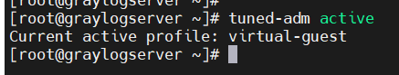
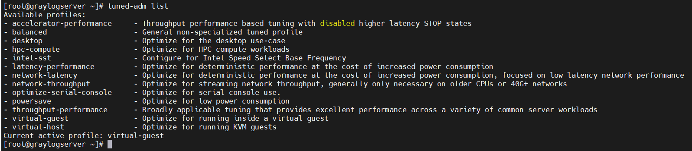
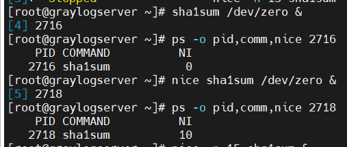
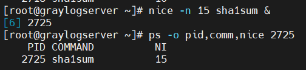
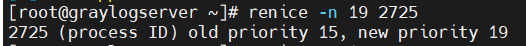

  # Mục lục   
 [1.Tuning Profiles](#1)    
 [2. Influencing Process Scheduling](#2)

# [Tham khảo](#3)

 ---

     

 ## 1. Tuning Profiles Distributed  
 |Tuned Profile|Mục đích|  
 |----|----|      
 |Balanced|Yêu cầu thoải hiệp giữa power saving và performance|   
 |Desktop|Nguồn gốc từ `balanced profiles` nhưng cung cấp nhanh hơn yêu cầu tương tác ứng dụng  |        
 |Throughput-performance|Điều chỉnh hệ thống để có thông lượng tối đa|    
 |latency-performance|Lý tưởng cho hệ thống máy chủ yêu cầu độ trễ thấp ở chi phí tiêu thụ năng lượng|     
 |network-latency|Nguồn gốc từ `latency-performance` profiles. Nó có thể thêm mạng, điều chỉnh thông số để cung cấp độ trễ thấp|      
 |Network-throughput|Nguồn gốc từ `Throughput-performance` profiles. Thêm mạng, điều chỉnh thông số thì được ứng dụng cho thông lượng mạng tối đa.|      
 |powersave|Điều chỉnh hệ thống cho power saving.|     
 |oracle|Tối ưu cho load database Oracle trong profile `throughput-performance`|      
 |virtual-guest|Điều chỉnh hệ thống cho hiệu suất tối đa nếu nó chạy trong một máy ảo.|    
 |virtual-host|Điều chỉnh hệ thống cho hiệu suất tối đa nếu nó kích hoạt là một host cho máy ảo.|    

 - Lệnh để quản lý `Profiles`.     
 - Câu lệnh: `tuned-adm`    
     - Kích hoạt `tuning profiles` sử dụng lệnh:  
     - `tuned-adm active`  

   

- Lệnh `tuned-list`: hiện thị danh sách tất cả tuning profiles có sẵn.      

   
- Lệnh `tuned-adm profile throughput-performance`: dùng để chuyển sang profile khác.    

    

## 2. Influencing Process Scheduling  

- Giá trị mức độ `nice` từ `-20 (highest priority) đến 19 (lowest priority)`.      
- Mức độ nice cao hơn hiện thị ít priority ( quá trình sẽ không cần đến CPU để sử dụng).    
- Mức độ nice thấp hơn hiện thị nhiều priority (quá trình cần đến CPU).      
- Process có priority cao hơn sẽ nhận ít thời gian CPU hơn với mức `nice` thấp hơn.     

### Lệnh Nice
- Lệnh `nice`: dùng để sử dụng bởi tất cả người dùng để bắt đầu lệnh với một default hoặc mức độ nice cao hơn.   
- Process với giá trị nice mặc định là 10.     

    
- Option `-n`: dùng để áp dụng mức độ nice mặc định của người dùng để bắt đầu process.    
VD: `nice -n 15 sha1sum &`     

     

### Lệnh Renice    
- Lệnh `renice`: dùng để thay đổi mức độ nice đang có sẵn của process.     

VD: `renice -n 19 2725`: thay đổi mức độ nice hiện tại là 15 sang mức độ nice là 19.    

    

   
## 3. Tham khảo    

