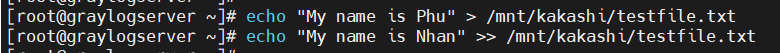

# Mục lục  
[1.ACLS là gì?](#1)  
[2. Ví dụ minh họa](#2)   

## [Tham khảo](#3)     

----   

    

## 1. ACLS là gì ?    
-  ACLs (Acess Control Lists): là cách khác để xác định quyền trên tệp tin hoặc thư mục. 
- ACLs hỗ trợ các hệ thống file ReiserFS, Ext2, Ext3, JFS, XFS. Một tệp và thư mục có thể có nhiều ACL.   
- Có 2 kiểu ACLs: `access ACLs` và `default ACLs`.      
   - `access ACLs`: được áp dụng cho một file cụ thể hoặc một thư mục.     
   - `default ACLs`: chỉ được áp dụng cho thư mục.       
- Lệnh `ls alista.txt`: dùng để kiểm tra quyền.      

     

- Lệnh `getfacl alista.txt`: dùng để kiểm tra trạng thái khởi đầu của ACL.    

     
- Gán quyền read, write và execute cho user root và group root.    

   
- Option `-m`: dùng để nhắc `setfacl` chỉnh sửa một ACL đã tồn tại.    

- Xem lại ACL với lệnh `getfacl`:    

      

- ACL mask định nghĩa quyền tối đa rằng bạn có thể cấp quyền named users, group owner và named group. Ngoài ra, nó không hạn chế quyền của file owner or other users.    
  
***Tất cả các file và thư mục thực hiện ACLs sẽ có một ACL mask.***          

VD: Điều chỉnh bỏ quyền write của group, output của lệnh ls cho thấy mask bits đã được điều chỉnh với chmod.     

       

***Chmod không ảnh hưởng trong bất kì quyền group cho file với thiết lập ACLs, nhưng nó được cập nhật bởi ACL mask.***           

   

## 2. Ví dụ minh họa   

### Access ACLs  
VD: Tạo một group tecmint và thêm tên người dùng kitty và sasuke cho nó.  
      
     

- Và xem liệu cả hai users thuộc group phụ chưa ta sẽ kiểm tra như sau:    

    

- Bước tiếp theo, tạo một thư mục mới gọi là kakashi trong thư mục /mnt và tên file testfile.txt bên trong. 
- Chúng ta sẽ thiết lập owner group tecmint và thay đổi default của nó, quyền ugo/rwx thành 770 (quyền read, write và execute cấp cho cả owner và group owner của file ).        

     
- Thêm nội dung vào file `testfile.txt`.     

     

- Lệnh `setfacl -R -m u:boruto:rwx /mnt/kakashi`: Để đưa người dùng `boruto` quyền read và write truy cập vào file `/mnt/kakashi/testfile.txt`.    

    

- Đã thêm thành công ACLs cho phép `boruto` write cho file.   

    

- Để xem ACLs cho một file cụ thể hoặc thư mục, ta sử dụng lệnh `getfacl`:   

    

### Default ACLs       
- Các thư mục con và tệp kế thừa default ACL của thư mục cha.       

VD: Thêm một default ACLs vào một thư mục amumu/.     

     

- `getfacl` sẽ trả về cả `access ACL` và `default ACL`      

    

- Nếu tạo một thư mục con trong amumu, thư mục con này sẽ kế thừa `default ACL` từ amumu.    

  

- Nếu tạo file trong amumu, file này sẽ kế thừa `default ACL` từ amumu.    
 
      

***Note***   

   

- Option `X`: chỉ có quyền thực thi với thư mục và file có trong thư mục thực thi chứ không có quyền thực thi đối với file.    

# Quiz
|Description|ACL Operation|   
|----|----|     
|Hiện thị ACL trong một thư mục|getfacl /directory|      
|Tên người dùng với quyền read và execute cho một file|user:marry:rx file|      
|Owner file với quyền read và execute cho file|user::rx file|       
|Quyền read và write cho một thư mục được cấp owner group|g::rw /directory|     
|Quyền read và write cho một file được cấp owner group|g::rw file|     
|Quyền read, write và execute cho một thư mục được cấp tên group|group:hug:rwx /directory|    
|Quyền read và execute thiết lập default mask|default:m::rwx /directory|     
|Tên người dùng cấp quyền read cho new files, và quyền read và execute cho new subdirectory|default:user:mary:rx /directory|    

 

## Tham khảo    
[1]https://www.tecmint.com/rhcsa-exam-configure-acls-and-mount-nfs-samba-shares/   
[2]https://viblo.asia/p/hieu-ro-ve-quyen-truy-cap-tep-trong-linux-07LKXJ8elV4

      
