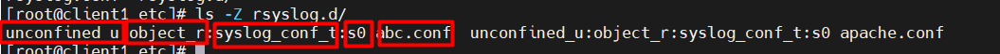

# Mục lục     
[1. SELinux là gì?](#1)    
[2. Chính sách của SELinux](#2)     
[3. SELinux Booleans](#3)      

## [Tham khảo](#4)   
----  

     

## 1. SELinux (Security Enhanced Linux) là gì?       
- SELinux là một mô-đun bảo mật ở nhân Linux, cung cấp cơ chế hỗ trợ các chính sách bảo mật kiểm soát truy cập (access control), bao gồm các điều khiển truy cập bắt buộc của Bộ Quốc phòng Hoa Kỳ (MAC_Mandatory Access Control).        
- SELinux xác định quyền truy cập và chuyển đổi quyền truy cập đến user, ứng dụng, file.
- SELinux có 3 chế độ hoạt động cơ bản, trong đó `Enforcing` là chế độ default khi install.   
    - `Enforcing`: Ghi log yêu cầu truy cập tại `/var/log/audit/audit.log`, sau đó kiểm tra chính sách, nếu không có quyền sẽ bị từ chối.    
    - `Permissive`:  
       - Chế độ Permissive, SELinux cho phép mọi truy cập, có ghi lại các log tại `/var/log/audit/audit.log`. 
       - Chế độ permissive hữu ích cho việc testing hoặc troubleshooting.   
    - `Disabled`: SELinux bị vô hiệu hóa hoặc bị tắt đi.           

- Kiểm tra SELinux ở chế độ nào bằng lệnh `sestatus`.    

       

- Như vậy, SELinux đang ở `status: enabled` và `mode: enforcing`.    
- Lệnh `getenforce`: để hiện thị modes hiện tại của SELinux.      

      
- Lệnh `setenforce`: để thiết lập modes hiện tại của SELinux.     

     

- Cài đặt Mode default SELinux.     
- File cấu hình SELinux `/etc/selinux/config`   

     

- Thay đổi dòng `SELINUX=` thay các giá trị như sau:    
   - `SELINUX=disabled`: tắt hoàn toàn.   
   - `SELINUX=permissive`: chế độ chỉ ghi ra log các yêu cầu truy cập, luôn cấp quyền truy cập.   
   - `SELINUX=enforcing`: kiểm tra quyền đầy đủ.   

  

## 2.Chính sách của SELinux     
- SELinux sử dụng một tập các nguyên tắc (chính sách) để xác định xem một tiến trình nào có thể truy cập các file nào, thư mục nào, cổng nào.         
- Như vậy, một ứng dụng khi hoạt động nó chỉ được truy cập đến các đối tượng được quy định trong chính sách dành cho nó.     

- Chính sách dành cho một ứng dụng ở đâu ra???  
   - Các chính sách SELinux dành cho ứng dụng do các lập trình viên đưa vào ứng dụng (không phải bạn).        
   - VD: `Apache` biết nó cần những quyền gì, những quyền đó được mô tả trong Apache và SELinux sẽ sử dụng chúng để kiểm tra.    

- SELinux sử dụng context (tập hợp thông tin bảo mật gán cho mỗi đối tượng) để xác định xem nó liên quan đến các chính sách bảo mật nào.    
- Sử dụng liệt kê các file của một thư mục với `option -Z`, ta sẽ thấy context liên quan đến file đó.        

    

- Lớp SELinux có một vài contexts: `user, role, type (và tùy chọn một cấp độ)`.    

       

*** Tên kiểu context thường có `_t` ở cuối.     
VD:  
- Kiểu context của web server là `httpd_t`.   
- MariaDB server có kiểu context là `mysqld_t`. 

   

- Lệnh `semanage fcontext`: dùng để hiện thị và biến đổi quy tắc (chính sách).     
    - Option:  
        -  `-a --add`: thêm một record cho kiểu file cụ thể.  
        - `-d --delete`: xóa một record của kiểu file cụ thể.   
        - `-l --list`: danh sách record của kiểu file cụ thể.        

- Lệnh `restorecon`: dùng để set default file context.      

- Lệnh `chcon`: dùng để thay đổi file context.    

        

   

## 3. SELinux BOOLEANS      

- Mỗi dịch vụ trên máy chủ sẽ được SELinux cấp cho một số quyền hạn nhất định. Tức là dịch vụ đó được làm gì và không được làm gì (ví dụ: `abrt_anon_write -> off` tức là dịch vụ không được quyền ghi tệp lên thư mục.)      
- Lệnh `semanage boolean -l`: xem các dịch vụ đang được cấp phép trong hệ thống.   

    

- Trong đó: 
   - `1`: Các đối tượng chịu sự kiểm soát của SELinux.   
   - `2`: Trạng thái hiện thời của đối tượng. Nếu đối tượng nào bạn chưa điều chỉnh thì giá trị state này sẽ bằng với giá trị mặc định Default.    
   - `3`: Các giá trị mặc định ban đầu mà SELinux thiết lập cho các đối tượng nó kiểm soát.    
   - `4`: Mô tả ngắn về đối tượng.     

### getsebool: Lấy trạng thái cấp phép hiện tại của dịch vụ.   

- Lệnh `getsebool -a | grep <tên dịch vụ>`: cho phép ta đọc trạng thái cấp phép của một dịch vụ trên SELinux.      

    

***Như vậy, chúng ta có thể nhìn thấy rằng dịch vụ nào đang được cho phép: (on hoặc 1) dịch vụ nào đang bị cấm (off hoặc 0).***       

### setsebool: Thay đổi trạng thái cấp phép 1 dịch vụ    

- Lệnh setsebool cho phép đặt trạng thái hiện tại của một hoặc nhiều boolean SELinux về giá trị nhất định. Giá trị có thể là 1 trong 2 trạng thái logic (boolean).    
   - Trạng thái bật (hoạt động): 1 hoặc true hoặc on.   
   - Trạng thái tắt (hoặc nghỉ): 0 hoặc false hoặc off.     

- Câu lệnh:   
`setsebool [-P] boolean value status`      
- VD: `setsebool -P ftpd_anon_write on`: thiết lập trạng thái dịch vụ về trạng thái hoạt động (on).   
  - Option `-P`: thiết lập trạng thái có hiệu lực ngay cả khi khởi động. 
  - Vì tất cả các giá trị đang chờ xử lý sẽ được ghi vào tệp chính sách trên đĩa => Sẽ duy trì qua các lần boot system.      

    

- Lệnh `semanage port -l`: dùng để xem SELinux đang mở những port nào cho dịch vụ cụ thể nào.    

     

- Lệnh `semanage port -l | grep 990`: dùng để tìm kiếm port đã được sử dụng hay chưa?      

         
- Thêm port vào một dịch vụ nào đó.

   

- Xóa port của một dịch vụ nào đó.     

  

   

## Tham khảo    
[1] https://xuanthulab.net/tim-hieu-selinux-bat-tat-selinux-trong-linux.html  
[2] https://www.tecmint.com/selinux-essentials-and-control-filesystem-access/  
[3] https://cuongcong.com/bao-mat/cac-lenh-cua-selinux-che-ngu-selinux-khong-kho.html#:~:text=SELinux%20boolean%3A%20c%C3%A1c%20%C4%91%E1%BB%91i%20t%C6%B0%E1%BB%A3ng,t%C6%B0%E1%BB%A3ng%20n%C3%B3%20%C4%91ang%20ki%E1%BB%83m%20so%C3%A1t.   