# Mục lục    
[1. Khái niệm File System là gì ? ](#1)   
[2. Bảng phân vùng là gì ?](#2)    
[3. Quản lý phân vùng fdisk](#3)     
[4. Quản lý phân vùng bằng tiện ích parted](#4)   
[5. Sử dụng tiện ích parted](#5)   
[6. Quản lý không gian Swap](#6)         

## [Tham khảo](#7)     

----   

   

## 1. Khái niệm File System là gì ?     
- Một File System xác định cách lưu trữ dữ liệu hoặc thông tin và truy xuất từ đĩa lưu trữ. Đối với hệ điều hành Windowns thì các file systems phổ biến là `FAT32` và `NTFS`.   
- Trên OS Linux, các file system phổ biến là `ext2, ext3, ext4, xfs, vfat, swap, ZFS và GlusterFS`.         

   

## 2. Bảng Phân vùng là gì ?    
- Phân vùng là một phần của không gian đĩa cứng. Một bảng phân vùng là một phân vùng (partition table) của đĩa chứa thông tin về `kích thước` và `vị trí` của phân vùng trên đĩa cứng.   
- Hai bảng phân vùng phổ biến nhất là `MBR` và `GPT`.          

### 2.1 Master Boot Record (MBR)    

- MBR chứa thông tin về các phân vùng logical chứa các hệ thống tệp được sắp xếp trên đĩa.      
- MBR hỗ trợ tối đa 4 phân vùng chính, nếu bạn muốn nhiều hơn bạn phải tạo phân vùng chính của mình thành các phân vùng extented và tạo các phân vùng logical hợp lý bên trong phân vùng extented.    
- MBR sử dụng 32 bit để lưu trữ dữ liệu địa chỉ khối, đối với các đĩa cứng có các sectors 512 byte, MBR xử lý tối đa 2TB (2^32*512 byte).       

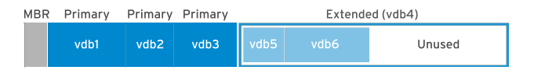         

### 2.2 Bảng phân vùng GUID (GPT)   

- GPT có thể có 128 phân vùng, GPT sử dụng 64 bit cho địa chỉ khối và cho các đĩa cứng có các sector 512 byte, kích thước maximum là 9,4 ZB (9,4 x 10^21 byte) hoặc 8 ZiB hoặc 8 billion TB.     
- `GPT primary` thì ở đầu của disk, trong khi `GPT backup` thì nằm ở cuối disk. 
- GPT sử dụng `checksum` để phát hiện lỗi và hỏng trong bảng phân vùng GPT.     

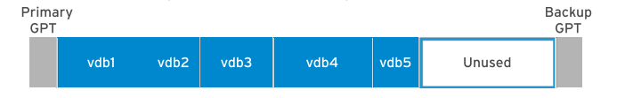     

   

## 3. Quản lý phân vùng fdisk     

- Lệnh `fdisk`: dùng để tạo thay đổi kích thước, xóa, thay đổi, sao chép và di chuyển các phân vùng.     
- `fdisk`: cho phép tạo tối đa bốn phân vùng chính, mỗi phân vùng có size minium `40mb`.    

***Note: fdisk không thể sử dụng đối với bảng phân vùng GUID (GPT) và nó không hoạt động partition > `2TB`***        

### 3.1 Lệnh `fdisk -l`: xem tất cả các phân vùng hiện có trong hệ thống.    

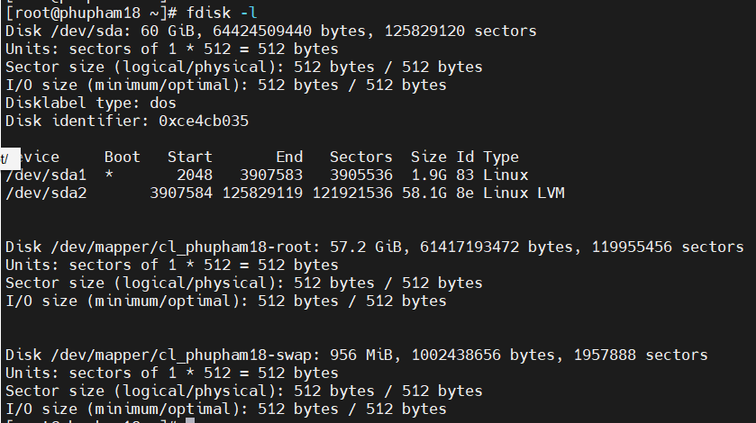    

### 3.2 Lệnh `fdisk -l /dev/sda`: xem phân vùng trên một disk cụ thể.    

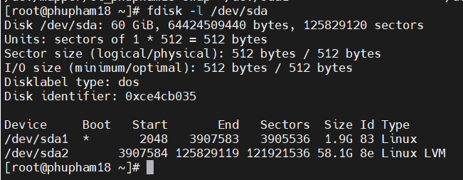    

   

## 4. Quản lý phân vùng ổ cứng bằng tiện ích `parted`    

- `parted` là một chương trình để thao tác phân vùng đĩa. Nó hỗ trợ nhiều định dạng bảng phân vùng bao gồm `MS-DOS` và `GPT`.   
- Nó cho phép người dùng tạo, xóa, thay đổi kích thước, thu nhỏ, di chuyển và sao chép phân vùng, sắp xếp lại việc sử dụng disk và backup dư liệu vào các disk mới.       

- `parted` là một công cụ cấp cao hơn fdisk. Nó cho phép chúng ta tạo phân vùng `> 2TB` nhưng `fdisk` không cho phép      

### Cài đặt parted   
- parted cài đặt sẵn trên các bản phân phối Linux. Nếu chưa được cài đặt sử dụng các lệnh sau để cài đặt.    
   - Đối với bản phân phối Debian/Linux.   
   `apt-get install parted`     
   - Đối với bản phân phối RHEL/CentOS:  
   `yum install parted`      

  

## 5. Sử dụng tiện ích parted      

- Khởi chạy `parted` dưới đây sẽ chọn đĩa `/dev/sda` vì đây ở ổng cứng đầu tiên tron hệ thống.    

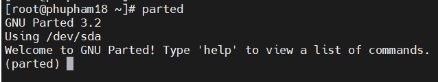     

- Di chuyển sang đĩa khác bằng cách sử dụng lệnh:   

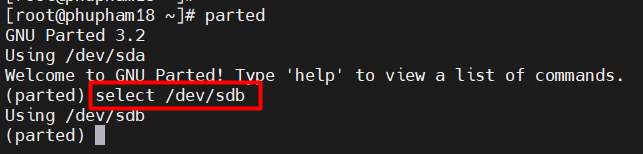    

- Xem tất cả tên đĩa có sẵn và các thông tin của phân vùng:    

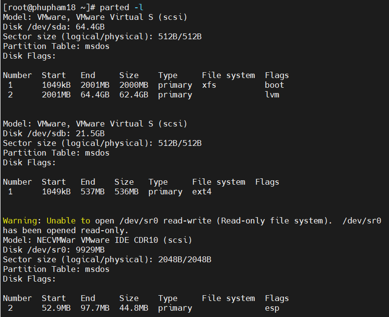    

### Tạo phân vùng mới     

- B1: Chọn đĩa mà phân vùng đang được tạo.    

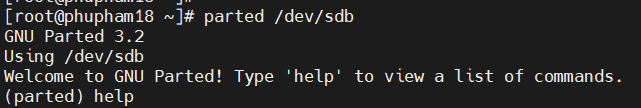    

- B2: Sử dụng lệnh `help` để xem các tùy chọn khác nhau được cung cấp trong lệnh `parted`.     

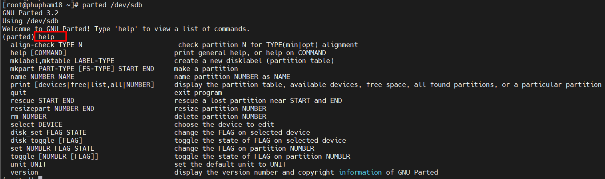    

- B3: Chọn loại table partition cho đĩa mới   

***Giá trị `msdos` tương ứng với partition table loại `MBR`, còn giá trị là `gpt` thì partition table loại `GPT`.***      

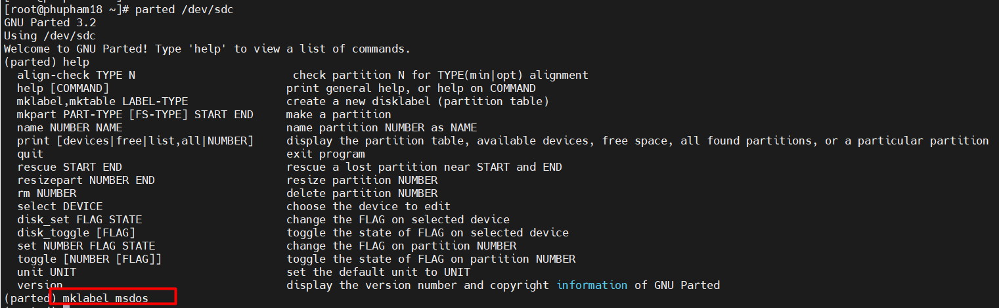    
- B4: Tạo phân vùng mới `mkpart`. Nhập `primary` cho phân vùng chính hoặc `extented` cho phân vùng mở rộng. Sau đó nhập size cho partition.    

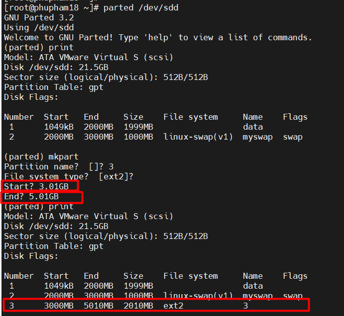

- Chúng ta, có thể tạo phân vùng với cú pháp sau đây:   

`parted [Disk Name] [mkpart] [Partition Type] [Filesystem Type] [Partition Start Size] [Partition End Size]`      

- Thay đổi flags cho partition:   

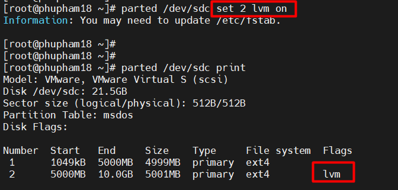    

- Thay đổi kích thước phân vùng thành kích thước lớn và nhỏ hơn.    
- Xem không gian trống của đĩa: `parted /dev/sdc print free`   

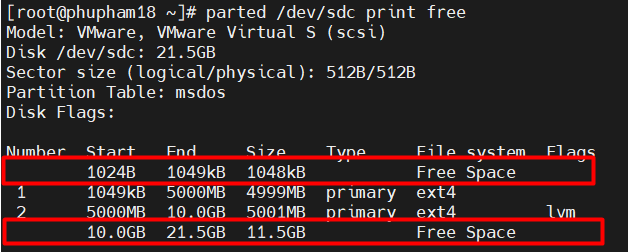     

- Tăng kích thước bằng chế độ `command line`, sử dụng lệnh 
    - `parted /dev/sdc resizepart 2 12.0GB`    

- Sau khi chạy lệnh `parted` chỉ tăng ở partition table, vì thế chúng ta phải chạy lệnh sau để resize   
    - Đối với file system (ext2, ext3, ext4): `resize2fs`    
    - Đối với file system (xfs): `xfs_growfs`     

### Xóa phân vùng   

***`Lưu ý`: Đối với phân vùng đã được mount trước khi xóa chúng ta phải `unmount` phân vùng đó. Và vào file `/etc/fstab` để xóa phân vùng đã gắn kết.***    

   

## 6. Quản lý không gian Swap    

- `Swap` hay được gọi là `RAM ảo` được sử dụng để hỗ trợ lưu trữ dữ liệu khi bộ nhớ vật lý (RAM) đầy. Đôi khi Swap được dùng song song để tăng dung lượng bộ nhớ đệm.    
- `Swap` thì nằm trong `disk` do đó sẽ chậm hơn khi so sánh với RAM.     

- Laptop và Desktop có chức năng ngủ đông sử dụng không gian `swap` để lưu dữ liệu RAM trước khi hệ thống tắt nguồn (powering off). Khi bạn quay lại system, kernel sẽ restore dữ liệu RAM từ `space swap` và không cần boot máy tính. Vì thế, `space swap` cần tốt hơn `RAM`.       

|RAM|Swap Space| Hibernation(ngủ đông)|  
|----|----|----|  
|2 GiB or less|2 lần RAM|3 lần RAM|  
|Between 2GiB and 8GiB| Same as RAM|2 lần RAM|    
|Between 8GiB and 64GiB| Ít nhất 4GiB|1.5 lần RAM|   
|Nhiều hơn 64GiB|Ít nhất 4GiB|Không khuyến khích|     
    
  

## Tham khảo    
[1] https://blogd.net/linux/quan-ly-phan-vung-dia-cung-tren-linux/

      

