# Mục lục     
[1. LVM là gì? ](#1)   
[2. Tạo và quản lý LVM ](#2)  
[3. Extending Logical Volume](#3)       

## [Tham khảo](#4)          

----    

     

## 1. LVM (Logical Volume Manager) là gì ?   

- `LVM` là một công cụ để quản lý `phân vùng logic` được tạo và phân bổ từ các ổ đĩa vật lý. Với `LVM` bạn có thể dễ dàng tạo mới, thay đổi kích thước hoặc xóa bỏ phân vùng đã tạo. Nó dễ dàng quản lý disk với `LVM` hơn công cụ tradition như `fdisk`, `parted`.           

### Mô hình Logical Volume Manager    

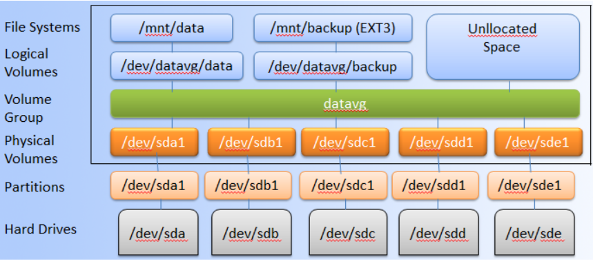       

- Một vài mục bạn cần hiểu trong khi sử dụng LVM:   

### Physical Volume (PV) 
- Một ổ đĩa vật lý có thể phân chia thành nhiều phân vùng vật lý gọi là `Physical Volume`.         

### Volume Group (VG)  

- Là một nhóm bao gồm nhiều Physical Volume trên 1 hoặc nhiều ổ đĩa khác nhau được kết hợp lại thành một Volume Group.     

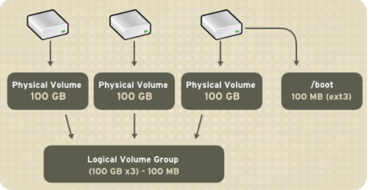     
### Logical Volume        
- Một Volume Group được chia nhỏ thành nhiều Logical Volume. Nó được dùng để `mount` tới hệ thống tập tin `File System` và được format với những chuẩn định dạng khác nhau như ext2, ext3, ext4,...    

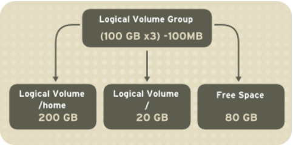         

### File systems    
- Hệ thống tập tin quản lý các file và thư mục trên ổ đĩa, được mount tới các Logical Volume trong mô hình LVM.    

  

## 2.Tạo và quản lý Logical Volume Manager    

### Tạo Logical Volume Manager    
- B1: Prepare physical device      

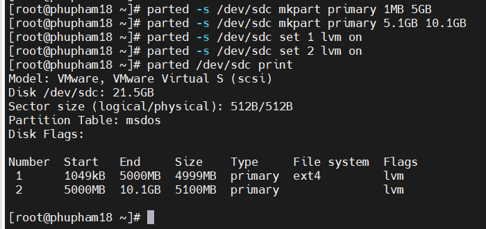    
- B2: Tạo physical Volume     

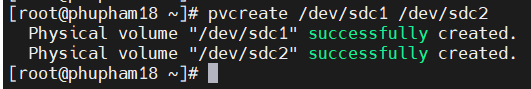   

- B3: Tạo volume Group: 
    - Lệnh `vgcreate`: bao gồm một tên volume group và theo sau là một hoặc nhiều physical volume được chỉ định đến volume group này.  
    - Cấu trúc:  `vgcreate [Volume Group Name] [Physical Volume]`        

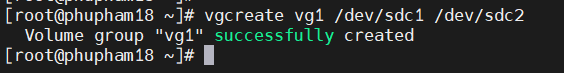    

- B4: Tạo Logical Volume    
   - Cấu trúc: `lvcreate -n [Logical Volume Name] -L size [Volume Group Name]`    
   
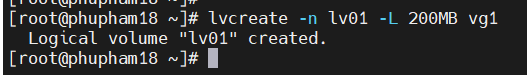    

- B5: Tạo file system cho Logical Volume    

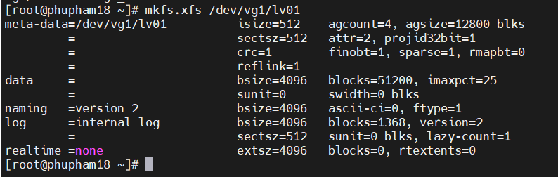    

- B6: Mount Logical Volume   

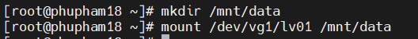    

- B7: Sửa file cấu hình `/etc/fstab`: để máy ảo tự nhận volume sau khi reboot.        

    

### Quản lý Logical Volume Manager    

- Tăng và giảm kích thước Logical Volume   
VD: Tăng kích thước Logical Volume lên 5GB     

 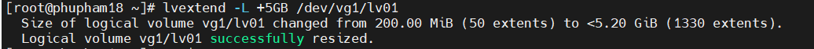    

- Xóa Logical Volume   

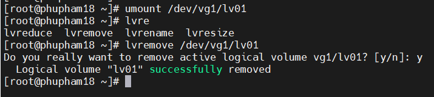    

- Xóa Logical Volume Group   

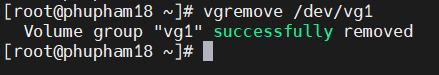   

- Xóa Physical Volume    

  

## 3. Extending Logical Volume   
### Extend Volume Group   

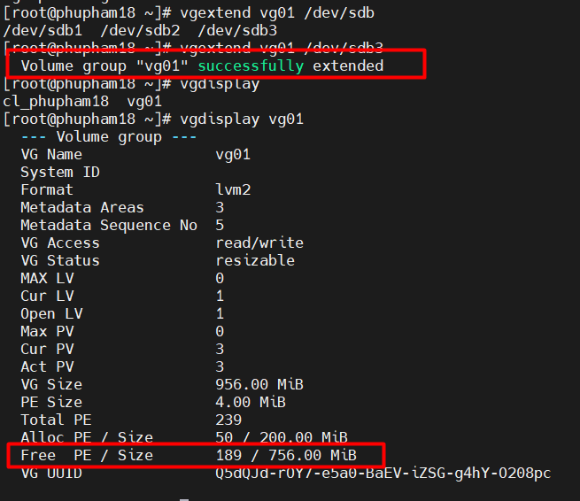  

### Giảm Volume Group
- B1: Di chuyển PE (Physical Extents) đến PV khác trong VG       

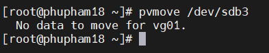      

- B2: Giảm Volume Group `vgreduce [VG_NAME] [PV_DIVICE_NAME]`      

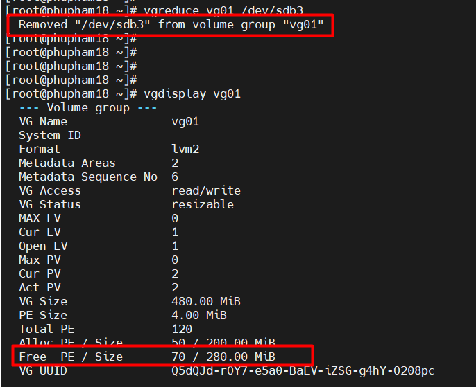   

### Extend Logical Volume    

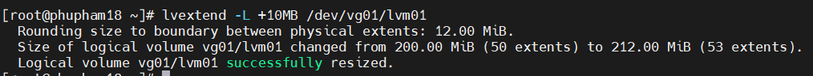    

|Command|Kết quả|  
|----|----|   
|lvextend -l 128|Resize logical volume 128 extents trong size(128 PEs*4MiB)|    
|lvextend -l +128|Add 128 extents vào size hiện tại trong logical volume (128 PEs *4MiB)|       
|lvextend -L 128M|Resize logical volume 128MB|  
|lvextend -L +128M|Add 128MB vào size hiện tại trong logical volume|    
|lvextend -l +50FREE|Add 50% không gian free hiện tại trong VG vào LV|    

### Extend File System    

- Lệnh `xfs_growfs mountpoint`     

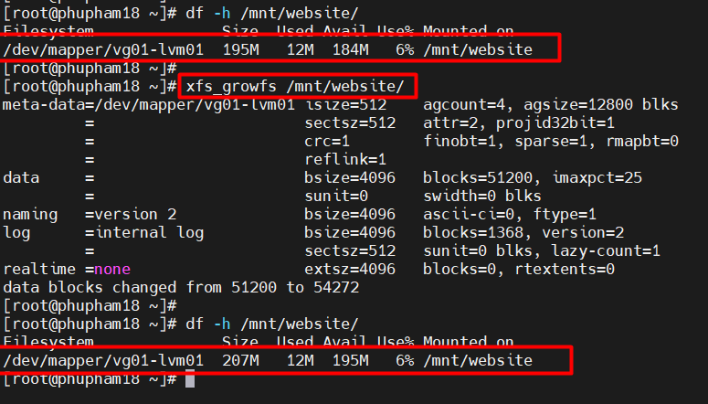        

- Lệnh `resize2fs /dev/vgname/lvname`  

***Note: `xfs_growfs lấy mountpoint` và `resize2fs lấy logical volume name`***    

- Đối với file system (ext2, ext3, ext4): `resize2fs`
- Đối với file system (xfs): `xfs_growfs`       

### Swap Space      

- Lệnh `swapoff -v /dev/vgname/lvname`: ngừng kích hoạt swap.     
- Lệnh `mkswap /dev/vgname/lvname`: định dạng toàn bộ LV là swap.    
- Lệnh `swapon -v /dev/vgname/lvname`: kích hoạt swap.    

     

## Tham khảo   
[1]https://vinasupport.com/lvm-la-gi-tao-vao-quan-ly-logical-volume-manager/ 

[2]https://www.tecmint.com/add-new-disks-using-lvm-to-linux/ 

