# Mục lục   
[1. Stratis là gì ?](#1)   
[2. Cài đặt Stratis](#2)      
[3. VDO là gì ?](#3)    
[4. Cài đặt VDO](#4)   

## [Tham khảo](#5)   

-----   

<a name='1'></a>    

## 1. Stratis là gì ?      
- Stratis là một giải pháp quản lý local storage cho Linux. Nó dễ dàng, đơn giản để bạn có thể truy cập đến tính năng storage nâng cao.    
- Stratis là một `pool` lưu trữ được tạo từ một hoặc nhiều `local disks` or `disk partitions`.   
- Stratis sử dụng lưu trữ `metadata` để quản lý pool, volumes và file system. Bạn có thể tạo đa pool(nhóm) với các block device khác nhau.   
- Bạn có thể tạo một hoặc nhiều file system. Hiện tại, bạn có thể tạo `2^24` file system trên nhóm.    

### Mục đích
- Stratis giúp bạn thiết lập và quản lý cấu hình storage phức tạp.  

      


- `Pool`: Một pool thì được tạo ra từ một hoặc nhiều block device. Total size của pool thì bằng total size của block device.    
   - Pool có nhiều tính năng hữu ích như là:  
      - File system snapshots   
      - Thin provisioning   
      - Tiering             
- `blockdev`: local disks or disk partition.      
- `Filesystem`: là một lớp `thin - provisioned` size < size cố định tổng. Filesystem thực tế có thể thay đổi size khi thêm data vào. Stratis tự động tăng kích thước hệ thống file dưới dạng kích thước data gần kích thước ảo của file system.

- `Block Device` bạn có thể sử dụng với `Stratis` bao gồm:   
   - LVM Logical Volumes    
   - LUKS   
   - SSDs (Solid State Drives)   
   - Device Mapper Multipath    
   - iSCCI   
   - HDDs (Hard Disk Drives)    
   - mdraid   
   - NVMe storage devices    
- Stratis cung cấp 2 phần mềm:   
   - `Stratis-cli`: Cung cấp công cụ dòng lệnh với `Stratis`.     
   - `Stratis daemon`: Để quản lý `block device` và đóng vai trò cung cấp một `DBUS API`.    

- `D-BUS API` để quản lý và giám sát các thành phần Stratis như là block device, pools và file system.    


### Mô hình Stack Stratis    

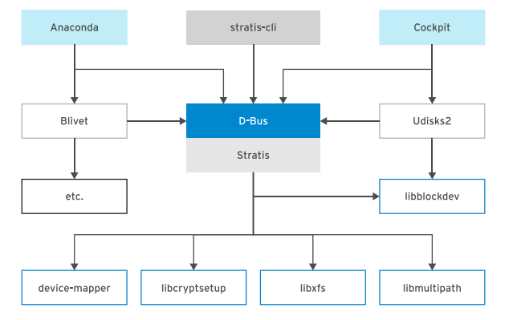     

<a name='2'></a>  

## 2. Cài đặt Stratis        

### Sửa lỗi download metadata cho repo   
- B1: Đi tới thư mục `/etc/yum.repos.d`.   
- B2: Chạy lệnh sau      
```  
[root@phupham18 yum.repos.d]# sed -i 's/mirrorlist/#mirrorlist/g' /etc/yum.repos.d/CentOS-*
[root@phupham18 yum.repos.d]# sed -i 's|#baseurl=http://mirror.centos.org|baseurl=http://vault.centos.org|g' /etc/yum.repos.d/CentOS-*

```    
- B3: Chạy lệnh `yum update`    

- Sau đó sẽ cài lệnh như bình thường để tránh bị lỗi.   

- Chạy lệnh `yum install stratis-cli stratisd`: để cài đặt `stratis-cli` và `stratisd` service.   

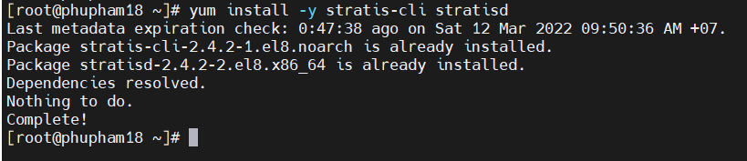    

- Kích hoạt `stratisd` service sử dụng lệnh `systemctl enable --now stratisd`      

### Tạo một Stratis Pool      
- B1: Trước khi tạo `Stratis Pool` phải xem xem trong table partition có block device nào không  bằng lệnh `blkid -p /<device-path>`       

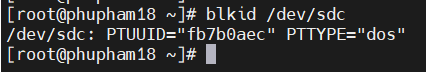     
- B2: Nếu có sẵn partition table, bạn có thể xóa nó đi bằng lệnh `wipefs -a /<device-path>`    

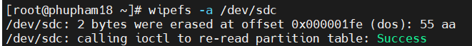     

- Chạy lệnh `stratis pool create <pool-name> <block-device>`: để tạo pool của một hoặc nhiều block device.       

***Note: mỗi pool là một thư mục con dưới thư mục `/stratis`***     

- Sử dụng lệnh `stratis pool list`: để xem danh sách của pool có sẵn.      

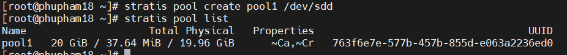    

- Lệnh `stratis pool add-data pool1 /<device-name>`: để thêm block device vào một pool.      

- Lệnh `stratis blockdev list pool1`: để xem có bao nhiêu `block device` trong `pool1`    

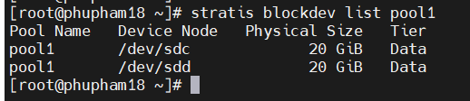  

### Tạo filesystem từ một Pool   

- Lệnh `stratis filesystem create pool1 stratis-filesytem1`: Thêm `thin - provisioned` file system tên là `stratis-filesystem1` trong pool `pool1`     

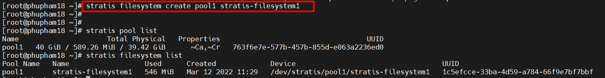    

### Mount 1 Stratis Filesystem   
- Tạo một thư mục `/stratisvol`      
- Mount `stratis-filesystem1` vào thư mục `/stratisvol`.     

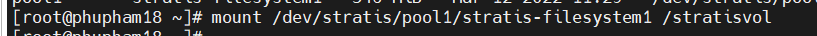    

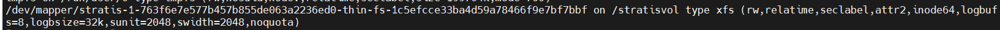  

- Tạo một file 2GB trong `stratis-filesystem1` sử dụng lệnh `dd`:   
``` 
[root@phupham18 ~]# dd if=/dev/urandom of=/stratisvol/file2 bs=1MB count=2048 
```      

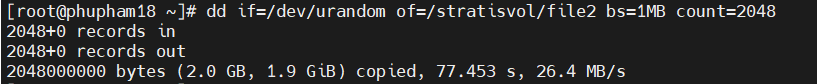    
 

### Tạo Snapshot     
- Snapshot dùng để truy cập đến bất kỳ file đã xóa từ `stratis-filesystem1` .     

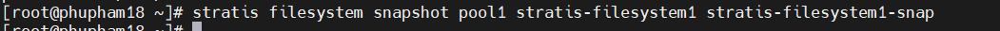   

- Remove `/stratisvol/file1`   
- Create thư mục `/stratisvol-snap`    
- Mount `/dev/stratis/pool/stratis-filesystem1-snap /stratisvil-snap`    
- Cat `/stratis-snap/file1`    

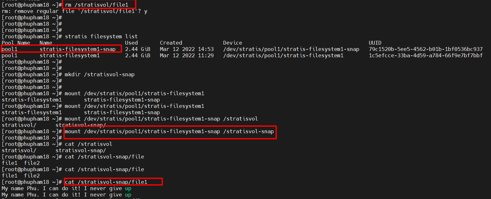    

***Note: để có thể mount a Stratis file system khi reboot khi bạn cần sửa file cấu hình `/etc/fstab`***     
```  
UUID=2a0d3ac9-ee3a-49a7-86b5-0154b3d0638e   /stratis2   xfs   default,x-systemd.requires=stratisd.service  0   0

``` 

### Destroy `thin-provisioned` file system
- Để xóa file system `thin - provisioned` ta phải `umount` rồi mới dùng lệnh để destroy    
- Xóa `stratis-filesystem1-snap` sử dụng lệnh `stratis filesystem destroy `   
- Xóa `stratis-filesystem1` sử dụng lệnh `stratis filesystem destroy`    

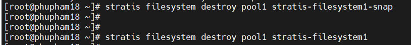    

### Destroy pool    

- Lệnh `stratis pool destroy poolname`: để xóa pool      

    

*Cuối cùng xóa toàn bộ trong file cấu hình `/etc/fstab` cho filesystems*         


<a name='3'></a>   

## 3.VDO là gì ?    

- `VDO (Virtual Data Optimizer)`: dùng để nén và dữ liệu trùng lặp (deduplicate) trong storage device.        
- `VDO` bao gồm 2 module:   
   - `kvdo` module: để kiểm soát nén data.   
   - `uds` module: cho deduplication (sự trùng lặp dữ liệu).    

- `RAID` là hình thức ghép nhiều ổ đĩa cứng vật lý thành hệ thống ổ đĩa cứng nhằm gia tăng tốc độ đọc/ghi dữ liệu.     

     

<a name='4'></a>   

## 4. Cài đặt VDO    

- Cài gói `vdo` và `kmod-kvdo` để bật VDO trong hệ thống.      

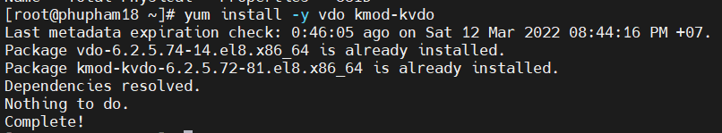    

   - `vdo`: là công cụ để quản lý cho `Virtual Data Optimiser`.       
   - `kmod-kvdo`: là một nhóm `module kernel` cho Virtual Data Optimiser.     

- Sau khi cài đặt xong, start, enable, và kiểm tra daemon `vdo`.    

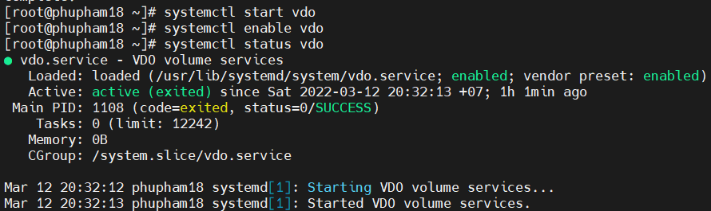    

### Tạo VDO Volume    
- Lệnh `vdo create --name=vdo1 --device=/dev/sdd --vdoLogicalSize=20G`: tạo VDO Volume trống.   

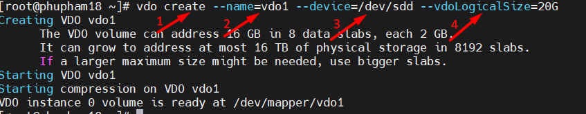    

   - `create`: tạo VDO volume.   
   - `--name=vdo1`: đặt tên label volume là `vdo1`
   - `--device=/dev/sdd`: Lựa chọn device disk cụ thể trong volume.       
   - `--vdoLogicalSize=20G`: Hiện thị khối lượng volume được sử dụng bởi OS.     

- Lệnh `vdostats --hu`: để hiện thị thông tin định dạng người dùng có thể dễ dàng đọc.   

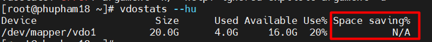      

***Space saving%: N/A (Not Applicate)***   

### Phân vùng Volume VDO    
***Bạn cần phân vùng và tạo filesystem điều đó sẽ giúp bạn sử dụng như disk normal.***     

- B1: Tạo PV và VG    

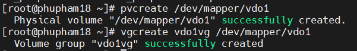   

- B2: Tạo 2 LV với cùng dung tích size 5GB    

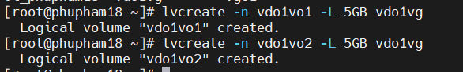   

- Lệnh `lvs` để xem trạng thái của volume.   

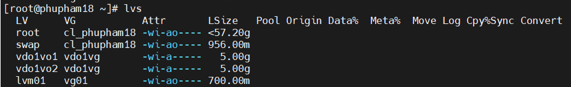    

### Định dạng và mount filesystem    

- Định dạng filesystem  

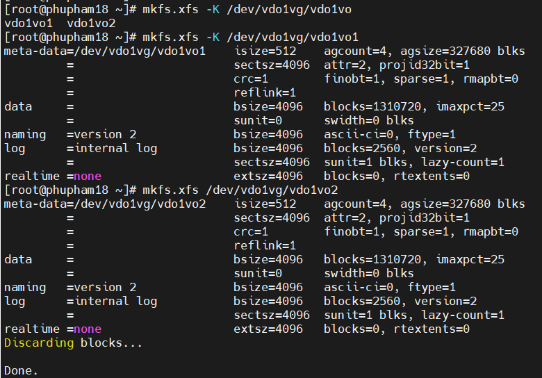     

- Option: 
    - `-K`: no discard cho filesystem `xfs`  
    - `-E`: no discard cho filesystem `ext$`.   

- Mount point cho volume.      

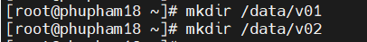   

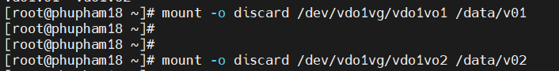     

- Kiểm tra xem volume `vdo1` có bật cả hai tính năng `Compression` và `Deduplication` không ?   

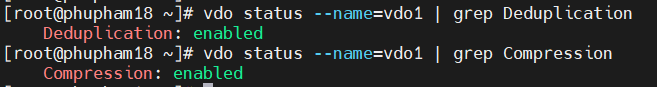    


<a name='5'></a>  

## Tham khảo   
[1]https://www.tecmint.com/install-stratis-to-manage-layered-local-storage-on-rhel/    
[2]https://www.techtarget.com/searchstorage/definition/thick-provisioning      
[3]https://www.tecmint.com/create-a-vdo-volume-on-a-storage-device-on-rhel-8/  


