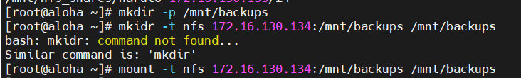

# Mục lục     
[1. NFS_Network File System là gì ? ](#1)   
[2. LAB ](#2)     
[3. Automount NFS share ](#3)   

## [Tham khảo](#4)     

-----    

<a name='1'></a>    
    
## 1.NFS (Network File System) là gì ?     

- NFS là một giao thức chia sẻ file cho phép bạn có thể chia sẻ thư mục, tệp tin với client Linux khác trong một mạng.    
- Thư mục được chia sẻ thì thường được tạo trong NFS Server và tệp tin được thêm đến thư mục đó.     
- Hiện tại có 3 phiên bản NFS là NFSv2, NFSv3, NFSv4.      

          

### Ưu điểm   
- Sử dụng NFS là giải pháp chi phí thấp khi chia sẻ tệp qua mạng.   
- Dễ dàng cài đặt.  
- Cho phép quản lý tập trung, giảm dung lượng đĩa trên hệ thống người dùng.    

### Nhược điểm   
- NFS không an toàn, chỉ nên sử dụng trong mạng phía sau firewall.   
- NFS bị chậm khi lưu lượng mạng lớn.   
- Server và Client tin tưởng nhau hoàn toàn.     

<a name='2'></a>     

## 2. LAB    

``` 
NFS Server IP: 172.16.130.134
NFS Client IP: 172.16.130.132    
```    

- B1: Cài đặt gói `nfs-utils` cung cấp một daemon cho kernel NFS Server và công cụ liên quan như là chứa chương trình `showmount`.  

   

- B2: Bắt đầu service `nfs-server`, bật nó để tự động bắt đầu khi hệ thống boot và kiểm chứng trạng thái sử dụng lệnh `systemctl commands`.  

    

### File cấu hình NFS server là:    
- `/etc/nfs.conf`: Cấu hình file chính cho NFS daemon và tools.   
- `/etc/nfsmount.conf`: một NFS mount configuration file.     

- B3: Tạo một file system để export và share trong server NFS.           

```  
mkdir -p /mnt/nfs_shares/naruto      
mkdir -p /mnt/backups   
ls -l /mnt/nfs_shares/          
```      

- B4: Xuất file system ở trên trong file cấu hình `/etc/exports` NFS server đến file system physical local để có thể truy cập đến NFS clients.      

```  
/mnt/nfs_shares/naruto      172.16.130.132/24(rw, sync)       
/mnt/backups                172.16.130.134/24(rw,sync,no_all_squash,root_squash)       
```    

  - Trong đó:  
     - `rw`: cho phép cả đọc và viết truy cập trong file system.     
     - `sync`: yêu cầu viết thông tin lên đĩa khi được yêu cầu (applies by default).    
     - `all_squash`: ngăn remote từ tất cả users.        
     - `no_all_squash`: Cho phép remote root users.        
     - `root_squash`: ngăn remote root users.       

- B5: Để xuất file system trên, chạy lệnh `exportfs command`.   
   - `-a` có nghĩa là `export` or `unexport` tất cả directory.       
   - `-r` có nghĩa là `reexport` tất cả thư mục, đồng bộ `/var/lib/nfs/etab` với `/etc/exports` và dưới file `/etc/exports.d`.        
   - `-v` có nghĩa là bật verbose output.    

      

- B6: Bạn phải cho phép traffic đến những dịch vụ NFS cần thiết `(mountd, nfs, rpc-bind)` qua firewall, sau đó reload firewall để apply thay đổi.     

    

- B7: Kiểm tra các port sử dụng bởi NFS    

  

### Thiết lập NFS client trong Client Systems    

- B1: Cài đặt gói tiện ích để truy cập NFS shares trong client systems.     
``` 
yum install -y nfs-utils nfs4-acl-tools    [On CentOs/RHEL]  
apt install -y nfs-common nfs4-acl-tools   [On Debian/Ubuntu]   
```     
- B2: Chạy lệnh showmount để hiện thị thông tin gắn cho NFS Server.     

      

- B3: Tiếp theo, tạo một file system/thư mục local để mounting file system NFS từ xa và mount nó như một file system nfs.    

```   
mkdir -p /mnt/backups   
mount -t nfs 172.16.130.134:/mnt/backups /mnt/backups    
```     

   
- B4: Xác nhận file system từ xa với `mount` và `grep nfs`      

    

- B5: Để tự động mount một thư mục NFS trên hệ thống, sau khi khởi động cần cấu hình file `/etc/fstab`       

```   
172.16.130.134:/mnt/backups   /mnt/backups    nfs  defautl  0   0   
 ```  

- B6: Kiểm tra NFS thì đang làm việc, tạo một file trong server và check nếu file đó có thể xem được ở client.     

   

   
- B7: Unmount file system từ xa ở phía client.     

   

<a name='3'></a>   

## 3. Automount NFS share   
- Lợi ích:   
   - Tự động mount file system và remote share khi nó truy cập.   
   - Bạn không phải mount file system tại tất cả thời điểm, file system thì chỉ được mount khi nó có nhu cầu.       

- Dịch vụ `autofs` đọc 2 file:   
   - Master map file `/etc/auto.master`    
   - Map file `/etc/auto.misc` or `/etc/auto.xxx`    

- Trong Master map `/etc/auto.master` có 3 trường khác nhau:    

`<Mount-Point>`     `<Map-file>`   `<Timeout-Value>`         

- Trong map file `/etc/auto.misc or /etc/auto.xxx` có 3 trường khác nhau:     

`<Mount-point>`     `<Mount-Options>`  `<Location_of_File System>`        

### Các bước mount nfs share sử dụng autofs
- B1: Install dịch vụ `autofs`      

    

- B2: Thêm `Master map` file đến `/etc/auto.master`       

``` 
vi /etc/auto.master    
/shares      /etc/auto.demo        --timeout=180   
```     

- ***NFS Share sẽ tự động umount sau 180s or 3p nếu không biểu diễn bất kì hành động nào trong share***       

- B3: Tạo file map `/etc/auto.demo`      

```  
vi /etc/auto.demo    
*  -fstype=nfs,rw,sync      172.16.130.134:/shares/&        
```       

   - `*`: là bất kỳ một mount point nào.    
   - `&`: thư mục con trong source location.   
   - `work`: là một mount point.     
   - `-fstype=nfs` là một kiểu file system, `rw,sync` là mount options.    
   - `172.16.130.134:/shares/work` là nfs chia sẻ vị trí.    

- B4: Sử dụng `systemctl` để restart và enable dịch vụ `autofs`.      

   


<a name='4'></a>   
## Tham khảo    
[1]https://www.tecmint.com/install-nfs-server-on-centos-8/    
[2]https://blogd.net/linux/thiet-lap-may-chu-nfs-tren-linux/    