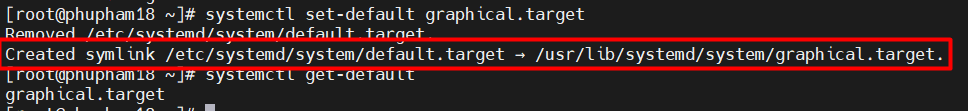
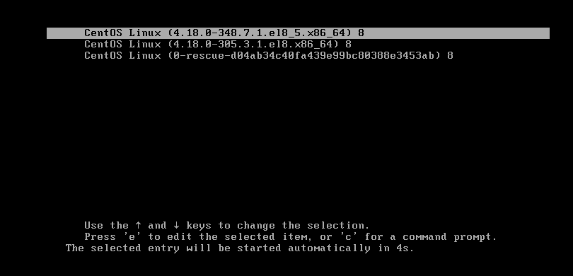
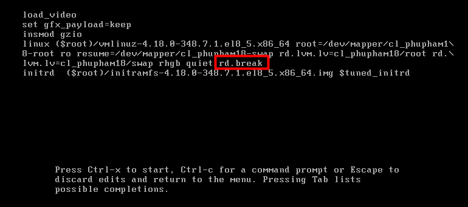
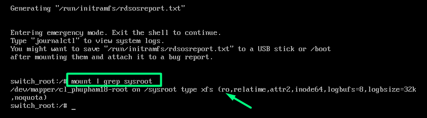
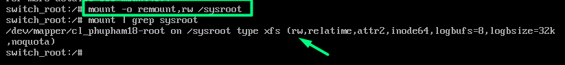
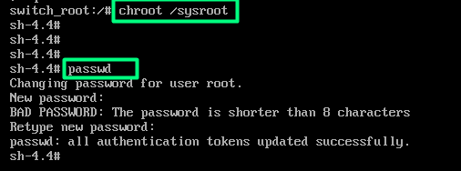
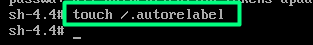
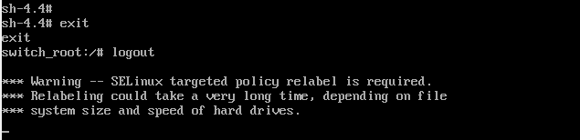

# Mục lục      

[1. Lựa chọn Target boot ](#1)    
[2. Resetting the Root passwd](#2)    

## [Tham khảo](#3)     
----    

<a name='1'></a>    
***UEFI (Unified Extensible Fireware Interface)***    

## 1. Lựa chọn target boot    
|target|Mục đích|      
|----|----|    
|graphical.target|Hệ thống hỗ trợ multiple users, graphical và đăng nhập dựa trên text|     
|multi-user.target|Hệ thống chỉ hỗ trợ multiple users, đăng nhập dựa trên text|     
|rescue.target|Lời nhắc `sulogin`, cơ bản khởi động hệ thống hoàn tất|    
|emergency.target|Lời nhắc `sulogin`,hệ thống root được gắn trong `/` chỉ đọc|      

- Lệnh `systemctl isolate`: dùng để chuyển tạm thời target trong runtime.     

### Setting a Default target     
- Bình thường, default target trong `/etc/systemd/system` là một symbolic link đến graphical.target or multi-user.target.    
- Lệnh `systemctl` cung cấp 2 subcommands để quản lý link: `get-default` and `set-default`.     

    

<a name='2'></a>     

## 2. Resetting the Root password     

- Đầu tiên khởi động lại hệ thống, tại boot grub menu chọn kernel, bạn nhấn `e` trong keyboard.   

    

- Thêm tham số `rd.break` và sau đó nhấn `Ctrl + x`.    

    

- Sau đó, bạn sẽ ở mode `emergency` ở đây ấn `Enter` để vào lời nhắc shell. Bây giờ, bạn bảo đảm confirm rằng bạn remount thư mục `sysroot` với quyền `read` và `write`. Bởi mặc định, nó được mount chỉ có quyền `read` mode hiện thị là `ro`    

```  
# mount | grep sysroot   
```     

   

- Bây giờ, remount thư mục `sysroot` với quyền `read` và `write` và confirm. Quyền sẽ thay đổi từ `ro`(read-only) thành `rw`(read-write).    

```  
# mount -o remount,rw /sysroot/    
# mount | grep sysroot      
```    

    

- Tiếp theo, mount file system root trong mode `read` và `write`.      
```   
# chroot  /sysroot     
```     
- Sau đó, sử dụng lệnh `password` để reset root password với new password và comfirm.     

    

- Cấu hình hệ thống tự động biểu diễn full relabel SELinux sau boot. Điều này là cần thiết vì lệnh `passwd` khởi động lại file `/etc/shadow` không có SELinux context.       

``` 
# touch /.autorelabel    
```     

   

- Cuối cùng, exit và sau đó log out để start quá trình SELinux relabeling.   

   


<a name='4'></a>  
## Tham khảo  
[1]https://www.tecmint.com/reset-forgotten-root-password-in-rhel-centos-and-fedora/   


 

