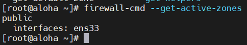

# Mục lục    
[1. Manage Server Firewall](#1)   
[2. Cài đặt FirewallD ](#2)      
[3. Cấu hình FirewallD ](#3)     
[4. Điểu khiển SELinux port ](#4)           

## [Tham khảo](#5)        

----       

***Mục đích: Điều khiển kết nối mạng đến services sử dụng firewall và quy tắc SELinux***  

<a name='1'></a>      

## 1.Manage Server Firewall        
- `Net-filter` là một firewall trong Linux.`FirewallD` là một daemon tự động để quản lý firewall với support cho các vùng mạng `network zones`.            
- Bạn có thể truy cập hoặc từ chối kết nối mạng đến hệ thống services sử dụng quy tắc `firewalld`       
- Trong `firewallD`, `zone` là một nhóm các quy tắc nhằm chỉ ra những luồng dữ liệu được cho phép, dựa trên mức độ tin tưởng của điểm xuất phát luồng dữ liệu đó trong hệ thống mạng. Để sử dụng, bạn có thể lựa chọn `zone` mặc định, thiết lập các quy tắc trong `zone`hay chỉ định giao diện mạng (Network Interface) để quy định hành vi cho phép.         

### Xác định trước Zone
|Tên Zone|Cấu hình mặc định|    
|----|----|    
|trusted|đáng tin cậy nhất - tin tưởng toàn bộ thiết bị trong hệ thống. Tất cả lưu lượng thì được chấp nhận|         
|home|Được sử dụng trong nhà, bạn có thể sử dụng zone này cho tin tưởng máy tính khác trong mạng để không gây hại đến máy tính của bạn như mọi zone. Điều này chỉ cho phép lựa chọn kết nối đến  |       
|internal|Zone này giống `work zone` với lựa chọn kết nối được cho phép|        
|work|Bạn có thể xác định chỉ mạng nội bộ `internal`. Lưu lượng mạng riêng thì cho phép|       
|public|Để chấp nhận kết nối được lựa chọn, bạn có thể xác định `rules` trong zone public. Điều  này chỉ cho phép port cụ thể được mở trong server của chúng, kết nối khác thì `dropped`|      
|external|Vùng này đóng vai trò là tùy chọn router với `masquerading` thì bật, kết nối khác sẽ `dropped` và sẽ không truy cập, chỉ kết nối cụ thể thì được cho phép |   
|dmz|Nếu bạn phải cho phép truy cập đến một vài services cho public, bạn có thể xác định nó trong vùng `dmz`|  
|block|Block zone sẽ phủ nhận kết nối mạng đến thì từ chối. Chỉ kết nối được thành lập trong server sẽ được cho phép|    
|drop|Bất kỳ gói đến thì `dropped` nếu bạn sử dụng `zone drop` này. Nếu bạn sử dụng `rule drop`, có nghĩa là không trả lời, chỉ kết nối mạng ra thì sẽ có sẵn(không trả lời với error ICMP)|    


### Xác định trước Services    

|Tên services|Cấu hình|    
|----|----|   
|ssh|Máy chủ ssh cục bộ. Lưu lượng đến `22/tcp`|   
|dhcpv6-client|Local DHCPv6 client. Lưu lượng đến `546/udp` trong mạng `fe80::/64 IPv6`|    
|ipp-client|Local IPP `(Internet Printing Protocol)` printing. Lưu lượng đến `631/udp`|    
|samba-client|Local Windows file and print sharing client. Lưu lượng đến `137/udp` và `138/udp`|    
|mdns|Multicast DNS (mDNS) local-link name resolution. Lưu lượng đến `5353/udp` đến địa chỉ multicast `224.0.0.251 (IPv4)` or `ff02::fb(IPv6)`|   

### Hiệu lực của quy tắc Runtime/Permanent     

- Trong `FirewallD`, các quy tắc được cấu hình thời gian hiệu lực `Runtime` hoặc `Permanent`    
- `Runtime` (default):có tác dụng ngay lập tức, mất hiệu lực khi reboot hệ thống.   
- `Permanent`: không áp dụng cho hệ thống đang chạy, cần reload mới có hiệu lực, tác dụng vĩnh viễn cả khi reboot hệ thống.     

***Việc `restart/reload` sẽ hủy bộ các thiết lập Runtime đồng thời áp dụng thiết lập Permanent mà không hề phá vỡ các kết nối và session hiện tại.***

<a name='2'></a>  

## 2.Cài đặt FirewallD      
- B1: Install   
```   
yum install firewalld    
```        

  
- B2: Khởi động FirewallD     
```  
systemctl start firewall    
```    
- B3: Check status hoạt động    

    

- B4: Thiết lập firewallD khởi động cùng hệ thống    
```    
systemctl enable firewalld     
```    

<a name='3'></a>   

## 3. Cấu hình FirewallD    

- Liệt kê tất cả các `zone` trong hệ thống    

    

- Kiểm tra `zone` mặc định     

    

- Kiểm tra `zone` active (được sử dụng bởi giao diện mạng)     

***Vì firewallD chưa được thiết lập bất kỳ quy tắc nào nên zone mặc định cũng đồng thời là zone duy nhất được kích hoạt, điều khiển mọi luồng dữ liệu***    

     

- Thay đổi `zone default` thành `home`     
``` 
firewall-cmd --set-default-zone=home    
```     
   

- Liệt kê toàn bộ các quy tắc trong Zone mặc định và zone actice     

    

<a name='4'></a>   

## 4.Điều khiển port SELinux      

- Lệnh `semanage` dùng để chỉ định new port labels, remove port labels, hoặc modify.    

- Lệnh `semanage port -l | grep ftp`: dùng để xem port của giao thức `ftp`.      

      

- Lệnh `semanage port -a -t port_label -p tcp/udp PORTNUMBER`: để thêm port đến một port có sẵn.

VD: `semanage -a -t ftp_port_t -p udp 234`  

    

- Lệnh ` semanage port -d -t ftp_port_t -p udp 234`: dùng để remove port   

    

- Lệnh `semanage port -m -t http_port_t -p tcp 71`: dùng để modify port 71/udp     

   
<a name='5'></a>    

## Tham khảo   
[1]https://cloud.z.com/vn/support/cloud/thiet-lap-tuong-lua-firewalld-tren-centos-7/   
[2]https://www.tecmint.com/configure-firewalld-in-centos-7/   
