  # Bash Shell
   
  [1. Different types of Shells](#1)   
  [2. Bash shell features  ](#2)   
  [3. Bash environment variables](#3)   
  [4. Path variables](#4)   
  [5. Customize Bash Prompt](#5)  

  ## [Tham khảo](#6)   
  
  ----    

### 1.Different types of Shells   

- Có các loại shells khác nhau trong linux, nhưng một số loại shell phổ biến đó là:    
    - Bourne Shell (sh)  
    - C Shell (csh or tsh)    
    - Korn Shell (ksh)    
    - Z Shell (zsh)   
    - Bourne again shell (Bash)           

- Lệnh `echo $SHELL`: để check shell đang được sử dụng.    
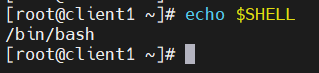     

- Lệnh `chsh`: dùng để thay đổi shell mặc định, cần sử dụng password và phải đăng nhập vào một phiên terminal mới.      

   
### 2. Bash Shell Features     

- Trong Bash, tùy chỉnh `alias` (bí danh) cho lệnh dùng dễ dàng hơn.      
    - Tạo `alias`:  
       - Cấu trúc: `alias alias_name='alias_command --options'`   
       - VD: `alias date='dt'`       
    - Lưu `alias`:   `source ~/.bashrc or ~/.bash_profile`: để khi reboot hệ thống không bị mất alias vừa tạo.        
    - Xóa `alias`: `unalias alias_name`       

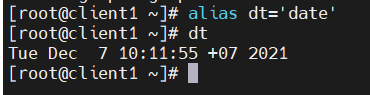    

- Lệnh `history`: để hiện thị danh sách  các lệnh chạy trước.    

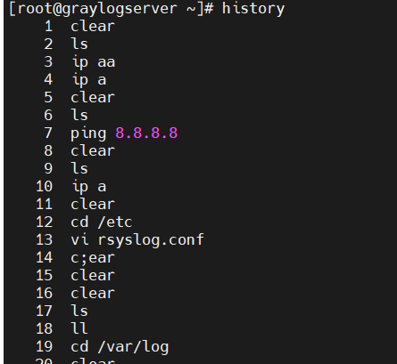    

   
### 3. Bash environment variables.  

- Lệnh `echo $SHELL`: để in `SHELL`.        

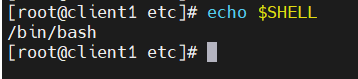    

- Lệnh `env`: để xem danh sách tất cả các enviroment variable.    

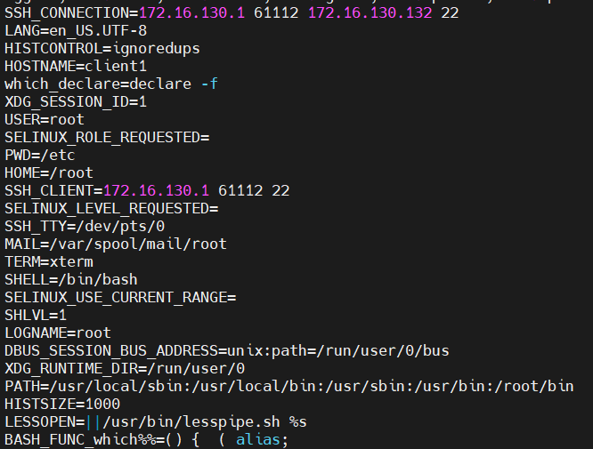     

- Lệnh `export`: để set một enviroment variables.    
- Lệnh `echo "export Environment_name" >> ~/.profile or ~/.pam_environment`: để tạo environment variables và lưu lại tại file ~/.bashrc or ~/.bash_profile.     

- Lệnh `echo $LOGNAME`: hiện thị tên đăng nhập ra screen.    

    
### 4.Path variables    

- `Path variables` là khi một người sử dụng lệnh external trong shell, thì shell sẽ sử dụng path variables để tìm kiếm lệnh external đó.    

- Lệnh `echo $PATH`: để xem các thư mục được xác định trong `path variables`.    

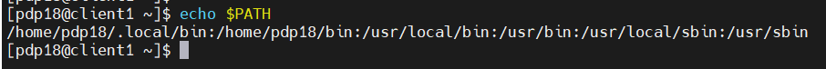      

- Lệnh `which [command]`: để xác định vị trí của command.    
- VD: `which pwd`      

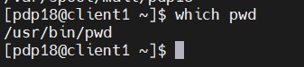     

  
### 5. Customize Bash Prompt   

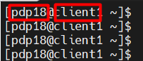   
- Trong đó:   
   - `pdp18`: username.
   - `client1`: hostname.
   - `~`:Thư mục làm việc hiện tại (Presenting Working Directory)  
   - `$`: biểu tượng của người sử dụng.    
   - `#`: biểu tượng của người quản trị hệ thống.      

- Bash Prompt thì được đặt trong một biến môi trường shell riêng. Đó là variable `PS1`:    
- Lệnh `echo $PS1`: để xem các giá trị được gán cho `PS1`      

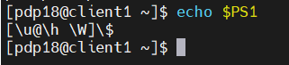   
- Lệnh `PS1="Centos8"` để thay đổi lời nhắc hiện thị word "Centos8"         
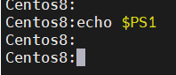            

- Các `[Options]`    

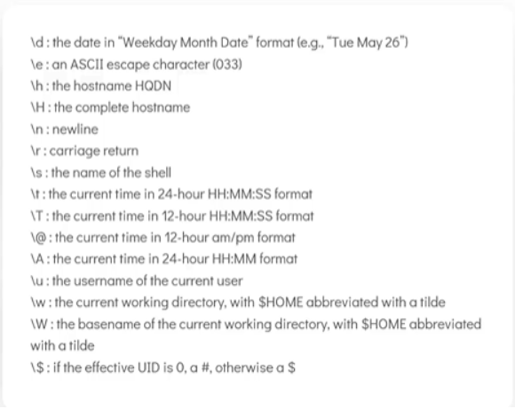    

- Lệnh `PS1="[\d \t \u@\h \w] $ "`: Để thay đổi bash prompt hiện thị `date`, `time`, `username of the current user`, `hostname`, và `current working  directory`.    

## Tham khảo    
  [1]https://github.com/phupham1805/linux-basics-course/blob/master/docs/02-Working-With-Shell-Part-I/05-Bash-Shell.md

