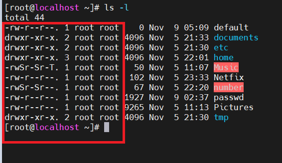
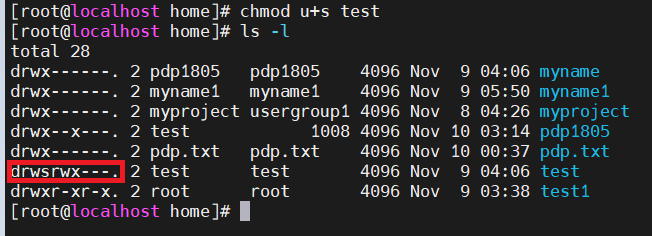
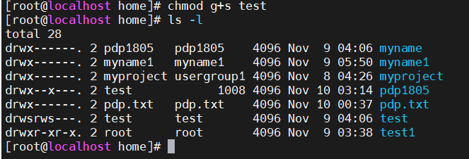
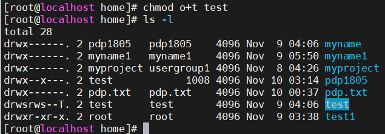
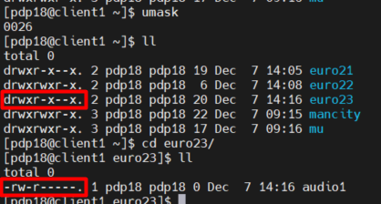

# Mục lục    
   [1.Phân quyền trong Linux](#1)   
   [2.Tham khảo](#2)   
 
---- 

 
### 1.Quyền truy xuất trong Linux  
- Để xem quyền truy cập trong Linux ta dùng câu lệnh ls - l   

    

- Danh sách quyền truy cập được trình bày ở cột đầu tiên trong kết quả. Các loại quyền truy cập gồm:   
    - `Read` (r): Cho phép đọc nội dung tập tin và xem nội dung thư mục bằng lệnh ls  
    - `Write` (w): Cho phép thay đổi nội dung hoặc xóa tập tin. Đối với thư mục, quyền này cho phép tạo, xóa hoặc đổi tên tập ti mà không phụ thuộc vào quyền sở hữu trên tập tin chứa trong thư mục.   
    - `Execute` (x): Cho phép thực thi chương trình, đối với thư mục, quyền này cho phép chuyển hướng thư mục bằng lệnh `cd`.   

- Quyền truy xuất gồm 3 nhóm:   
   
      

|ký hiệu|kiểu file|  
|----|----|   
|`-`| Regular file|  
|`d`|Directory|  
|`l`|Symbolic link (Soft link)|  
|`b`|Block special file|   
|`c`|Character special file|   
|`p`|Named pipe|  
|`s`|Socket|     

   - Nhóm 1: Quyền của người sở hữu (owner hoặc user), ký hiệu bằng kí tự u : người tạo ra thư mục / file hoặc được gán quyền sở hữu.   
   - Nhóm 2: Quyền của nhóm (group), ký hiệu bằng kí tự g: nhóm người sử dụng được gắn quyền.   
   - Nhóm 3: Quyền của người dùng khác (others), ký hiệu bằng kí tự o : là những người sử dụng khác không thuộc 2 nhóm trên.     

*Có hai cách biểu diễn quyền truy xuất*   
- Quyền truy xuất được viết bằng ký tự:   
   - `r`: read   
   - `w`: write  
   - `x`: execute  
   - `-`: không có quyền   
- VD:   
   - `rwx`: full quyền  
   - `rw-`: có quyền đọc và viết   
   - `r-x`: có quyền đọc và thực thi  
   - `--x`: chỉ có quyền thực thi   
   - `---`: không có quyền    
- Quyền trên một file sẽ gồm cả 3 nhóm quyền (ower, group, other) nên danh sách quyền sẽ gồm 9 ký tự:   
   - VD:  
      - `rwx---rw-r--`: người sở hữu có full quyền, các user cùng nhóm có quyền đọc, viết, còn mọi người khác  chỉ có quyền đọc.  
      - `rwxw-----`: người sở hữu có full quyền, các user cùng nhóm có quyền viết, còn mọi người khác chỉ có quyền đọc.   
      - `rw-r-----`: người sở hữu có quyền đọc và viết, các user cùng nhóm có quyền đọc, còn mọi người khác không có quyền.   

- Quyền truy xuất được viết bằng các chữ số:   
|Quyền|Giá trị|   
|----|----|   
|Read permission|4|  
|Write permission|2|   
|Execute|1|   

- `read + execute` = 5   
- `read + execute + write` = 4+2+1 = 7    

   - 0 or ---: Không có quyền   
   - 1 or --x: execute   
   - 2 or -w-: write - only  
   - 3 or -wx:write and execute   
   - 4 or r--: read - only  
   - 5 or r-x: read and execute   
   - 6 or rw-: read and write   
   - 7 or rwx: read, write and execute   

- Vì quyền thực sự gồm cả 3 nhóm quyền (owner, group, others) nên danh sách biểu diễn dưới dạng sẽ gồm 3 chữ số:   
   - VD:  
       - `rwxr---w-`: (`742`): người sở hữu có full quyền, những user trong nhóm có quyền đọc, còn mọi người khác có quyền viết.    
       - `rwx---r--`: (`704`): người sở hữu có full quyền, những user trong nhóm không có quyền, còn mọi người khác có quyền viết.   
       - `rw-rw----`: (`660`): người sở hữu có quyền đọc và viết, những user trong nhóm có quyền đọc và viết, còn mọi người khác không có quyền.   
### Các lệnh và quyền   

- Lệnh `chmod`: Thay đổi quyền truy xuất trên tập tin/thư mục.   
    - Cấu trúc lệnh:  
    `chmod [options] [mode] [file]`    
    - Options:  
       - -R: Áp dụng đối với thư mục cho lệnh `chmod` có tác dụng lên cả thư mục con (đệ quy).   
   - Mode: Quyền truy xuất mới cho tập tin.    

|Nhóm người dùng|u-user|g-group|o-other|a-all|    
|----|----|----|----|----|
|Thao tác|+ :thêm quyền|- :xóa quyền|= :gán ngang quyền|      
|Quyền|r-read|w-write|x-execute|          

- Ví dụ 1:
  - Gán thêm quyền write cho group: chmod g+w namefile   
  - Xóa quyền read trên group và others: chmod go-r namefile   
  - Cấp quyền execute cho mọi người: chmod ugo+x namefile    
  - Chỉ cho phép thực thi với người khác: chmod o=x namefile      
   
- Lệnh `chown`: Lệnh thay đổi chủ sở hữu trên thư mục/tập tin (owner).  
   `chown [option] [owner] [file]`   
   - Option:  
       - -R là áp dụng đối với thư mục cho lệnh chown có tác dụng lên cả thư mục con (đệ quy)   
   - Owner: chủ sở hữu mới của tập tin.   

- Có thể thay đổi đồng thời chủ sở hữu hoặc group của file.   

   `chown [option] [owner]:[group_owner] [file]`

- Lệnh `chgrp`: Là lệnh thay đổi nhóm sở hữu trên thư mục/tập tin.    

    `chown [option] [group_owner] [file]`     
    - Options:   
      - -R: Áp dụng đối với thư mục cho lệnh chown có tác dụng lên cả thư mục con (đệ quy).   
   - Group_owner: nhóm sở hữu mới của tập tin.
### Các lệnh SUID, SGID và STICKY    
- SUID
    - `|u+s(suid)|`cho phép thực thi được thực hiện dưới owner của file thay vì thực hiện dưới user đang login trên máy.
       - Cấu trúc lệnh:   
          - `chmod u+s file_name`    
          - `-R`: Áp dụng đối với thư mục làm cho lệnh chmod có tác dụng trên cả thư mục con(đệ quy).

      

- SGID
    - `|g+s(sgid)`: được sử dụng trong file thực thi (execute files) để cho phép việc thực thi được thực hiện dưới owner group của file thay vì thực hiện như group đang đăng nhập trong hệ thống.  
    - SGID: cũng có thể được sử dụng để thay đổi ownership của file được tạo hoặc di chuyển nó đến 1 thư mục mà owner group của nó sẽ là owner group của thư mục chuyển đến thay vì group mà nó được tạo ra.
       - Cấu trúc lệnh:  
          - `chmod g+s file_name`   
          - -R: Áp dụng đối với thư mục làm cho lệnh chmod có tác dụng lên cả thư mục con (đệ quy).   

     

- Sticky bit:    
    - `|o+(sticky)|` được dùng để chia sẻ, mục đích là ngăn chặn người dùng này xóa file người dùng khác. Chỉ có duy nhất owner file và root có quyền rename hay xóa file, thư mục khi nó được set sticky bit.     
       - Cấu trúc lệnh:    
          - `chmod o+t file_name`   
          - -R: Áp dụng đối với thư mục làm cho lệnh chmod có tác dụng lên cả thư mục con (đệ quy).  

     
- setuid = 4; setgid = 2; sticky = 1;
### Lệnh umask ll

- Lệnh umask: phân quyền mặc định trên file/thư mục.    
- VD: Phân quyền cho file_name 751 thì ta thực thi    
    - umask: 026    
    - mkdir:  folder_name       
Thì mặc định folder_name sẽ được phân quyền là 751     
- Đồng thời lúc đó thì nó sẽ tự động phân quyền cho file trong folder là 640   

    

- `Note`: 
    - Mặc định umask của root là 0022 vì thế quyền khi tạo directory sẽ là 755 và quyền của file sẽ là 644.
    - Mặc định umask của owner 0002 vì thế quyền khi tạo directory sẽ là 775 và quyền của file sẽ là 664.

## 2.Tham khảo
[1]https://news.cloud365.vn/linux_basic-sticky-bit-suid-sgid/   
