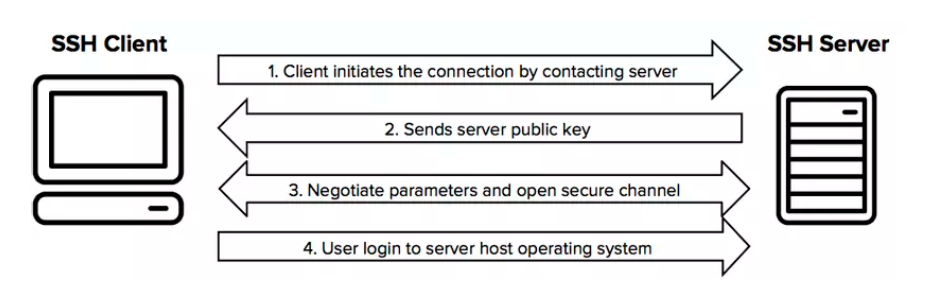
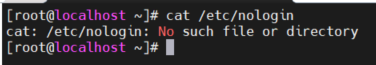
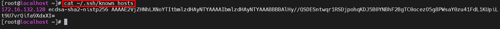
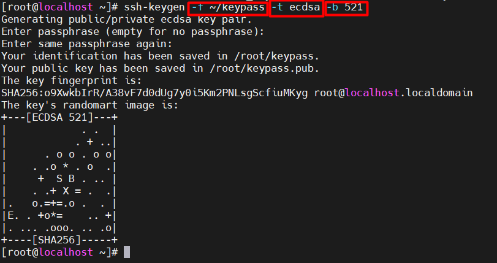
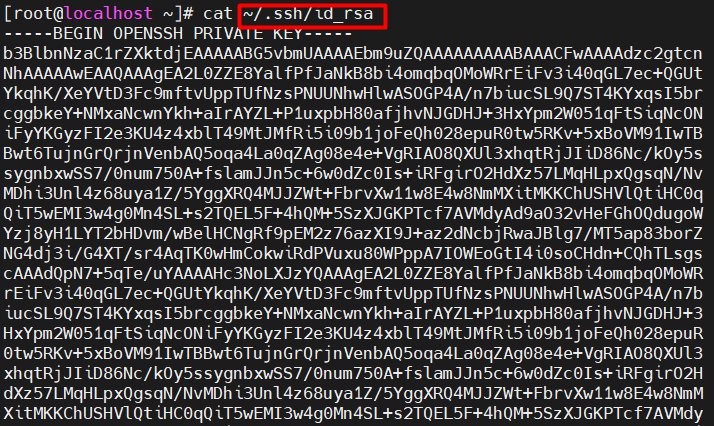
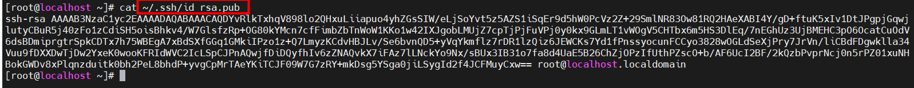
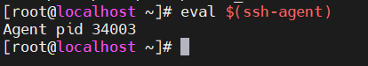

# Mục lục   
[1. SSH là gì](#1)   
[2. Một số file cấu hình của dịch vụ OpenSSH trên Linux](#2)   
[3. Truy cập dòng lệnh từ xa với SSH](#3)   
[4. Cấu hình SSH xác thực dựa trên khóa](#5)   
[5. Tùy chỉnh dịch vụ cấu hình OpenSSH](#5)  
   
## [Tham khảo](#6)     

---  
```
Mục đích:   
- Đăng nhập từ một hệ thống từ xa đang sử dụng ssh để chạy những lệnh từ lời nhắc shell.      
- Thiết lập ssh để cho phép bảo mật đăng nhập không có mật khẩu bởi đang sử dụng một file xác thực riêng.     
- Tùy chỉnh cấu hình ssh để hạn chế trực tiếp đăng nhập như root hoặc vô hiệu hóa đăng nhập bằng password.       
```      
---   

<a name='1'></a>  
### 1. SSH là gì?     
 - SSH hay còn gọi là Secure Socket Shell, là một giao thức cung cấp cho quản trị viên một cách an toàn để truy cập máy tính từ xa.     

   

<a name='2'></a>   
### 2. Một số file cấu hình của dịch vụ OpenSSH trên Linux.   

- Cổng dịch vụ mặc định SSH: `TCP - 22`       
- `/etc/ssh/sshd_config`: file cấu hình dịch vụ OpenSSH server.   
- `/etc/ssh/ssh_config`: file cấu hình OpenSSH client.   
- `~/.ssh/`: thư mục chứa nội dung cấu hình ssh của user client trên Linux.   
- `~/.ssh/authorized_keys`: thư mục chứa thông tin các public key được user sử dụng để login vào hệ thống Linux.      
     - root    `/root/.ssh/authorized_keys`    
     - user(abc)    `/home/abc/.ssh/authorized_keys`       

- `/etc/nologin`: nếu thư mục này tồn tại, thì dịch vụ SSH server trên Linux sẽ từ chối đăng nhập từ các user khác trên hệ thống ngoại trừ user root. File này cần trong trường hợp khẩn cấp cần cách lý sớm hệ thống.    
     
- Lệnh `SCP (secure copy-sao chép an toàn)` là lệnh do OpenSSH Client cung cấp, nó cho phép truyền tải file qua lại giữa máy local và remote (server), nó sử dụng giao thức SSH để truyền file.    
    - Cấu trúc:  
        - `scp [OPTION] [user_src@src_host:]src_file [user@]desk_host:]des_file `   

Trong đó:  
   - `[user_src@src_host:]src_file` là file, thư mục nguồn, ví dụ abcuser@172.16.138.124:/home/file1.txt là file /home/file1.txt tại máy abcuser@172.16.138.124, như dấu `:`, nếu là tại máy local thì không cần chỉ ra user, host tức bỏ đoạn `abcuser@172.16.138.124:`    
   - `[user@]desk_host:]des_file` đường dẫn file, thư mục đích muốn copy - ý nghĩa tương tự như trên.    
   - `[OPTIONS]` các thiết lập cho thêm vào nếu muốn, như cho thêm tham số -r để đệ quy copy cả thư mục, các file, thư mục con theo đường dẫn.       

VD: `scp root@172.16.138.102:/home/data/1.txt /mycode/1.txt `     

- Nghĩa là một file nằm trên server 172.16.138.102  ở đường dẫn /home/dat/1.txt có tài khoản SSH với user là root về lưu ở máy local với đường dẫn /mycode/1.txt.

<a name='3'></a>  
### 3. Truy cập dòng lệnh từ xa với SSH     
- Lệnh ssh: dùng để tạo một kết nối bảo mật đến một hệ thống từ xa, xác thực như một user riêng và nhận được một phiên shell tương tác trong hệ thống từ xa với tư cách user đó.   
- Sử dụng SSH để login với password   
    - Trên máy local:   
        `ssh your-username@host`     
    - VD:   
        `ssh boo@remotehost`       
  
*Note: host ở đây có thể là ip hoặc domain của máy mà bạn truy cập tới.*    
Sau đó nhập mật khẩu tương ứng với user của bạn tại host đó.     

- Cơ chế xác thực bằng SSH Key: 
   - Ngoài cơ chế xác thực bằng mật khẩu như trên còn có cơ chế sử dụng SSH Key để xác thực. Để tạo nên xác thực này cần có hai file, một file lưu Private Key và một lưu Public Key.      
      - `Public Key` khóa chung: là một file text - nó lại lưu ở phía Server SSH, nó dùng để Client gửi Private Key (file lưu ở Client) lên để xác thực thì kiểm tra phù hợp giữa Private Key và Public Key này. Nếu phù hợp thì cho kết nối.   
      - `Private Key` khóa riêng: là một file text bên trong nó chứa mã riêng để xác thực (xác thực là kiểm tra sự phù hợp của Private Key và Public Key). Client kết nối với Server phải chỉ ra file này khi kết nối SSH thay vì nhập mật khẩu.   
      *Note: Hãy lưu file Private Key cẩn thận, bất kỳ ai có file này có thể thực hiện kết nối đến máy chủ của bạn.*    

- `SSH Known Hosts Key Management`:    
    - Public Key được lưu trữ trong `/etc/ssh/known_hosts` và từng người `~/.ssh/known_hosts` file trong SSH client.        
        

 
 <a name='4'></a>  
 ### 4. Cấu hình SSH xác thực dựa trên khóa.  
- Sử dụng câu lệnh để tạo ra một cặp khóa xác thực SSH (Public Key & Private Key)     
- Câu lệnh trên local:     
    - `ssh-keygen [Options]`     
    - Options:   
        - `-f`: là key name và nơi sẽ lưu trữ key.   
        - `-t`: là thuật toán mã hóa để sinh khóa.     
        - `-b`: kích thước khóa.
- VD: `ssh-keygen -f ~/keypass -t ecdsa -b 521`      
  

    - Private Key thì được lưu ở file  `~/.ssh/id_rsa`, nó được dùng để SSH client (máy local) kết nối đến Server. Mở file này đoạn mã Private Key có dạng:    
        

    - Public Key thì được lưu ở file `~/.ssh/id_rsa.pub`, nó được lưu (dùng) ở máy Server để xác thực khi có Private key gửi đến. Mở file này đoạn mã Public Key có dạng:     
       

```  
- Trong lúc generate, hệ thống sẽ yêu cầu bạn cung cấp passphrase. Mục đích sinh ra passphrase là để encrypt private key. Vậy khi một kẻ tấn công biết được private key của bạn cũng chưa chắc có thể sử dụng, vì nó đã bị mã hóa.   
- Trong thực tế, hầu hết khi tạo khóa SSH người ta thường không sử dụng thêm passphrase. Vì khi gặp vấn đề liên quan tới automation, passphrase này đâu thể đánh bằng tay mà ta phải lưu trong một kho lưu trữ hoặc là trong một đoạn script nào đó. Kết quả là bạn quay về xác thực bằng mật khẩu (lol !), attacker vẫn có thể biết được passphrase 
```   
- Lệnh `ssh-copy-id`: dùng để copy Public Key của keypair SSH đến hệ thống đích.    
- Nếu bạn bỏ lỡ con đường đến file public key trong khi chạy `ssh-copy-id`, nó sử dụng mặc định file `/home/user/.ssh/id_rsa.pub`       
- Cấu trúc lệnh:  
    - `ssh-copy-id [Options]` 
    - Option: 
        - `-i`: để chỉ định đường dẫn đến file private key.
- VD: ssh-copy-id -i .ssh/keypass.pub user@ip(domain)

- Lệnh `ssh-agent`: temporarily cache your `private key` passphrase in memory.    
- Lệnh `eval $(ssh-agent)`: bắt đầu ssh-agent và chạy những lệnh tự động, thiết lập biến môi trường cho phiên shell. Nó sẽ hiển thị PID của process ssh-agent.    

      
- Thêm private-key vào SSH-agent   
    - Trên máy local:     
       ` ssh-add /PATH/TO/YOUR/KEY`    
 ``` 
- ssh-add là câu lệnh để thêm SSH private-keys vào SSH authentication agent, gọi là ssh-agent để quản lý việc truy cập vào các máy tính sử dụng các khóa private. Khi bạn đã thêm khóa vào ssh-agent thì lúc truy cập bạn không cần phải khai báo thêm khóa này.   
- Phần public của khóa private được lưu vào ssh-agent phải được đặt trong ~/.ssh/authorizedkeys (authorized_keys) là một file) 
    
```       
*Note: Lỗi hay gặp không kết nối được SSH Key: thường là lưu file public key ở Server ở các thư mục không được chmod phù hợp. Nếu user có tên abc, thì chmod phù hợp là:*      
``` 
/home/abc                        700   
/home/abc/.ssh                   700
/home/abc/.ssh/authorized_keys   600  
```

<a name='5'></a>   
## 5. Tùy chỉnh cấu hình dịch vụ OpenSSH     
- Chỉ sử dụng giao thức SSH phiên bản 2.  
    - `protocol 2`     
- Không sử dụng mật khẩu rỗng.   
    - `PermitEmptyPasswords no`    
- Thay đổi cổng (Port) SSH.   
    - ` Port 2021`    
- Không cho đăng nhập bằng User Root.   
    - ` PermitRootLogin no`    
- Cấu hình thời gian ngắt kết nối SSH nếu User không hoạt động.   
    - ` ClientAliveInterval 300 ClientAliveCountMax 0`     
- Cấu hình thời gian TimeOut khi user không đăng nhập thành công.   
    - ` LoginGraceTime 120`    
- Tắt Log đăng nhập lần gần cuối.  
    - `PrintLastLog no`    
- Sử dụng chứng thực mật khẩu SSH key, tắt chứng thực mật khẩu.   
    - `PubkeyAuthentication yes PasswordAuthentication no`     
- Cho phép/từ chối kết nối SSH từ 1 User hoặc 1 Group.    
    - Cho phép:       
       - `AllowUsers user1 user2 AllowGroup G1`     
    - Từ chối:   
       - `DenyUsers user1, user2 DenyGroups G1`     
- Số lần tối đa đăng nhập sai:  
    - `MaxAuthtries 3`     
    
- Chố độ *StrictModes*     
   - *StrictModes* là chỉ định dịch vụ SSH kiểm tra thông tin quyền (permission) của thư mục $HOME, thư mục ".ssh" và file "authorized_keys" chứa key SSH nếu bạn sử dụng SSH Key.    
   - Nếu bạn không sử dụng chế độ này (option "no") thì dịch vụ SSH sẽ không kiểm tra các cấu hình quyền khi bạn đăng nhập vào VPS/Cloud Server. Vì vậy bạn cần chú ý cấu hình đúng các phân quyền (permission) cho thư mục/key dùng để đăng nhập SSH.    
       - `StrictModes yes`   
 
<a name='6'></a>  
## Tham khảo   
[1]https://cloudviet.com.vn/13-cach-cau-hinh-bao-mat-ssh-server-tren-linux/   
[2]https://viblo.asia/p/ssh-so-luoc-mot-so-cau-lenh-co-ban-phan-1-maGK7JLD5j2   
[3]https://xuanthulab.net/tao-ssh-key-va-xac-thuc-ket-noi-ssh-bang-public-private-key.html

    


   