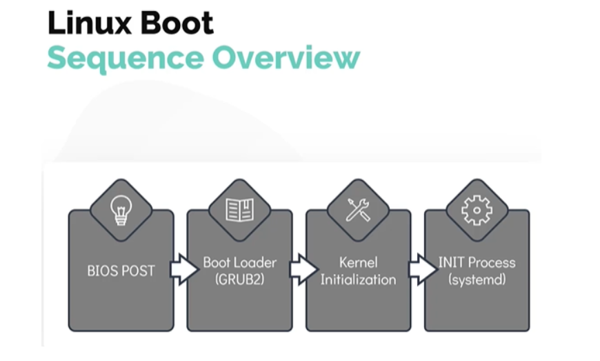
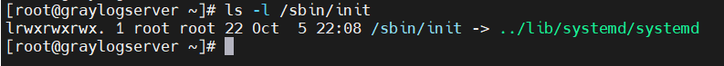
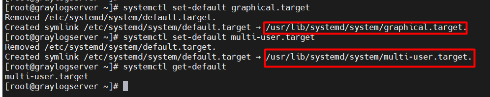
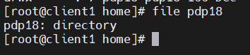

# Mục lục    

[1. Linux Boot Sequence](#1)  
[2. Run - Levels](#2)    
[3. File Types Linux](#3)        

## [Tham Khảo](#4)     

----   

     
### 1. Linux Boot Sequence         
- Quá trình Boot được chia xuống thành 4 giai đoạn.      

1. BIOS POST    
2. Boot Loader (Grub2)    
3. Khởi tạo Kernel    
4. INIT Process         

     

- `BIOS POST`    
   - POST viết tắt là Power On Self Test   
   - `BIOS (Basic Input/Ouput System)` chạy kiểm tra POST để đảm bảo các thành phần phần cứng được gắn vào thiết bị hoạt động bình thường, nếu không nó sẽ dừng.           

- `Boot Loader (Grub2)`    
   - BIOS tải và thực thi mã boot từ thiết bị boot. Tệp này nằm trong `/boot`.      
   - Một Boot Loader phổ biến hiện nay và được sử dụng chính trong hầu hết hệ điều hành  là `Grub2` (GRand Unified BootLoader Version 2).     

- `Khởi tạo Kernel`    
   - Kernel thực hiện tác vụ khởi động phần cứng và tác vụ quản lý memory cùng những thứ khác.     
   - Sau khi hoàn thành vận hành, kernel sẽ tìm `INIT Process` để chạy.     

- `INIT Process`    
   - Hầu hết các bản distro Linux hiện nay, chức năng `INIT` được gọi là `systemd` daemon.     
   - `systemd`: là process chạy đầu tiên trên hệ thống với `ID=1`.    
   - `systemd`: giúp máy chủ Linux về trạng thái có thể sử dụng được.   
   - `systemd`: gắn kết các hệ thống tệp, bắt đầu và quản lý dịch vụ hệ thống.           

- Lệnh `ls -l /sbin/init`: để check init hệ thống.      
 
    

    
## 2. Run - Levels     

- `Systemd Targets (Run-Levels)`     
   - Linux có thể chạy nhiều chế độ và được đặt bởi `runlevels`.      
   - Cung cấp một giao diện đồ họa `(GUI)- Graphical User Interface` thì được gọi là `runlevel 5`.   
   - Cung cấp một giao diện dòng lệnh thì được gọi là `runlevel 3`.      
- Lệnh `runlevel`: để xem hệ thống đang vận hành ở chế độ nào.        
- Trong `systemd`, runlevels được gọi là `targets`.    
   - Runlevel 5 thì được gọi là `graphical targe`.  
   - Runlevel 3 thì được gọi là `multiuser target`.    

- Lệnh `systemctl get-default`: để xem target mặc định của hệ thống. Lệnh này được tìm thấy trong file `/etc/systemd/system/default.target`.    

- Lệnh `systemctl set-default [argument]`: thay đổi target mặc định.    
   - Trong đó [argument]:   
       - `multi-user.target` or `graphical.target`.      

   
    
   
### 3. File Types Linux.    

- Có 3 kiểu của files:  
    - Regular file.   
    - Directory.  
    - Special file.     

- `Special file` có 5 kiểu của files khác nhau.     
    - Character Files: Tệp thiết bị nằm trong thư mục /dev như là keyboard và mouse.      
    - Block Files: Tệp block devices nằm trong thư mục /dev như là đĩa cứng (harddisks) và RAM.     
    - Links: là liên kết hai hoặc nhiều tên files vào cùng một file dữ liệu.     
       - Có 2 loại link: `hardlink` và `softlink`.    
    - Sockets: cho phép giao tiếp giữa 2 process.   
    - Named Pipes: cho phép kết nối một process làm đầu vào cho một process khác.       

- Lệnh `file`: để xác định lại tệp.   

   

  
## Tham khảo    
[1] https://github.com/phupham1805/linux-basics-course/blob/master/docs/03-Linux-Core-Concepts/09-Lab-Linux-RunLevels-Filesystem-Hierarchy.md

 

