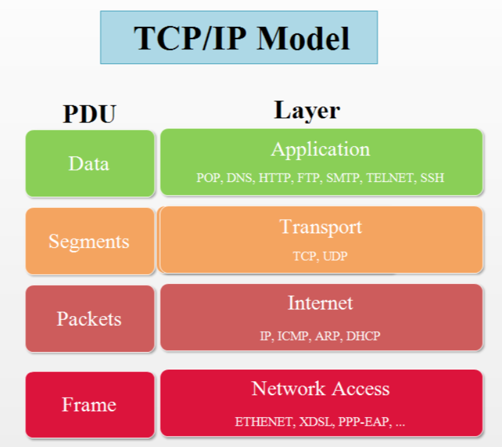
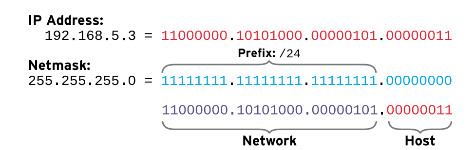
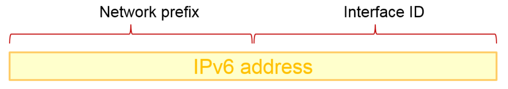
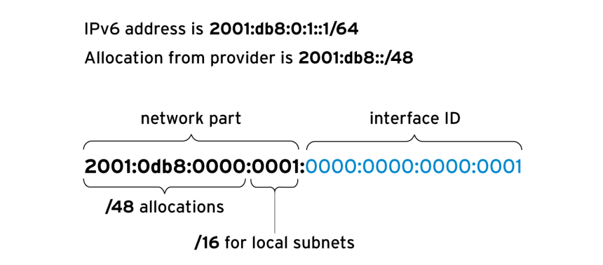
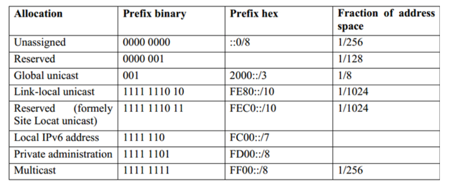

# Mục lục    
[1. Mô hình TCP/IP](#1)   
[2. IPv4 Networking](#2)      
[3. IPv6 Networking](#3)    

## [Tham khảo](#3)   
----   
    
### 1. Mô hình TCP/IP     

-  Mô hình TCP/IP gồm 4 layer     
   - `Application`: Mỗi ứng dụng có thông số kỹ thuật để giao tiếp vì vậy clients và servers có thể giao tiếp qua nền tảng. Các Protocols chung bao gồm SSH (remote login), HTTPS (secure web), NFS or CIFS (file sharing) and SMTP (chuyển mail điện tử), DNS (phân giải tên miền),...      
   - `Transport`: xử lý vấn đề giao tiếp giữa các máy chủ của cùng một mạng hoặc khác mạng được kết nối với nhau thông qua bộ định tuyến.      
      - Giao thức lớp vận chuyển là TCP và UDP.   
         - TCP là một giao tiếp định hướng kết nối đáng tin cậy.     
         - UDP là một connectionless datagram protocol. (tốc độ truyền tải nhanh nhưng không đảm bảo được chất lượng dữ liệu được gửi - thường được sử dụng trong realtime như thoại, video)  
      - File `/etc/services`: liệt kê các cổng đã đăng kí.      
    - `Internet`: lớp mạng mang dữ liệu từ nguồn host đến đích host (định tuyến, chuyển tiếp, định địa chỉ, đóng gói dữ liệu, đảm bảo chất lượng dịch vụ,...)     
       - Giao thức lớp Internet là IP(IPv4 và IPv6), ARP (Address Resolution Protocol - giao thức tìm địa chỉ) và RARP (Reverse Address Resolution Protocol - giao thức tìm địa chỉ ngược lại) nằm bên dưới IP và trên tầng Link.             
       - Mỗi host sẽ có một địa chỉ IP và một prefix length sử dụng để làm địa chỉ mạng. Router thì đã được kết nối mạng.       
    - `Link`: cung cấp kết nối với phương tiện vật lý. Hầu hết các kiểu của mạng là kết nối có dây Ethernet (802.3) và kết nối không dây WLAN (802.11). Mỗi thiết bị vật lý có địa chỉ phần cứng (MAC) được sử dụng để xác định đích của gói trong thành phần mạng cục bộ.    

- Tên giao diện mạng dựa trên thông tin từ fireware, topology bus PCI và kiểu của thiết bị mạng.
   - Interface Ethernet là `en`    
   - Interface WLAN là `wl`   
   - Interface WWAN là `ww`         
- `eno1`: là thiết bị Ethernet trên bo-mạch 1.   
- `ens3`: là 1 card Ethernet trong hotplug PCI số 3.   
- `wlp4s0`: là 1 card WLAN trên bus PCI 4 trong slot 0.      
- `wlp3s1f1`: là 1 card WLAN trên bus PCI 3 trong slot 1 function 1.      

  
### 2. IPv4 Networking       
- IPv4 là một số 32 bit được chia thành 4 octet, mỗi octet có 8 bit được ngăn cách nhau bởi dấu `.`.    
- Địa chỉ mạng được chia làm 2 phần: phần network và phần host.     
- Tất cả phần `Host` trong một subnet (mạng con) có thể nói chuyện trực tiếp lẫn nhau mà không cần thông qua rou      
- Phần `Host` là duy nhất trên một subnet (mạng con).     
- Để biết phần nào là phần `network`, phần nào là phần `host` trong địa chỉ IPv4 thì cần tới ` netmask`.        
- Phần `host` tất cả là 0 thì được gọi là `network address` địa chỉ thấp nhất trên một subnet.        
- Phần `host` tất cả là 1 thì được gọi là `broadcast address` địa chỉ cao nhất trên một subnet.    
- Có 2 cách để xác định phần mạng trong IP   
     - Phần mạng có 16 bits và đọc là `255.255.0.0`   
     - Trong IP có hiện /24 ở đuôi có nghĩa là có 24 bit phần mạng được gọi là `prefix length`.       

    

Tính địa chỉ mạng cho 172.16.130.131/24    

|Host addr|172.16.130.131|10101100.00010000.10000010.10000011|      
|----|----|----|    
|Netmask Prefix|/24 (255.255.255.0)|11111111.11111111.11111111.00000000|   
|Network Address|172.16.130.0|10101100.00010000.10000010.00000000|    
|Broadcast Address|172.16.130.1|10101100.00010000.10000010.11111111|       

- Địa chỉ IP `127.0.0.1` là địa chỉ IP của thiết bị (localhost).        

### IPv4 Routing       
- Định tuyến là phương thức mà router dùng để chuyển gói tin đến địa chỉ đích một cách tối ưu nhất.(tìm con đường đi ngắn nhất) thông qua các subnet.
- Mỗi host sẽ có một bảng định tuyến `routing table` có nhiệm vụ định tuyến lưu lượng cho mạng riêng. Một bảng định tuyến sẽ liệt kê các con đường đến đích.    
- Bảng định tuyến mặc định cho toàn bộ Internet IPv4 là `0.0.0.0/0`.     

### IPv4 Address và Router Configuration     

- Một máy chủ có thể tự động cấu hình địa chỉ IPv4 cho nó tại thời điểm boot từ 1 DHCP server (Dynamic Host Configuration Protocol).        
- Bạn có thể cấu hình server để sử dụng một cấu hình mạng tĩnh. Trong trường hợp, cài đặt mạng thì đọc từ files cấu hình local. Bạn cần phải cài đặt chính xác từ người quản trị mạng của bạn và cập nhật chúng để tránh xung đột với máy chủ khác.    

  
## 3. IPv6 Networking     

- Một địa chỉ IPv6 là một số 128 bit.     
- IPv6 có thể sử dụng song song với IPv4 thì được gọi là mode `dual-stack`(ngăn xếp kép).    
- Red Hat Enterprise Linux vận hành với `mode dual-stack` mặc định.      

### IPv6 Address     

- Địa chỉ IPv6 dài 128 bit, chia thành 8 nhóm, mỗi nhóm gồm 16 bit, được ngăn cách nhau bởi dấu `:`, mỗi nhóm được biểu diễn bằng 4 số `hexa`.   

- VD: `abcd:0034:0000:2543:0983:0000:0000:0000:ab23`    

- Ta có thể rút ngắn dải địa chỉ IP trên thành:   
`abcd:34::2543:983:0:0:0:ab23`       

### IPv6 Subnetting      

- `unicast`: được định nghĩa là một cổng của một node IPv6.    
- `multicast`: được địng nghĩa là một nhóm các cổng IPv6.  
- `anycast`: được đăng ký cho nhiều cổng (trên nhiều node).       

- Địa chỉ IPv6 gồm 2 phần:    
    - `Network Prefix`    
   
    - `Interface ID`     

      

- Khác với IPv4 thì IPv6 có tiêu chuẩn subnet mask và được sử dụng hầu hết ở tất cả các địa chỉ bình thường là `/64`. (một nửa network prefix và một nửa interface ID)       
- Đặc biệt, người cung cấp mạng sẽ phân bổ prefix `/48`, để 16 bits cho `subnet`.  

      

|IPv6 Address or Network|Mục đích|Mô tả|      
|----|----|----|    
|::1/128|localhost|`127.0.0.1/8` đặt làm địa chỉ loopback|      
|::| Không xác định địa chỉ|Sẽ lắng nghe tất cả địa chỉ IP đã được cấu hình|     
|::/0:|route mặc định|Là route mặc định trong bảng định tuyến|    
|2000::/3|Địa chỉ Global unicast|Địa chỉ IPv6 bình thường hiện đang được phân bổ bởi IANA(Internet Assigned Numbers Authority - Tổ chức cấp phát số hiệu Inter net) phạm vi từ 2000::/16 đến 3ff::/16|
|fd00::/8|Địa chỉ local duy nhất|Chỉ được sử dụng private và không được sử dụng trên `Internet` toàn cầu|      
|fe80::/10|Địa chỉ Link-local|Mỗi IPv6 card tự cấu hình một địa chỉ `link-local unicast` chỉ làm việc trong link-local trên mạng fe80::/64 và được sử dụng trong tương lai|       
|ff00::/8|Multicast|IPv6 tương đương 224.0.0.0/4 . Multicast được sử dụng để truyền đến đa host tại cùng một thời gian, nó không có địa chỉ broadcast|       

   

- Một địa chỉ `link-local` là địa chỉ không thể thay đổi sử dụng để giao tiếp với máy chủ trên link network riêng.      
-   

   

## Tham Khảo   

[1]https://vinahost.vn/ipv6-la-gi/   

   

  

