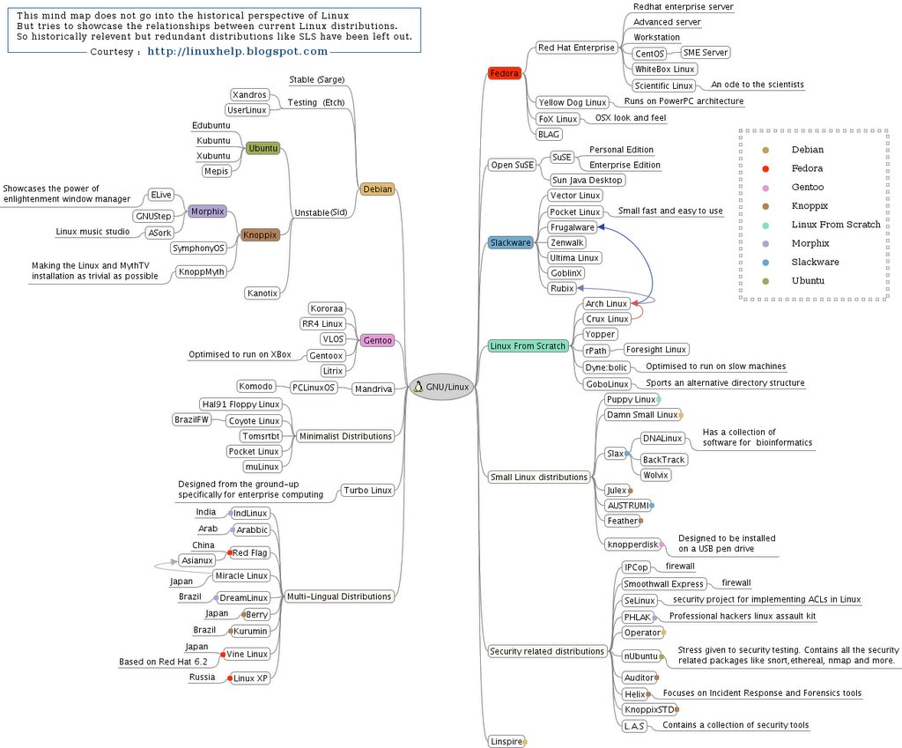

# Mục lục
-  1.Khái niệm 
-  2.Các nhánh và distro phổ biến 
-  3.Đặc điểm và So sánh   

##  Tham khảo 
----
 
###  Distributions của Linux 
1. Khái niệm, distro là gì?  
Một bản phân phối Linux(Thường được gọi tắt là distro) là một hệ điều hành được tạo dựng từ tập hợp các phần mềm nhưng đều dựa trên hạt nhân Linux (Linux kernel)  
   - Hạt nhân Linux-Kernel có chức năng là cho phép hệ thống giao tiếp, quản lý và điều khiển các bộ phận phần cứng của máy tính. 
2. Các nhánh và distro phổ biến  
Vì là mã nguồn mở nên Bất cứ ai cũng có thể tạo một Distro và tự đặt tên (tuân theo luật)
### Loại hình các distro 
   - Các bản phân phối Linux được thiết kế cho 
        - Người dùng doanh nghiệp
        - Người dùng cá nhân
        - Người dùng chuyên nghiệp 
  - Hỗ trợ nhiều nền tảng phần cứng 
  - Thiết kế riêng cho máy chủ, máy tính cá nhân, thiết bị nhúng.  
### Các distro 
 - Dù có rất nhiều các distro nhưng dựa trên 3 nhánh lớn:  
     - Debian:
        - Ubuntu: Xubuntu, Kbuntu, Edubuntu.
        - Knoppix: Morphix,...Linux Mint 
    - Fedora:   
        - Red Hat Enterprise Linux: CentOs, WhiteBox Linux...
    - Slackware:
        - Vector Linux 
        - Pocket Linux 
        - Prugalware 
        - Rubix  
   - Các nhánh khác như:  
        - Open SUSE: SUSE, Sun Java Desktop
        - Linux From Scratch: Arch Linux, Crux Linux  
        - Gentoo: Kororaa, RR4 Linux, Gentoox, Litrix        
3. Đặc điểm và So sánh các distro  
- Tổng quan: 
   - Các distro hướng đến người dùng am hiểu và phát triển hệ thống: Arch Linux, Gentoo, Slackware. 

   - Các distro hướng đến người dùng là doanh nghiệp và chính phủ: CentOs, RedHat.. 
   - Các distro hướng đến người dùng cá nhân: Ubuntu, openSuSE. 
- Đặc điểm và so sánh:
   - Ubuntu, SUSE
       -Hướng nhiều đến GUI (Giao diện người dùng) để cấu hình hệ thống dễ sử dụng cho người dùng cá nhân.
       - Miễn phí cho người sử dụng, liên tục có phiên bản mới.
       - Ubuntu: Phiên bản hỗ trợ thông thường ( hỗ trợ đến YY .MM ) hoặc Phiên bản hỗ trợ lâu dài ( LTS - Long Term Support ). SuSE ( Persional Edition, Enterprise Edition )
    - RedHat, CentOs 
        - Bản chất CentOs là nhánh con của RedHat, nên việc cập nhật phiên bản tính năng phụ thuộc nhiều vào RedHat.
        - Phù hợp cho môi trường cần tính ổn định vì các bản cập nhật thường đến khá lâu.
        - Có các dịch vụ hỗ trợ thương mại cho các công ty, ít sử dụng các công nghệ mới.
    - Debian, Fedora và Arch Linux, Gentoo Slackware  
        - Xây dựng hệ thống dựa trên môi trường dòng lệnh 
        - Debian, Fedora thì có công cụ để hỗ trợ xây dựng hệ thống ( Cần phải am hiểu mới làm được với Arch, Gentoo ).
        - Raspbian: Dùng cho thiết bị nhúng như Raspberry Pi để điều khiển.   

---  

##  Tham khảo  

[1]https://vi.wikipedia.org/wiki/B%E1%BA%A3n_ph%C3%A2n_ph%E1%BB%91i_Linux#B%E1%BA%A3n_ph%C3%A2n_ph%E1%BB%91i_ph%E1%BB%95_bi%E1%BA%BFn   
[2]https://github.com/vinhducnguyen1708/Internship-VNPT-IT/blob/master/Linux/Overview%20Linux/Linux%20Distributions.md  
[3]http://www.aboutlinux.info/2006/04/mind-map-of-linux-distributions.html 
