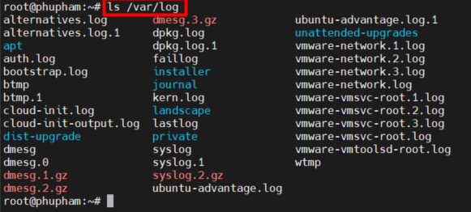
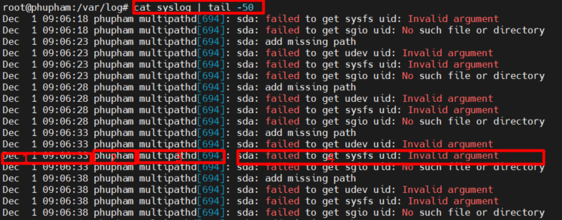

# Mục lục    
[1. Mô tả kiến trúc Log hệ thống](#1)    
[2. Reviewing Syslog Files](#2)    
[3. Reviewing System Journal Entries](#3)    
[4. Preserving The System Journal](#4)     
[5. Duy trì thời gian chính xác](#5)     

## [Tham Khảo](#6)   

----  

    
### 1. Mô tả kiến trúc Log hệ thống   
- Hầu hết các hệ thống ghi lại logs of events trong tệp văn bản, có thể được tìm thấy trong thư mục `/var/log` và thư mục con.     

    
- Một `logging system` tiêu chuẩn dựa trên giao thức `syslog` thì đã được xây dựng trong Linux. Nhiều chương trình sử dụng hệ thống này để ghi lại events và sắp xếp chúng thành files log. Dịch vụ `systemd-journald` và `rsyslog` xử lý `syslog messages` trong Linux.     

       

 
  

|Log File|Chức năng|   
|----|----|  
|/var/log/messages|Most syslog messages are logged here. Ngoại trừ thông tin liên quan authentication và email processing, scheduled job execution and debug.|   
|/var/log/secure|Files log lưu trữ syslog messages liên quan đến bảo mật và xác thực events.|   
|/var/log/maillog|Files lưu trữ syslog messages liên quan mail server |   
|/var/log/cron|Files lưu trữ syslog messages liên quan đến scheduled job execution |   
|/var/log/boot.log|Non-syslog console messages liên quan đến hệ thống khởi động.|     

    
### 2. Reviewing syslog files       
- Logging events to the system   
   - Nhiều chương trình sử dụng giao thức syslog để log events đến hệ thống. Mỗi log messages thì được phân phối bởi 1 cơ sở (kiểu của messages) và độ ưu tiên (mức độ nghiệm trọng của messages).    

   |code|Priority|Severity|   
   |----|----|----|   
   |0|emerg|Hệ thống thì không thể sử dụng được|    
   |1|alert|Hành động phải được thực hiện ngay lập tức|    
   |2|crit|Tình trạng nguy hiểm|   
   |3|err|Tình trạng lỗi không nguy hiểm|   
   |4|warning|Tình trạng cảnh báo|   
   |5|notice|Event bình thường nhưng quan trọng|   
   |6|info|Thông tin event|    
   |7|debug|Debugging-level messages|   

