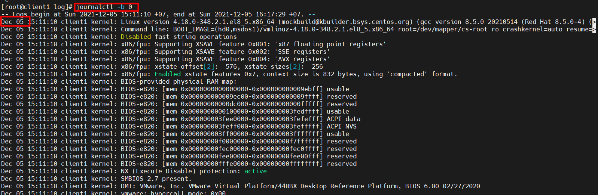
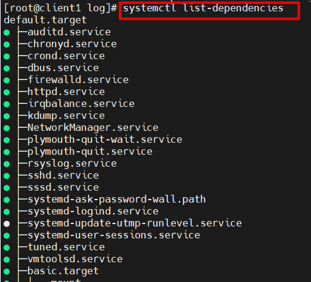

# Mục lục    
[1. Log là gì, để làm gì?](#1)    
[2. Giao thức Syslog là gì?](#2)    
[3. Rsyslog là gì?](#3)      
[4. Logrotate là gì?](#4)     
[5. Journal](#5)     

## [Tham Khảo](#6)   

----  

    
### 1. Log là gì, để làm gì?    

*VD: Khi quản lý một server chứa nhiều dữ liệu hoặc đã cài đặt rất nhiều ứng dụng, tính năng. Server tự nhiên mất dữ liệu, muốn điều tra xử lý và tìm nguyên nhân khắc phục hậu quả xảy ra thì `log` sẽ giúp việc này.*    

- 1.1 Log là gì?             
   - `log` là dữ liệu sinh ra khi hệ thống hoạt động ghi lại liên tục các thông báo về hoạt động của cả hệ thống hoặc các dịch vụ được triển khai trên hệ thống và file tương ứng.       

     

- 1.2 Công dụng của Log    
   - Phân tích nguyên nhân và khắc phục nhanh hơn khi có sự cố xảy ra.   
   - Phát hiện và dự đoán vấn đề có thể xảy ra đối với hệ thống.
   
- Các file log sẽ xuất log cho bạn biết tất cả các tiến trình diễn ra trong hệ thống.      
- Hệ điều hành Linux cung cấp một kho lưu trữ tập trung các file log trong thư mục `/var/log`     

           
- 1.3 File Log:   
     **Ví dụ**  
   - Syslog: Log hệ thống thông thường chứa các thông tin mặc định của hệ thống, thường được lưu trong /var/log/syslog hoặc /var/log/messages.   

*Note: Syslog (Ubuntu), Messages (CentOs): Log hệ thống thông thường chứa các thông tin mặc định của hệ thống.*      

     

   - Auth.log: Chứa thông tin xác thực trên hệ thống. Khi chúng ta tìm kiếm vấn đề liên quan đến cơ chế ủy quyền của người dùng thì file log này sẽ làm điều đó.   
      - Thông qua file log này giúp cho chúng ta xác định được:  
         - Các lần thử đăng nhập thất bại.   
         - Điều tra các cuộc tấn công và các lỗ hổng liên quan đến cơ chế ủy quyền của người dùng.        

*Note: Auth.log (Ubuntu), Secure (CentOs): đều chứa thông tin xác thực trên hệ thống*    

       
- Một số file log có trong thư mục /var/log    
    - /var/log/boot.log: log trong quá trình khởi động hệ thống.      
       
    - /var/log/cron: các hoạt động của crond.       
       
    - /var/log/dmesg: chứa thông tin bộ đệm vòng kernel.    
    - /var/log/yum.log: các log của yum.    
    - /var/log/secure: log xác thực     
    - /var/log/wtmp: chứa thông tin lịch sử về các lần đăng nhập và đăng xuất.    
    
    - /var/log/btmp: chứa thông tin đăng nhập không thành công.   

    
### 2. Giao thức Syslog      

- 2.1 Syslog là gì?   
    - Syslog là một giao thức client/server là giao thức dùng để chuyển log và thông điệp đến máy nhận log. Máy nhận log thường được gọi là `syslogd, syslog daemon hoặc syslog server.`        
    - Syslog có thể gửi qua UDP hoặc TCP.   
    - Syslog dùng `port 514`.   
    - Trong chuẩn syslog, mỗi thông báo đều được dán nhãn và được gán các mức độ nghiêm trọng khác nhau.      
- 2.2 Mục đích của syslog ?    
    - Syslog xác định mức độ nghiêm trọng (severity levels) cũng như mức độ cơ sở (facility levels) giúp người dùng hiểu rõ hơn về log được sinh ra ở máy.  

**Cấp độ cơ sở Syslog (Syslog Facility levels)**:    
- Dùng để xác định chương trình
- Xác định Log được tạo ra từ đâu   
- Xác định mục đích Log sinh ra    
- Nếu một máy khác muốn sinh ra log thì sẽ là một tập hợp các cấp độ facility được bảo lưu từ 16-23 được gọi là "local use" facility levels.     

|Facility|Nguồn tạo log|Ý nghĩa|   
|----|----|----|    
|0|kernel|Những log mà do kernel sinh ra|   
|1|user|Log ghi lại cấp độ người dùng|   
|2|mail|Log của hệ thống mail|    
|3|daemon|Log của các tiến trình trên hệ thống|    
|4|auth|Log từ quá trình đăng nhập hoặc xác thực hệ thống|    
|5|syslog|Log từ chương trình syslogd|   
|6|lpr|Log từ quá trình in ấn|    
|7|news|Thông tin từ hệ thống|    
|8|uucp|Log UUCP sybsystem|    
|9||Clock daemon|    
|10|authpriv|Quá trình đăng nhập hoặc xác thực hệ thống|    
|11|ftp|Log của FTP daemon|    
|12||Log từ dịch vụ NTP của các subserver|    
|13||Kiểm tra đăng nhập|   
|14||Log cảnh báo hệ thống|   
|15|cron|Log từ clock daemon|    
|16-23|local 0-local 7|Log dự trữ cho sử dụng nội bộ|     

**Cấp độ cảnh báo**    
- Dựa vào mức cảnh báo để biết và khắc phục sự cố.   
- Có 8 cấp độ từ 0-7, 0 là cấp độ khẩn cấp quan trọng nhất.    

|Value|Severity|Keyword|    
|----|----|----|  
|0|Emergency|`emerg`-Thông báo tình trạng khẩn cấp|   
|1|Alert|`alert`-Hệ thống cần can thiệp ngay|    
|2|Critical|`crit`-Tình trạng nguy kịch|    
|3|Error|`err`-Thông báo lỗi đối với hệ thống|    
|4|Warning|`warning`-Mức cảnh báo đối với hệ thống|    
|5|Notice|`notice`-Chú ý đối với hệ thống|   
|6|Informational|`info`-Thông tin của hệ thống|   
|7|Debug|`debug`-Quá trình kiểm tra hệ thống|     

**Định dạng chung của một gói tin syslog**    
- Định dạng của một thông báo syslog gồm 2 phần chính.   
   `HEADER MSG`           

Trong đó:   
`HEADER`    
- Phần HEADER thì gồm các phần chính sau:   
    - Time stamp -Thời gian mà thông báo được tạo ra. Thời gian này được lấy từ thời gian hệ thống    
    *Note: thời gian của server và thời gian của client khác nhau thì thông báo ghi trên log được gửi lên server là thời gian của client*      
    - Hostname hoặc IP      
   
`MSG`   
- Phần Message hay MSG chứa một số thông tin về quá trình tạo ra thông điệp đó. Gồm 2 phần chính: 
   - Tag field: tên chương trình tạo ra thông báo.   
   - Content field: chứa các chi tiết của thông báo.      

*Đối với file ghi log có thể dùng một số lệnh sau để giúp cho việc xem log một cách dễ dàng*     
- Lệnh `more`: Dùng để xem toàn bộ nội dung của thư mục.   
- Lệnh `tail`: In ra 10 dòng cuối cùng nội dung của file.   
- Lệnh `head`: In ra 10 dòng đầu tiên của nội dung file.   
- Lệnh `tail-f`: Dùng để xem ngay lập tức khi có log đến.     

    
### 3. Rsyslog    
3.1 Rsyslog là gì ?       
- Rsyslog là một sự phát triển của syslog, cung cấp các khả năng như các mô-đun có thể cấu hình, được liên kết với nhiều mục tiêu khác nhau (ví dụ chuyển tiếp nhật ký Apache đến một máy chủ từ xa).      
- Rsyslog sử dụng `port 10514` cho TCP, đảm bảo rằng không có gói tin nào bị mất trên đường đi.   
- Có thể sử dụng giao thức TLS/SSL trên TCP để mã hóa các gói Syslog của bạn, đảm bảo rằng không có cuộc tấn công trung gian nào có thể được thực hiện để theo dõi log của bạn.     

3.2 Rsyslog làm gì ?     
- rsyslog có thể thu thập các bản ghi từ các thiết bị khác như một máy chủ.    

3.3 Điều cần nhớ:   
- Facility level: các tiến trình cần ghi log.   
- Priority level: loại thông điệp cần thu thập dựa trên mức cảnh báo đưa ra.     
- Destination: nơi cần gửi các bản ghi log đến.       

3.4 Cấu hình  

   **Cài đặt rsyslog**  
    

   **Thư mục chứa rsyslog**   
     

*Cấu hình syslog dựa trên mô hình sau:*   
`[facility-level].[Priority-level][Destination]`     
*Ví dụ:*   

`mail.warn /var/log/mail.warn`    
Giải thích: với các dữ liệu có Facility là mail và tất cả Priority từ Chế độ Warning trở lên sẽ được lưu log lại trong /var/log/mail.warn      
`mail.=info /var/log/mail.info`   
Giải thích: Dữ liệu có Facility là mail và có chế độ Priority là info sẽ được lưu lại.     
`*.* @@172.16.69.23:10514`     
Giải thích: Tất cả các log gồm mọi Facility và Priority sẽ được chuyển đến máy chủ có địa chỉ ip 172.16.69.23 bằng TCP qua port 10514    

3.5 Tìm hiểu file cấu hình `rsyslog.conf`   
Dưới đây là file cấu hình `rsyslog.conf` đã bỏ comment.     
   

Cơ bản trên file `rsyslog.conf` mặc định cho chúng ta thấy nơi lưu trữ các log tiến trình của hệ thống.      
    
Kết quả kiểm tra file /var/log/auth.log   
   
Trong đó:   
   - `1` là các trường Selector: chỉ ra nguồn tạo log và mức độ cảnh báo của log đó.   
   - `2` là các trường Action: để chỉ ra nơi lưu trữ log của tiến trình đó. Có 2 loại lưu tại file trong localhost hoặc gửi lên IP của máy chủ Log.

*Note: -/var/log/syslog có nghĩa là đăng nhập vào tập tin /var/log/syslog. Dấu ngạch ngang trước nói với syslogd không gọi fsync (), tức là không xóa bộ đệm kernel vào đĩa sau mỗi lần ghi vào tệp.*  

### 4. Logrotate      
4.1 Cấu hình mặc định của logrotate lưu tại `/etc/logrotate.conf`        

      
- Theo như trên, log file được rotate hàng tuần, dữ liệu log được lưu trữ trong vòng 4 file, file log mới sẽ được tạo sau khi rotate file cũ.   
- Các file log thêm hậu tố ngày trong tên file.       
   
4.2 Thông tin cấu hình log file của từng ứng dụng cụ thể được lưu tại `/etc/logrotate.d/`       
      

4.3 Rotate    
- Để phòng ngừa bản ghi log lấp đầy hệ thống, ta cần có cơ chế rotate.      

|Thông số| Chức năng|    
|----|----|    
|daily|Mỗi ngày|   
|weekly|Mỗi đầu tuần|    
|monthly|Mỗi đầu tháng|    
|yearly|Mỗi năm|   
|missingok| Nếu file log vì lý do gì đấy bị mất hoặc không tồn tại *.log thì logrotate sẽ tự động di chuyển tới phần cấu hình log của file log khác mà không cần phải xuất ra thông báo lỗi.    
|nomissingok|Ngược lại với missingok|    
|rotate [number]|Quy định số lượng log file cũ đã được giữ lại sau khi rotate.|  
|Notifempty|Không rotate log nếu file log này trống.|    
|compress|Logrotate sẽ nén tất cả các file log lại sau khi đã được rotate, mặc định bằng gzip|    
|Delaycompress| Được sử dụng khi không muốn file log cũ nén ngay sau khi vừa được rotate|     
|nocompress|không sử dụng tính năng nén đối với file log cũ|    
|compresscmd| Khi sử dụng chương trình nén như bzip2, xz hoặc zip|       
|create|Phân quyền cho file log mới sau khi rotate|    
|Dateext|Cài đặt hậu tố của tên log file là thời gian theo cấu trúc `yyyymmdd`|      
|copytruncate|File log cũ được sao chép vào một tệp lưu trữ, và sau đó nó xóa các dòng log cũ|        
|prerotate [Command] endscript|Để chạy một số lệnh trước khi quá trình rotate bắt đầu|   
|postrotate [Command] endscript|Để chạy lệnh sau khi quá trình rotate kết thúc|    
|sharedscripts|Script postrotate sẽ được chạy sau khi toàn bộ các file logs được rotate, ngược lại nếu không có option này thì sẽ được chạy sau mỗi log file được rotate|    

Ví dụ: Chúng ta có thể quy định tiến trình rotate dựa vào dung lượng file.              
- `Với /var/log/wtmp` khi minsize 1M sẽ tạo tệp mới.    
    
   - minsize 1M: Logrotate chỉ chạy nếu kích thước tệp bằng (hoặc lớn hơn) kích thước này.   
   - create: Rotate tệp gốc và tạo tệp mới với sự cho phép người dùng và nhóm được chỉ định.   
   - rotate: Giới hạn số vòng quay của file log. Vì vậy, điều này sẽ chỉ giữ lại 1 file log được rotate gần nhất.   
   - monthly: rotate hàng tháng    
   - missingok: bỏ qua thông báo lỗi khi tệp thực tế không có sẵn.    

- Chạy Logrotate thủ công   
   `logrotate -vf /etc/logrotate.d/`   
   - `-v`: Hiện thị thêm thông tin, có ích khi bạn muốn dò lỗi logrotate. 
   - `-f`: Bắt buộc rotate ngay lập tức.   

     
### 5. Journal     

- `Journal` là một daemon (chạy background trên hệ thống), một bộ phận của systemd, là một system service thực hiện việc thu thập và lưu trữ dữ liệu logging.   
- Mặc định log sẽ được chứa trong `/run/log/journal`, bởi dữ liệu trong `/run` sẽ bị mất sau khi reboot, log cũng sẽ bị mất theo (có thể config để thay đổi điều này).   
- Journalctl là một công cụ để query (truy vấn).     
- Câu lệnh:    
    - `journalctl -p err` câu lệnh này hiện thị journald messages từ chế độ err trở lên.      

       

- Câu lệnh:  
    - `journalctl -b 0` câu lệnh này cho phép xem log của lần boot hiện tại.   
   
      
*Đối với lần boot trước, sử dụng "-1" thay vì "0", hoặc hai lần boot trước là "-2",...*     
     `journalctl -b -1`     

- Một số tiến trình được bắt đầu và quản lý bởi các unit được gọi là systemd. Để xem tất cả các bản ghi liên quan đến cron service unit, hãy dùng lệnh:      
`journalctl -u cron.service`    
- Xem list các unit có sẵn bằng lệnh:   
`systemctl list-dependencies`     

     

- Câu lệnh cho phép xem journald được tạo ra trên thời gian thực  `journalctl -f`     

    

- Câu lệnh cho phép xem journald messages đã được viết ở PID=1 từ 12h trưa - 17h chiều.    
`journalctl _PID=1 --since 12:00:00 --until 17:00:00`       

      
- VD:   `journalctl --since "2021-12-03 15:00:00" --until "2021-12-05 17:00:00"`   
Giải thích: hiện thị tất cả journald messages phạm vi từ `2021-12-03 15:00:00` đến `2021-12-05 17:00:00`      
`journalctl --since today`:hiện thị journald messages trong ngày hôm nay. 
`journalctl --since "-1hour"`:hiện thị journald messages trước 1h       

- `journalctl _SYSTEMD_UNIT=sshd.service _PID`: câu lệnh xem chi tiết log của service với PID tương ứng.     
- Cấu trúc:    `journalctl [Options]`   
    - [Options]:    
        - `_UID`: UID của user đang chạy process.  
        - `_EXE`: đường dẫn đến thực thi cho process.  
        - `_COMM`: tên của lệnh  
        - `_PID`: PID của process.
        - `_SYSTEMD_UNIT=httpd.service`: chi tiết log của service.

   

- Vì theo mặc định, Journal được lưu ở file /run/log/journal. Nên sau khi reboot journal sẽ bị mất. Để tạo một journal được đóng dấu khi hệ thống khởi động lại, bạn phải chắc chắn thư mục /var/log/journal tồn tại.   
    - Tạo journal:    
       - Tạo thư mục để lưu `mkdir /var/log/journal`   
       - Trước khi journal được viết vào thư mục này thì phải phân quyền `chown root:systemd-journal /var/log/journal ` và `chmod 2755 /var/log/journal`    
       - Giờ có thể reboot hệ thống hoặc dùng lệnh `killall -USR1 systemd-journal`   
       - Kiểm tra dùng lệnh `journalctl -b`   

  
## Tham khảo   
[1]https://levanphu.info/tim-hieu-co-ban-ve-cac-loai-log-tren-linux-unix   
[2]https://news.cloud365.vn/rsyslog-lab-co-ban-phan-1-huong-dan-cau-hinh-log-tap-trung-tren-linux/    
[3]https://hocvps.com/logrotate/#2.1._L%E1%BB%B1a_ch%E1%BB%8Dn%C2%A0Log_file_%C4%91%C6%B0%E1%BB%A3c_rotate 

