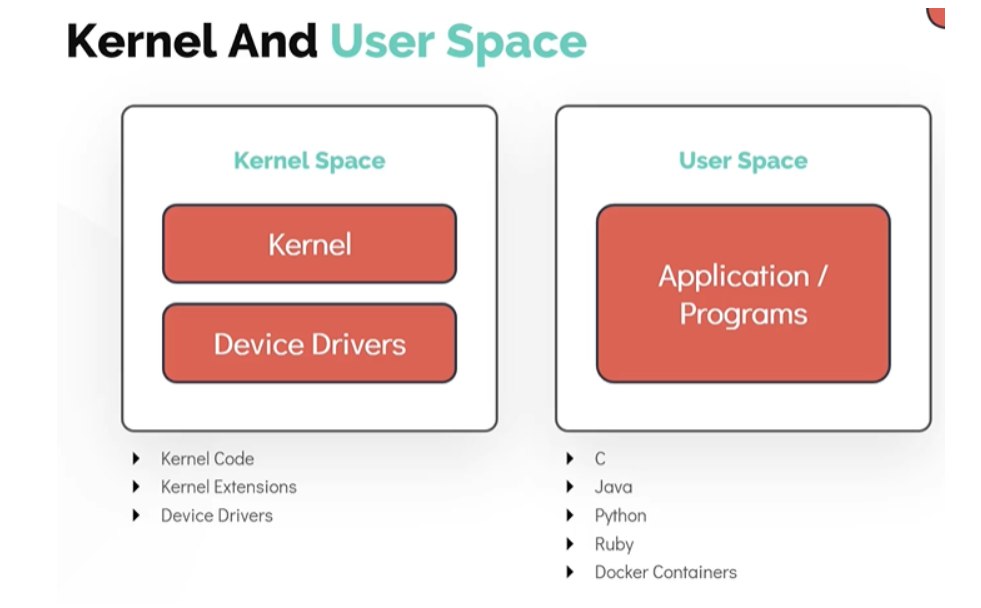
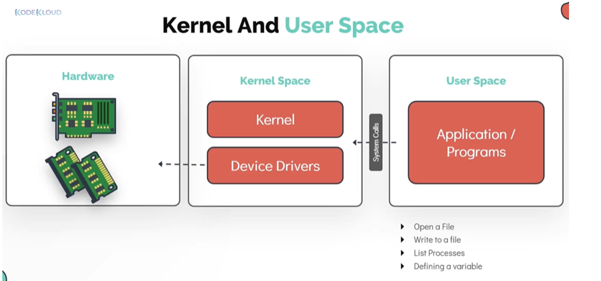
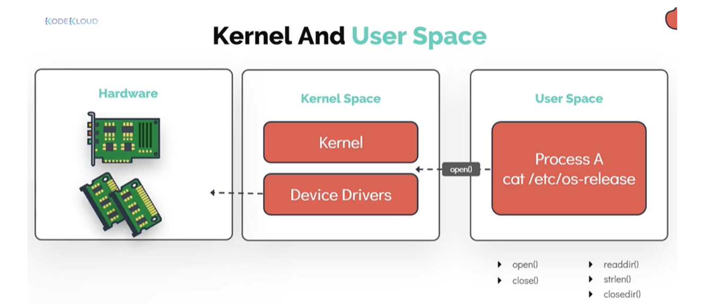

# Mục lục  
 [1.Tổng quan về Unix và Linux](#1)  
 [2.Sự khác nhau giữa Unix và Linux](#2)   
 [3. Kernel and User Space](#3)  

## [Tham khảo](#4)  

---

   
## 1.Tổng quan về Unix và Linux

### `Lịch sử`
- Linux dựa trên Unix về tinh thần và chức năng, nhưng không phải về mã.  
- Linux phát triển từ 2 dự án: Dự án GNU và nhân Linux (kernel) trong đó dự án GNU là tạo ra một hệ điều hành tương tự Unix, không chứa mã Unix và đã chấp nhận hạt nhân Linux và do đó, hệ điều hành GNU/Linux ra đời.  
### `Khái niệm`
- Linux là một nguồn mở, tự do sự dụng hệ điều hành dùng rộng rãi cho phần cứng và phần mềm của máy tính.  
- Unix là một hệ điều hành độc quyền thường được sử dụng cho máy trạm, máy chủ và máy tính cá nhân.     

   
## 2.Điểm khác nhau giữa hệ điều hành Linux và Unix     

|Mã nguồn của Linux có sẵn cho người dùng|Mã nguồn của Unix không có sẵn cho người dùng|  
|----|----|  
|Linux chủ yếu sử dụng giao diện đồ họa người dùng và giao diện dòng lệnh|Unix chỉ sử dụng giao diện dòng lệnh|  
|Linux có tính di động và có thể hoạt động ở các ổ cứng khác nhau|Unix không có tính di động|  
|Linux có thể cài trên hầu hết các HOME BASED PSC|Unix yêu cầu chặt chẽ về phần cứng, nên không thể cài trên các thiết bị|  
|Các phiên bản của Linux: Ubuntu, Fedora, Debian, CentOs, OpenSUSE, Redhat,...|Các phiên bản của Unix: AIS, HP-UX, BSD, IRIS...|  
|Linux chủ yếu sử dụng đối với máy tính để bàn, máy tính cá nhân, điện thoại di động| Unix chủ yếu sử dụng đối với máy chủ, máy trạm, máy tính cấp cao|  
|Cài đặt Linux khá tiết kiệm không đòi hỏi phần cứng đặc biệt cấp cao|Cài đặt Unix đòi hỏi phần cứng đặc biệt|  
|Hệ thống tập tin Linux có dạng: xfs, ramfs, nfs, vfat, cramfsm ext3, ext4, ext2, ext1, ufs, autofs, devpts, ntfs...|Hệ thống tập tin Unix có dạng: zfs, js, hfx, gps, xfs, vxfs|  
|Linux được phát triển bởi cộng đồng Linux đang hoạt động trên toàn thế giới|Unix được phát triển bởi các nhà phát triển của công ty AT&T|   

   
## 3. Kernel and User Space   

- Một trong những chức năng chính của kernel Linux đó là `Memory Management`.       
- Memory được chia thành 2 khu vục.   
1. Kernel Space  
  - Kernel code.
  - Kernel Extensions.
  - Divice Drivers.   
2. User Space   
  - `C`
  - `Java`  
  - `Python`   
  - `Ruby e.t.c`   
  - `Docker Container`     

     

- Tất cả chương trình người sử dụng được hoạt động bằng cách thao tác với dữ liệu hoặc được lưu trữ trong memory hoặc disk. Chương trình người sử dụng truy cập dữ liệu bởi yêu cầu đặc biệt đến kernel được gọi là `System Calls`.  

   

VD: Mở 1 file `/etc/os-release` để xem hệ điều hành đã được cài trong máy, kết quả trong `system call`.    

   

  
## Tham khảo  

[1]https://techshare.vn/linux/sanh-dieu-hanh-linux-va-unix 
[2]https://github.com/phupham1805/linux-basics-course/blob/master/docs/03-Linux-Core-Concepts/02-The-Linux-Kernel.md 

