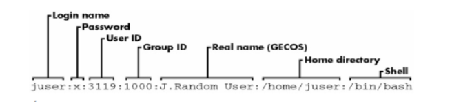
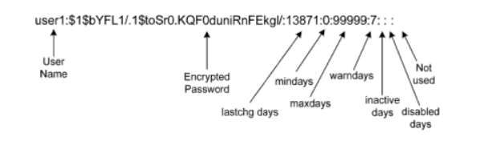
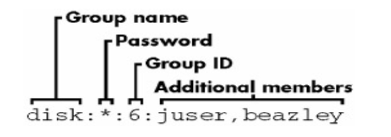

# Mục lục  
[1. Quản lý tài khoản user](#1)  
[2. Tạo user](#2)  
[3. Tạo group](#3)  

## [Tham khảo](#4)   

----

## Root  
- su: Đây là môi trường có thể hoạt động như người dùng (mở một subshell mới)   
- sudo: Cho phép cài đặt các lệnh với quyền người dùng ngay trên subshell đó mà không cần phải chuyển sang chế độ root.       

### 1.Quản lý tài khoản user

- Mỗi user thường có đặc điểm như sau:  
   - Tên tài khoản user là duy nhất, có thể đặt tên chữ thường, chữ hoa.  
   - Mỗi user có 1 mã định danh duy nhất (uid)   
   - Mỗi user có thể thuộc về nhiều group.  
   - Tài khoản super user có uid=gid=0     

- File /etc/passwd:   
   - Là file văn bản chứa thông tin về các tài khoản user trên. Mọi user đều có thể đọc tập tin này nhưng chỉ có root mới có quyền thay đổi.   
   - Để xem nội dung file ta dùng lệnh: `#cat /etc/passwd`   

      
- File /etc/shadow:   
   - Là tập tin văn bản chứa các thông tin về mật khẩu của các tài khoản user trên máy.  
   - Chỉ có user root mới có quyền đọc tập tin này. User root có quyền reset mật khẩu của bất kỳ ai trên máy.   

     

### 2. Tạo User   
----   
*Khi làm việc với các công cụ như useradd, một số giá trị mặc định được giả sử. Những giá trị mặc định được đặt trong hai tệp cấu hình: /etc/login.defs và /etc/default/người dùng*    
- Lệnh adduser: Tạo tài khoản user    
    - Cấu trúc lệnh:   
       - `useradd [Options] login_name`   
       - -c: comment, tạo bí danh.  
       - -u: set user ID. Mặc định sẽ lấy số ID tiếp theo để gán cho user.  
       - -d: chỉ định thư mục home.  
       - -g: chỉ định nhóm chính.  
       - -G: chỉ định nhóm phụ (nhóm mở rộng).  
       - -s: chỉ định shell cho user sử dụng.    
    - Ví dụ:    
- Lệnh usermod: Sửa thông tin tài khoản   
    - Cấu trúc lệnh:   
       - `usermod [Options] login_name`   
       - -c: comment, tạo bí danh.  
       - -l -d: thay đổi thư mục  home.   
       - -g: chỉ định nhóm chính.   
       - -G: chỉ định nhóm phụ (nhóm mở rộng).  
       - -s: chỉ định shell cho user sử dụng.   
       - -L: Lock account.  
       - -U: Unlock account.  
- Lệnh passwd: Đổi password  
    - Cấu trúc lệnh:  
       - `passwd [login_name]   
       passwd -n 31 -w 5 -x 100   
       -  Cài password cho người dùng trong khoảng thời gian tối thiểu 31 ngày, hết hạn sau 100 ngày và có 5 ngày cảnh báo trước khi hết hạn.   

- Lệnh Userdel: Xóa User.  
    - Cấu trúc lệnh:   
       - `userdel [Options] login_name`   
       - -r: xóa thư mục home của user   
    - Dòng mô tả tương ứng của user trong tập tin /etc/passwd và /etc/shadow cũng bị xóa.   
- Lệnh chage: Dùng để thiết lập chính sách cho user.   
   - Cấu trúc lệnh:   
      - `chage [Options] login_name`   
      - -l: xem chính sách của 1 user.  
      - -E: thiết lập ngày hết hạn cho account.   
      Vd: `chage -E 2021-12-10 pdp1805`   
      - -I: thiết lập số ngày bị khóa sau khi hết hạn mật khẩu.   
      - -m: thiết lập số ngày tối thiểu được phép thay đổi password   
      - -M: thiết lập số ngày tối đa được phép thay đổi password  
      - -W: Thiết lập số ngày cảnh báo trước khi hết hạn mật khẩu.   
    - Ví dụ: `chage -E 2021-12-10 -m 5 -M 90 -I 10 -W 5 pdp1805`   
*Lệnh trên sẽ thiết lập mật khẩu cho user pdp1805 hết hạn vào ngày 2021-12-10. Số ngày tối thiểu phải thay đổi mật khẩu là 5, số ngày tối đa là 90. Tài khoản sẽ bị khóa 10 ngày nếu hết hạn, sẽ có tin nhắn cảnh báo trước 5 ngày trước khi hết hạn.*    

### 3. Tạo group:   

- Nhóm là tập hợp của nhiều user. Mỗi nhóm có tên duy nhất, và có một mã định danh duy nhất (gid). Khi tạo một user (không dùng option -g) thì mặc định một group được tạo ra.  
- File /etc/group: Là file chứa thông tin về group user trên máy. Mọi user đều có thể đọc nhưng chỉ có root mới có quyền thay đổi.   
  

- Lệnh groupadd:    
 
Cấu trúc: group [Options] Group  
   - -g GID: Định nghĩa nhóm với mã nhóm GID  
   - Group: Tên nhóm định nghĩa   
   - Ví dụ: Tạo nhóm users   
      *Tạo nhóm accouting với GID = 100  
      `groupadd -g 100 accouting`   
- Lệnh groupmod:   
   - Cấu trúc lệnh: groupmod [Options] group   
   - -g GID Sửa mã nhóm thành GID  
   - -n group_name: Sửa tên nhóm thành group_nam.  
   - Group: Tên nhóm cần chỉnh sửa   
   - Ví dụ: *Sửa gid của nhóm user thành 101*  
      `groupadd -g 101 users`   
     Đổi tên nhóm accouting thành accouted  
     `groupadd -n accouted accouting`   
- Lệnh groupdel: dùng để xóa nhóm   
   - Ví dụ: xóa nhóm testgroup   
       `groupdel testgroup`  

-----

## Tham khảo   

[1]https://www.hostinger.vn/huong-dan/cach-su-dung-sudo-va-file-sudoers   
[2]https://quantrimang.com/su-khac-biet-giua-sudo-va-su-175907  
[3]https://www.redhat.com/sysadmin/local-group-accounts

