# Mục lục  
[1. Mô tả người sử dụng và chấp nhận nhóm](#1)  
[2. Giành được quyền truy cập siêu người dùng](#2)  
[3. Quản lý tài khoản người sử dụng cục bộ](#3)  
[4. Quả lý tài khoản nhóm cục bộ](#4)  
[5. Quản lý mật khẩu người sử dụng.](#5)

## Tham khảo.   

----

### 1.Mô tả người sử dụng và chấp nhận nhóm.
- `ps`: lệnh để xem thông tin xử lý.  
- `ps - a`: để xem xử lý tất cả với thiết bị đầu cuối.  

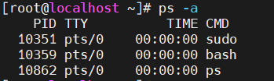 
- `ps -au`: với một quá trình để xem người sử dụng có liên quan   

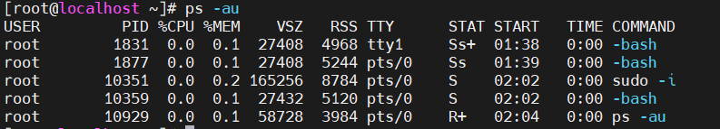
- /etc/passwd file chứa thông tin về người một người sử dụng.

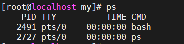  
- `uid`: số cho tài khoản sử dụng này.  
- `gid`: số cho nhóm riêng tài khoản người sử dụng này.  
- `id`: Lệnh được sử dụng để tìm về thành viên nhóm cho một người sử dụng.  

### 2.Giành được quyền truy cập siêu người dùng    
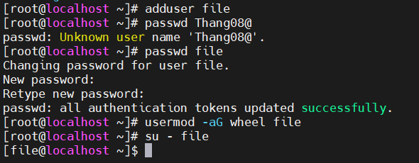   

- B1: Tạo user vào hệ thống   
    `adduser <new_user>`   
- B2: Thay đổi password cho user vừa tạo   
     `passwd <new_user>`  
- B3: Thêm user vừa khởi tạo vào nhóm wheel   
     `usermod -aG wheel <new_user>`   
- B4: Kiểm tra user bằng lệnh sudo.  
     `su - <new_user>`   
     `sudo - la`     

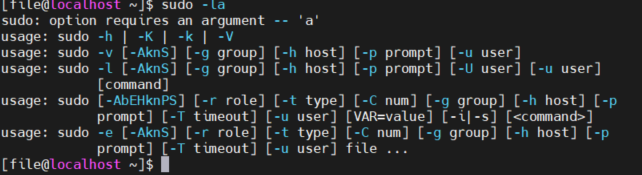  

### Lệnh su & sudo  
- su [user]: chuyển sang user mới
- su - [user]: sử dụng biến môi trường shell của user mới.  
- sudo -i: Lệnh truy cập vào tài khoản root.    

### 3.Quản lý tài khoản người sử dụng cục bộ   
- Tạo người sử dụng:  
`adduser` or `username`   
`usermod`: Sửa đổi tài khoản người dùng.      
- Biến đổi người sử dụng hiện có từ dòng lệnh.    
- `userdel`: lệnh xóa tài khoản người dùng và các tệp liên quan.    

|usermod|usage|  
|----|----|   
|-c|thêm tên người dùng thực để comment tập tin|   
|-g|chỉ định một nhóm chính cho tài khoản người dung|   
|-G|chỉ định một danh sách các nhóm bổ sung được phân tách bằng dấu phẩy cho tài khoản người sử dụng|  
|-a|Sử dụng với lựa chọn -G để thêm nhóm bổ sung để người sử dụng hiện tại lập thành viên nhóm thay vì thay thế lập nhóm bổ sung với thiết kế mới|   
|-d|chỉ định danh mục Home riêng từ tài khoản người sử dụng|  
|-m|di chuyển người sử dụng danh mục Home đến một địa điểm mới. Phải sử dụng với lựa chọn -d|   
|-s|chỉ một đăng nhập Shell riêng cho tài khoản người sử dụng|  
|-L|khóa tài khoản người sử dụng|  
|-U|mở khóa tài khoản người sử dụng|   

### 4. Quản lý tài khoản nhóm cục bộ  

- B1:Tạo nhóm sử dụng:  
   `grounpadd`: tạo nhóm   
    
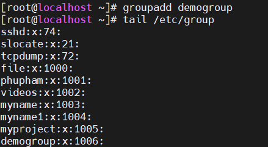

- B2:Thay đổi GID 10007   
`sudo groupmod -g GID groupname`   

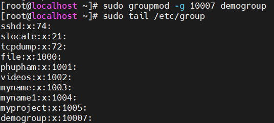  
- B3: Thay đổi tên của một nhóm   
`sudo groupmod -n NEWNAME oldname`    

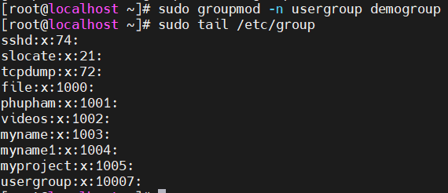
- B4: Thêm người dùng vào một nhóm  
`sudo usermod -g groupname user01`  

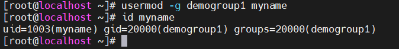   

- B5: Xóa group   
`sudo groupdel groupname`    

- `usermod -aG `: thêm một người sử dụng đến một nhóm bổ sung.   

- B6: Cấu hình nhóm Sudo   

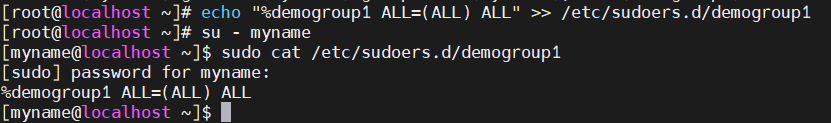

### 5.Quản lý mật khẩu người sử dụng  
Cấu hình lão hóa mật khẩu.
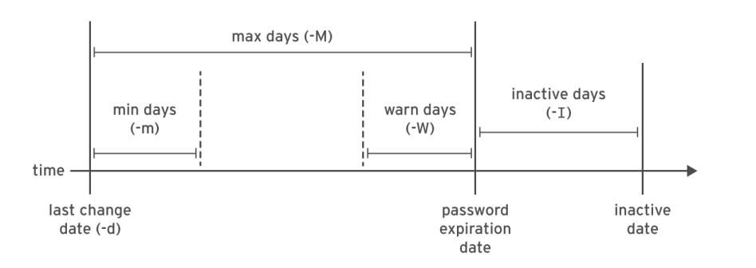    

- `chage -M date username`: thiết lập tuổi tối đa của mật khẩu người sử dụng.  
- `chage username`: cấu hình quản lý mật khẩu.   

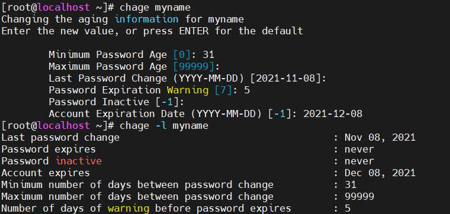   

- `date -d "+date days" +%F`: thêm ngày giới hạn cho tài khoản.   

## Tham khảo   

[1]https://www.hostinger.vn/huong-dan/cach-su-dung-sudo-va-file-sudoers   
[2]https://quantrimang.com/su-khac-biet-giua-sudo-va-su-175907  
[3]https://www.redhat.com/sysadmin/local-group-accounts

