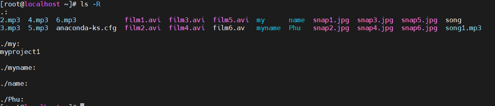

# Mục lục  
1. **Hệ thống file trên Linux**     
2. **Các lệnh thao tách file trên Linux**  

### Tham khảo  

----

  

- *Thao tác với file, folder trên Linux thường dùng lệnh. Dưới đây là các lệnh giúp tạo, xóa, sửa, copy, di chuyển file*  

1. `Hệ thống file trên Linux`

|Lệnh|Mô tả|  
|----|----|  
|ls|hiện danh sách file|  
|touch, vi|tạo mới file|
|cat, vi|xem nội dung file|
|cp|copy file, folder|
|mv|di chuyển, đổi tên file, folder|
|rm|xóa file|  

2. `Các lệnh thao tác file trên Linux`  

- pwd: (print working directory) trình bày đầy đủ đường dẫn của thư mục hiện tại đang làm việc.
- ls: hiện danh sách file   

  
- cd: di chuyển thư mục làm việc.  
- touch: tạo một file mới trống thông qua dòng lệnh.  

 
- ls - l: có nhiều lựa chọn để trình bày các thuộc tính trong tệp.  

  
- ls -a: liệt các file bao gồm cả file ẩn  
  

- ls -R: liệt kê các file bao gồm các thư mục phụ bên trong.  
 

- ls -al: liệt kê tất cả file và thư mục với thông tin chi tiết.  
  

- cd -: thay đổi thư mục phía trước vừa thực hiện.  
 

- cd .. lệnh sử dụng .. danh mục ẩn để di chuyển một mức độ đến thư mục gốc.
- mv: di chuyển một file đến một thư mục khác.  
- rm: lệnh tẩy một file đơn từ thư mục làm việc của bạn.  
- rm -r: lệnh tẩy một thư mục con và nội dung của nó.  
- rmdir: lệnh chỉ tẩy thư mục thành trống.  
- cat: dùng để xem nội dung file  
    - cat>filename tạo ra file mới
    - cat>filename1 filename2>filename3 nhập 2 file (1 và 2) để lưu kết quả vào file (3)  
- ping: để kiểm tra trạng thái kết nối của bạn.   
- echo: lệnh này để chuyển dữ liệu vào một file.  

[1]https://blogd.net/linux/lam-viec-voi-tap-tin-va-thu-muc-tren-linux/   
[2]https://www.hostinger.vn/huong-dan/cac-lenh-co-ban-trong-linux  

