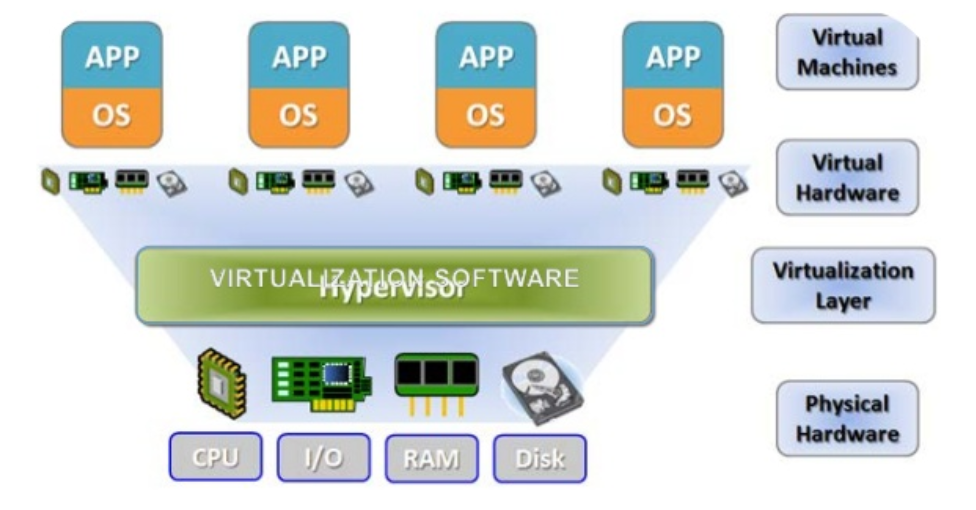
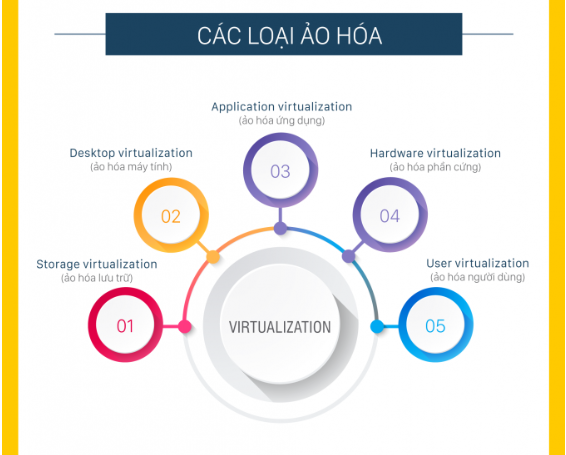
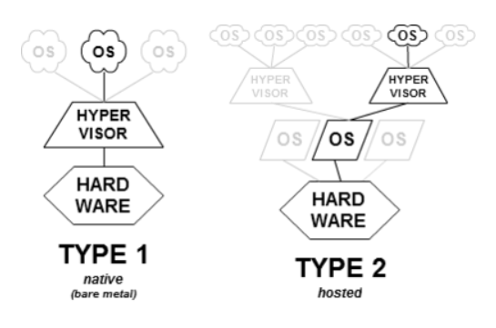
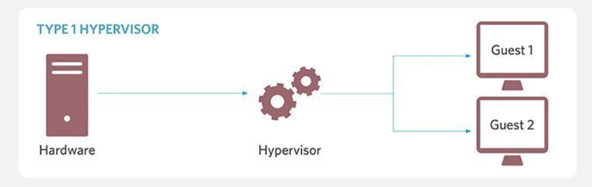
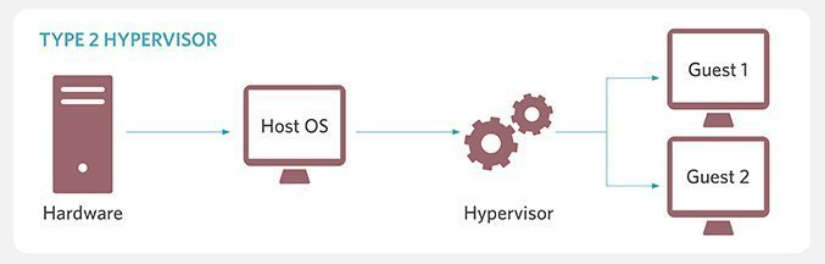

# Mục lục    
[1. Virtualization là gì ? ](#1)    
[2. Hypervisor là gì  ](#2)      
[3. Các kiểu Hypervisor](#3)      

## [Tham khảo](#4)    

----    
   

## 1.Virtualization là gì?    
- `Virtualization` là quá trình tạo phiên bản "ảo" của một thứ gì đó, chẳng hạn như môi trường máy tính, OS, thành phần lưu trữ hoặc thành phần mạng, thay vì sử dụng phiên bản vật lý cho một số cơ sở hạ tầng của công ty.          

   

- Các loại ảo hóa      

     

- Các lợi ích của ảo hóa Server    
   - Tiết kiệm năng lượng, thân thiện môi trường   
   - Cung cấp các máy chủ nhanh hơn    
   - Tăng uptime    
   - Tăng khả năng phục hồi thảm họa    
- Các lợi ích của ảo hóa trong data center   
   - Dễ dàng di chuyển lên cloud   
   - Cắt giảm chi phí   
   - Giảm sự gia tăng nhiệt độ   
   - Dễ dàng backup     

        

## 2. Hypervisor là gì ?      
- Hypervisor là một phần mềm quản lý một hoặc nhiều máy ảo (VMs).    
- Mục đích: để tạo, start up, dừng và reset lại các máy ảo.    
- Tác dụng: Hypervisor cho phép mỗi VM hoặc "guest" truy cập đến resource hardware như CPU, RAM, và storage.    

 

##  3.Có 2 loại Hypervisor chính    
- Đó là `Native` và `Hosted`      

    

- Loại 1: `Native`    

   

  - Một hypervisor dạng `native` hay còn gọi là `bare metal` chạy trực tiếp trên phần cứng. Nó được khởi động trước OS và tương tác trực tiếp với kernel.    
  - Ưu điểm: đem lại hiệu suất cao nhất có thể.   
  - Nhược điểm: Hệ thống chỉ có thể chạy các máy ảo (VMs) vì `hypervisor` luôn chạy ngầm dưới backgroud.        
  - Các hypervisor dạng native hiện nay đang được sử dụng đó là: `VMware ESXi, Microsoft Hyper-V, Apple Boot Camp`       
 

- Loại 2: `Hosted`       

   

   - Một hypervisor dạng `hosted` được cài đặt trên một máy tính chủ (host computer), trong đó hệ điều hành đã được cài sẵn.      
   - Nó chạy như một ứng dụng (phần mềm) của OS  
   - Ưu điểm: Có thể enable/disable hoặc exit khi cần thiết, giải phóng resource cho host. Cũng đem lại hiệu suất cao nhất có thể.   
   - Các hypervisor dạng hosted hiện nay đang được sử dụng đó là: `VMware Workstation, Oracle Virtual Box, Parallels Desktop for Mac, KVM (Kernel based Virtual Machine)`      

 
- ***Tóm lại: dạng `hosted` thường sử dụng cho cá nhân hoặc doanh nghiệp nhỏ, còn đối với dạng `native` thì được sử dụng cho các app doanh nghiệp và điện toán đám mây_cloud computing.***      

  

## Tham khảo    
[1] https://www.thegioimaychu.vn/blog/thuat-ngu/hypervisor/  
[2] https://adg.vn/tin-cong-nghe/virtualization-ao-hoa-la-gi-loi-ich-cua-ao-hoa   
[3] https://searchservervirtualization.techtarget.com/feature/Whats-the-difference-between-Type-1-and-Type-2-hypervisors
