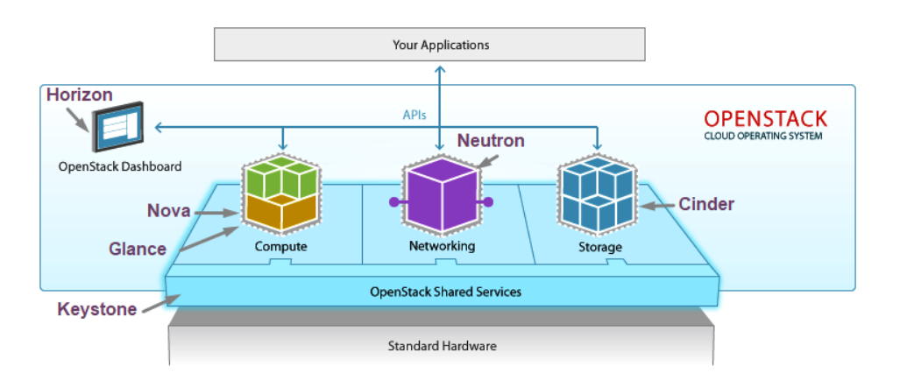

# Mục lục      
[1. Overview Openstack ](#1)   
[2. Các thành phần của Openstack ](#2)    
[3. Lợi ích và hạn chế khi sử dụng Openstack](#3)      

## [Tham khảo](#4)    
-----     
 
    

## 1. Overview Openstack   
-  Openstack là một phần mềm mã nguồn mở dùng để triển khai Cloud Computing, bao gồm private cloud và public cloud.    
- Nó cung cấp giải pháp xây dựng hạ tầng điện toán đám mây đơn giản, có khả năng mở rộng và nhiều tính năng phong phú (IaaS)     
- Openstack là một cloud software được thiết kế để chạy trên các sản phẩm phần cứng như x86, ARM. Sẵn sàng tích hợp vào các hệ thống.     

   

## 2. Các thành phần của Openstack      
- Kiến trúc tổng quan của Openstack được chia thành 3 tầng:   
   - `Tầng ứng dụng (Your Application)`: Các ứng dụng/phần mềm sử dụng Openstack     
   - `Tầng Hypervisor (Standard Hardware)`: Phần cứng máy chủ đã được ảo hóa để chia sẻ cho người dùng.    
   - `Dịch vụ Openstack (Openstack Shared Services)`: Các thành phần cơ bản như Dashboard, Compute, Networking, API, Storage.     

    

- `OpenStack Compute (Nova)`: là module quản lý và cung cấp máy ảo (VMs).  
   - Nó hỗ trợ nhiều hypervisor gồm: KVM, QEMU, LXC, XenServer...   
   - Compute là một tool mạnh mẽ có thể điều khiển toàn bộ các jobs: networking, CPU, storage, memory, create, control, delete VMs, security, access control.   
   - Bạn có thể điều khiển bằng dòng lệnh hoặc dashboard trên web.    
-  `OpenStack Glance`: là Openstack `Image Service` dùng để quản lý các disk image ảo.    
   - Glance hỗ trợ các ảnh `Raw, Hyper-V(VHD), VirtualBox(VDI), Qemu(qcow2) và VMWare (VMDK, OVF).`   
   - Bạn có thể thực hiện: cập nhật thêm các virtual disk images, cấu hình các public và private image và điều khiển việc truy cập vào chúng, và tất nhiên là có thể tạo và xóa chúng.         
- `Keystone (Identity Server)`: dùng để quản lý xác thực cho user và projects.  
- `Openstack Storage`   
   - `Object Storage (Swift)`: Swift cung cấp khả năng lưu trữ dựa trên các cấu trúc phân tán (distributed architecture), giúp tăng cao khả năng dự phòng (redundancy), mở rộng/thu gọn (scalability) và hiệu năng (performance).       
   - `Block Storage (Cinder)`: cho phép bạn thêm và quản lý block-level storage vào VM. Dịch vụ này tương ứng với Amazon EC2 Elastic block Storage - EBS.      
- `Openstack Network (Neutron)`: là thành phần quản lý network cho máy ảo.   
   - Cung cấp chức năng network as a service.   
   - Đây là hệ thống có các tính chất pluggable, scalable và API-driven.   
- `Openstack Dashboard (Horizon)`:   
   - Ứng dụng web chạy trên apache   
   - Cung cấp giao diện cho Administrator quản trị dịch vụ Openstack   
      - Cung cấp giao diện đồ họa (GUI) để truy cập   
      - Cung cấp và tự động phát tài nguyên cloud   
      - Việc thiết kế có thể mở rộng giúp dễ dàng thêm và các sản phẩm cũng như dịch vụ ngoài như billing, monitoring và các công cụ giám sát khác.      

   

## 3. Lợi ích và hạn chế khi sử dụng Openstack   
***Lợi ích***   
- Tiết kiệm chi phí   
- Hiệu suất cao   
- Nền tảng mở   
- Dễ dàng trong việc tương tác  
- Khả năng phát triển và mở rộng cao    

***Hạn chế***  
- Độ ổn định chưa cao  
- Hỗ trợ đa ngôn ngữ chưa tốt  
- Chỉ hỗ trợ kĩ thuật qua chat và email    

    

## Tài liệu tham khảo   
[1]https://vnpt-idc.vn/tim-hieu-ve-openstack-trong-he-thong-cloud/  
[2]https://dzone.com/articles/openstack-core-components   
[3]https://viblo.asia/p/tim-hieu-ve-dien-toan-dam-may-voi-openstack-ZabG9zZ5vzY6  
[4]https://vudinhnghi.wordpress.com/2015/03/12/openstack-open-source-cloud-computing-phan-1-tong-quan/
