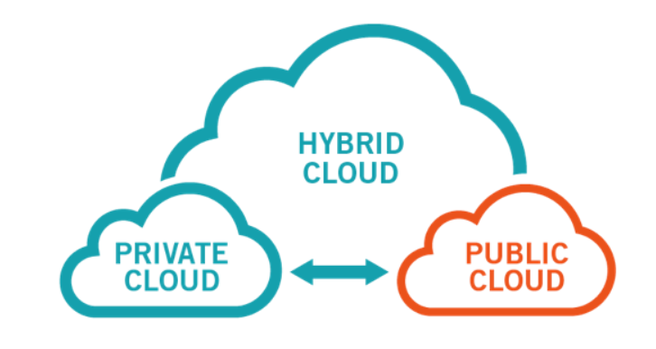
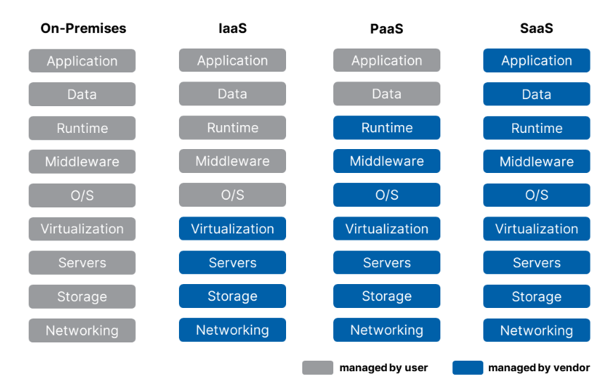

# Mục lục    
[1. Cloud computing là gì ? ](#1)        
[2. Đặc điểm của Cloud Computing ](#2)            
[3. Mô hình triển khai ](#3)          
[4. Mô hình dịch vụ ](#4)        

## [Tham khảo](#4)     
-----    

   

## 1. Cloud computing là gì ?    
- Cloud computing (Điện toán đám mây) là mô hình `truy cập qua mạng Internet` để lựa chọn và sử dụng tài nguyên có tính toán (ví dụ: mạng, máy chủ, lưu trữ, ứng dụng và dịch vụ) `theo nhu cầu` một cách thuận tiện và nhanh chóng; đồng thời cho phép kết thúc sử dụng dịch vụ; giải phóng tài nguyên dễ dàng, giảm thiểu các giao tiếp với nhà sản xuất.         
- Điện toán đám mây đơn giản là một tập các tài nguyên máy tính gộp lại và cung cấp dịch vụ trên các kênh web. Khi chúng ta biểu đồ mối quan hệ giữa tất cả các yếu tố thì chúng tương tự như một đám mây.         

    

## 5 Đặc điểm của cloud computing    
- 5 đặc điểm:   
  - Khả năng thu hồi và cấp phát tài nguyên (Rapid Elasticity)    
  - Truy cập qua các chuẩn mạng (Broad Network Access)    
  - Dịch vụ sử dụng đo đếm được (Measured service)      
  - Khả năng tự phục vụ (On-demand self-service)    
  - Chia sẻ tài nguyên (Resource pooling)    

***Lợi ích***   
- Sử dụng các tài nguyên tính toán động        
- Giảm thiểu chi phí       
- Giảm độ phức tạp trong cơ cấu của doanh nghiệp         
- Tăng khả năng sử dụng tài nguyên tính toán    

        

## Mô hình triển khai     

     

- Public Cloud: thì được sở hữu và vận hành bởi người cung cấp dịch vụ cloud bên thứ 3, giao tài nguyên máy tính như `servers or storage` qua internet đang sử dụng web browser.    
   - VD: Amazon AWS,  GCP, Microsoft Azure                        
- Private Cloud: dùng trong doanh nghiệp và không chia sẻ với người dùng ngoài doanh nghiệp đó.    
- Hybrid Cloud: là mô hình kết hợp giữa mô hình Public Cloud và Private Cloud. Mô hình này cho phép `data` và `application` được chia sẻ và di chuyển giữa public cloud và private cloud đáp ứng tính linh hoạt và nhiều lựa chọn phát triển.    

   

## Mô hình dịch vụ     
- Hạ tầng như một dịch vụ (Infastructure as a Service_IaaS)      
   - Cung cấp dịch vụ về hạ tầng, các máy chủ, tài nguyên là: RAM, CPU, Storage...     
- Nền tảng như một dịch vụ (Platform as a Service_PaaS)        
   - Cung cấp dịch vụ về nền tảng (Platform) như Database, môi trường để phát triển chương trình      
   - Máy chủ có sẵn các môi trường để phát triển ứng dụng        
- Phần mềm như một dịch vụ (Software as a Service_SaaS)         
   - Cung cấp các dịch vụ về phần mềm, bán hoặc cho thuê lâu dài.            
   - Nhà cung cấp dịch vụ triển khai gần như toàn bộ.       

    

   
## Tham khảo    
[1]https://www.pentasecurity.com/blog/iaas-paas-saas/   
[2]https://github.com/vinhducnguyen1708/Internship-VNPT-IT/blob/master/OpenStack/T%C3%ACm%20hi%E1%BB%83u%20v%E1%BB%81%20Cloud%20Computing.md    

    

